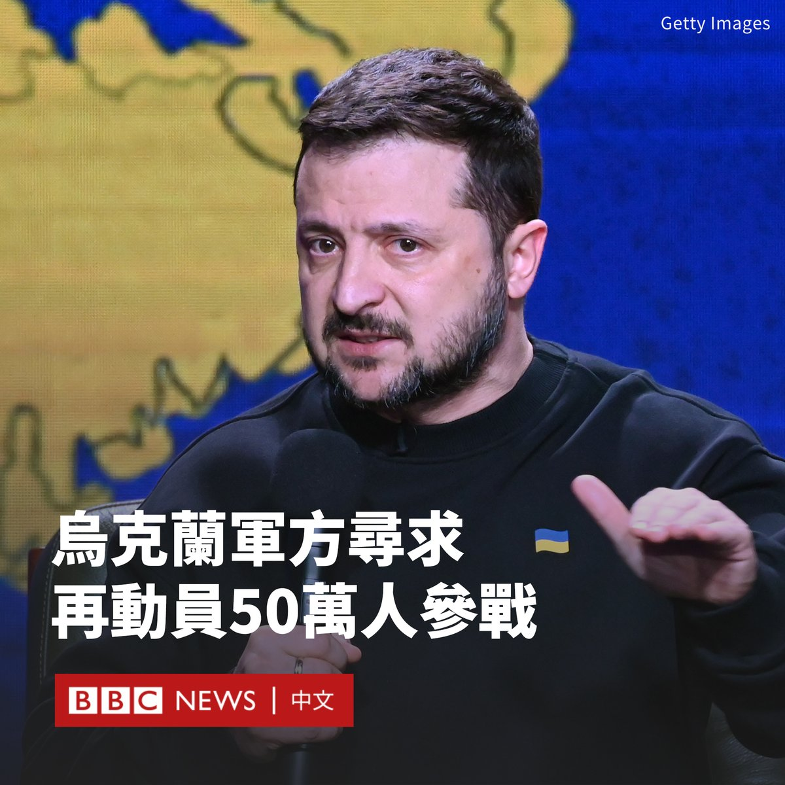

D英国广播公司BBC 北京时间 2023-12-20T14:46:57Z 1737363942022984077 乌克兰总统泽连斯基（Volodymyr Zelensky）透露，在俄罗斯入侵该国近两年之际，乌军方希望额外动员多达50万人。

泽连斯基在基辅的一次记者上表示，他的指挥官们正在寻求“45至50万人”。他说，在支持此举之前，他需要更多细节。

“我需要具体情况：乌克兰百万大军将何去何从，那些两年来一直保卫国家的人将何去何从？我们有轮岗和假期问题。这应该是一个全面的计划。”

在他发表此番言论前，乌克兰从美国和欧盟获得援助的计划受挫。乌克兰军队目前仍在防御俄罗斯对乌东部和南部的持续攻击。

本月早些时候，美国国会共和党人首次阻止了向乌克兰提供600亿美元的军事援助计划。上周，匈牙利阻止了欧盟500亿欧元的财政援助协议。

基辅的反攻在冬季开始时陷入停顿，外界担心俄罗斯可能会在火力上完全超过乌克兰。

当被BBC记者问及乌克兰是否开始输掉战争时，泽连斯基态度坚决地回应说：“不是”。

泽连斯基还表示，与俄罗斯的和谈目前不可行。他强调将寻求全面恢复国际公认的乌克兰边界，包括克里米亚。   D英国广播公司BBC 北京时间 2023-12-20T12:54:30Z 1737335643410477546 美国科罗拉多州最高法院周二（12月19日）裁定，由于特朗普（Donald Trump）涉及2021年1月美国国会大厦骚乱事件，他明年不能在该州竞选总统。

科罗拉多州最高法院以4比3裁定，特朗普不符合参选资格。特朗普竞选团队称这一决定是反民主的，并誓言要上诉。

“特朗普总统煽动及鼓励使用暴力和目无法纪的行动来破坏权力的和平移交。”裁决书说。

这一前所未有的裁决引人关注，因为其是美国史上首次动用宪法第14修正案第三款以将总统候选人除名。在新罕布什尔州、明尼苏达州和密歇根州，类似的法律尝试都失败了。

这项裁决只适用于3月5日的该州初选，届时共和党选民将选出他们喜欢的总统候选人。

目前，这项裁决的生效日期被延后至1月4日，以便特朗普可以向美国最高法院提出上诉。

特朗普竞选团队发言人史蒂文·张（Steven Cheung）称该裁决“彻底错误”，并猛烈抨击了所有由民主党州长任命的法官。

“他们已经对拜登失败的总统任期失去了信心，现在正在尽一切努力阻止美国选民明年11月把他们赶出白宫。”

共和党议员也谴责了这一决定，其中包括众议院议长迈克·约翰逊（Mike Johnson），他称这是“一场毫不掩饰的党派攻击”。   D英国广播公司BBC 北京时间 2023-12-20T09:07:44Z 1737278575265583601 “表面上看，机构还在，建筑还在，法官还在，律师也还在。但事实上，法治的基本原则受到了侵蚀。”黎智英国际法律团队的大律师乔纳森·普莱斯（Jonathan Price）表示。https://t.co/xjyaou65d6   D英国广播公司BBC 北京时间 2023-12-20T09:06:46Z 1737278332998136241 “表面上看，机构还在，建筑还在，法官还在，律师也还在。但事实上，法治的基本原则受到了侵蚀。”黎智英国际法律团队的大律师乔纳森·普莱斯（Jonathan Price）表示。https://t.co/JVj5kCly43   