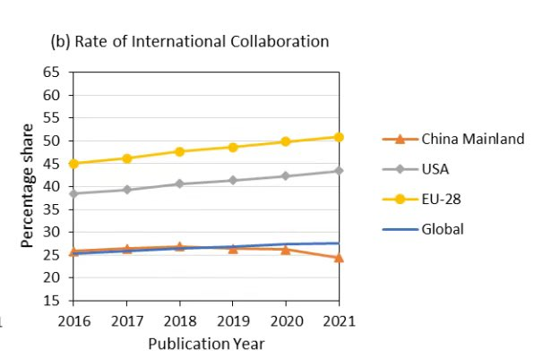

Petrichor 北京时间 2023-12-20T10:47:09Z 1737303594989236412 又吹牛逼了：「共軍已經發明速度每秒35万公里的激光。」超光速已经人工实现了吗？所做物理的人都可以下课了！愛因斯坦錯了？ https://t.co/1FZeRCCvxc   Petrichor 北京时间 2023-12-20T09:30:13Z 1737284236388786443 2020年以来中美两国的科学合作产出下降了15%。中美政府之间的矛盾，造成两国科学家之间的研究合作下降。随着中国反间谍法施行和扩大化施行，今后中美科技合作更是雪上加霜。

德国政府发布了新的对华战略文件，文件声称要降低与中国的联系风险，承诺将会“发布规定，不支持或只在有适当条件的情况下支持可能造成知识流失的，与中国合作的研究项目”。

哈佛大学经济学家理查德-弗里曼（Richard Freeman）的研究指出，私人关系，尤其是华裔学者的重要性在中美科学合作中尤为关键。78.5%的中美合作论文中，都有一位在美国工作或者从美国回国的中国科学家参与。但现在华裔科学家正处于尴尬境地。许多华裔科学家不仅被西方国家情报部门约谈，回国参加学术交流又受中国国安烦人的骚扰。他们两边不受信任，干脆不再热心与国内同行合作，多一事不如少一事。

加拿大是中国在科学上的第七大合作伙伴，中国的合作科学产出曾在2020年左右达到峰值，但根据自然指数，2022年两国的科学合作产出相比峰值已经下降了13%。加拿大由国家安全部门直接插手学术，否决那些被认为有风险的项目。近年来，加拿大安全情报局（CSIS） 加大了对大学和私营部门研究机构与外国合作伙伴合作的潜在风险的警告力度。今年年初，CSIS以存在无法接受的风险为由，阻止了 32 项研究资助申请，被拒绝的申请涉及航空航天、能源和通信技术领域。   Petrichor 北京时间 2023-12-20T04:34:02Z 1737209696853897562 逻辑不通。被人全面管治，也就失去自治。铁链女的自治权，多么可笑！ https://t.co/YSmCE0jQFw   Petrichor 北京时间 2023-12-20T00:43:13Z 1737151609526710762 共产党控制人的思想、扼杀言论自由，无论投多少钱，也不可能办好教育，特别是大学！它的行为，必然导致民族智力衰退，被世界抛弃。 https://t.co/Mf5bxSK3XP   