自由亚洲电台 北京时间 2023-12-20T23:35:01Z 1737496834510115230 RT @RFA_Chinese: #李家超述职  出席者阵容耐人寻味，#您怎么看？
#习近平 坐在长桌的正中间。
总理 #李强，政治局常委蔡奇和丁薛祥，统战部长石泰峰和政法委书记陈文清坐在习左边。
李家超和港澳办主任夏宝龙等人坐习右边。
https://t.co/hbPJhJC…   自由亚洲电台 北京时间 2023-12-20T16:15:44Z 1737386284765814950 【新疆社科院副研究员杜曼被软禁5年后下落不明】
【文学界十多哈萨克族人被捕】
新疆社科院语言研究所副研究员 #杜曼·加合甫，被软禁5年后，一个月前与家人失去联系。海外 #哈萨克 族人权组织称，学者杜曼失联应与其个人学术观点有关。另外，近期，新疆文学界十多哈萨克族人被捕。
https://t.co/8WZbihcPeb 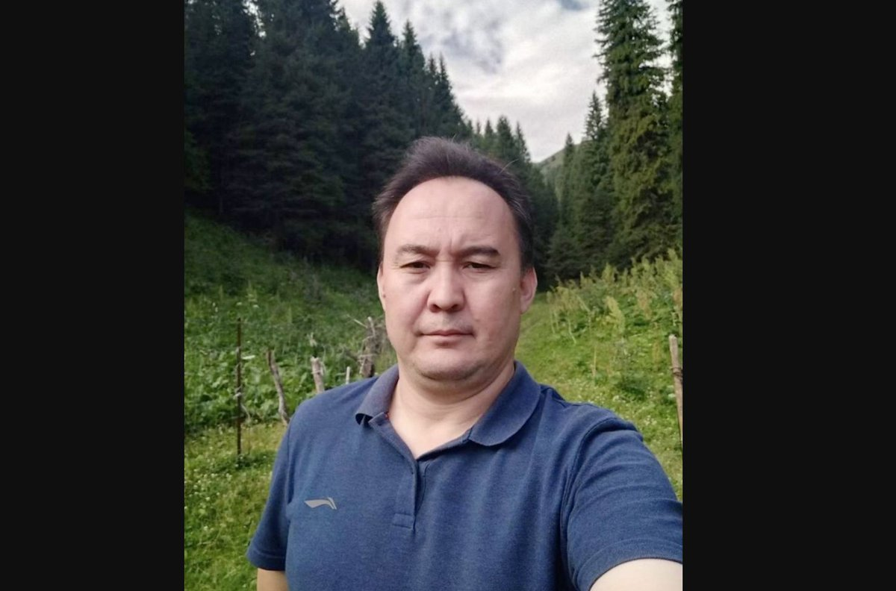  自由亚洲电台 北京时间 2023-12-20T09:12:37Z 1737279806675583121 欢迎收听和订阅播客【＃亚太报道】 https://t.co/MjLNSvVMqc
甘肃 #积石山县 地区发生强烈 #地震；中国民法泰斗 #江平逝世；#黎智英 案进入庭审第二天；#中央经济工作会议 传递政治信号；#习近平 与常委破例同场会见港澳特首 https://t.co/kN1sH3rJC8 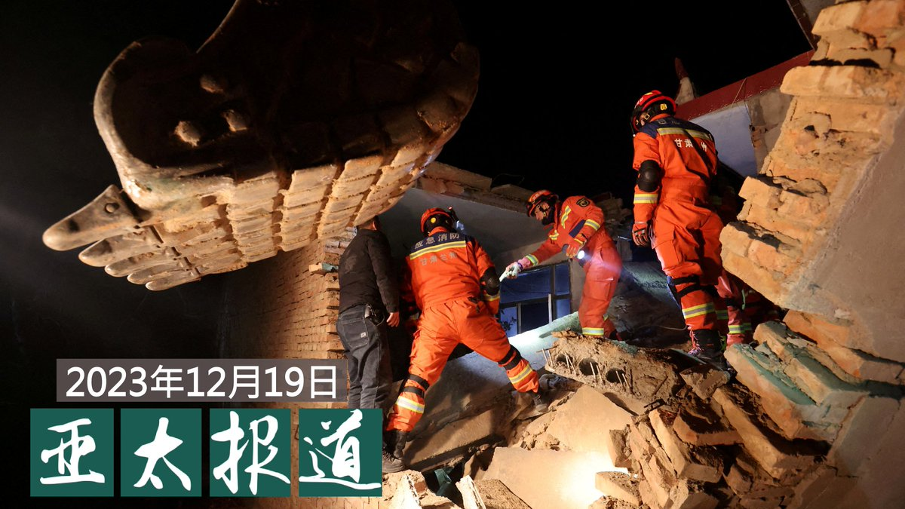  自由亚洲电台 北京时间 2023-12-20T09:27:08Z 1737283458282705112 #事实查核 @asiafactcheckcn| #胡锡进 称美报告建议与中国切断经济联系？
https://t.co/blpz1R4XYZ https://t.co/Pqq1UuGOTu 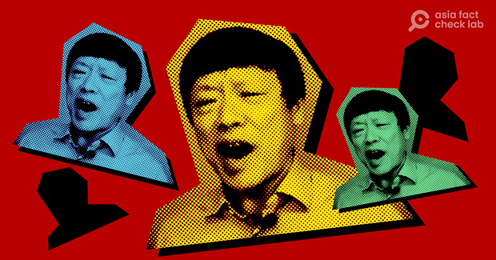  自由亚洲电台 北京时间 2023-12-20T04:42:23Z 1737211801576837480 香港媒体大亨 #黎智英 被控涉嫌违反《港区国安法》一案周二进入庭审的第二天。英国政府当天表示，希望香港当局允许外交人员与英国公民黎智英会面，以提供援助。

https://t.co/zAdRdJS8rc https://t.co/Y1TWrEKQra 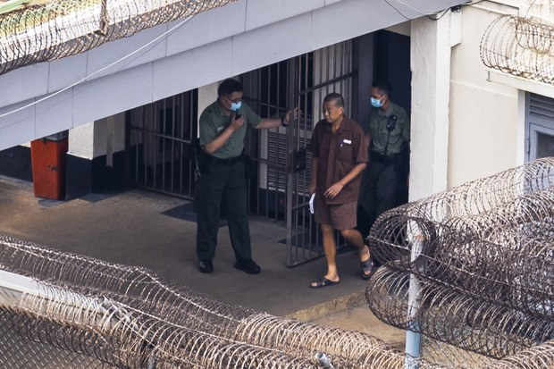  自由亚洲电台 北京时间 2023-12-20T04:17:55Z 1737205642811637814 RT @RFA_Chinese: 【欢迎加入自由亚洲电台电报群】https://t.co/UkKZmFSRkG https://t.co/Qid2LNZxJn   自由亚洲电台 北京时间 2023-12-20T05:08:56Z 1737218480917930490 #甘肃强震 后，中央社19日报道，台湾的总统 #蔡英文@iingwen 除向不幸罹难人员与家属致上哀悼、慰问，也请海陆两会表达愿意提供必要协助之意，期盼各项抢救及灾后复原工作顺利进行，当地能早日恢复正常生活。
https://t.co/ji47Nd7jMG https://t.co/dOSexBPUVt 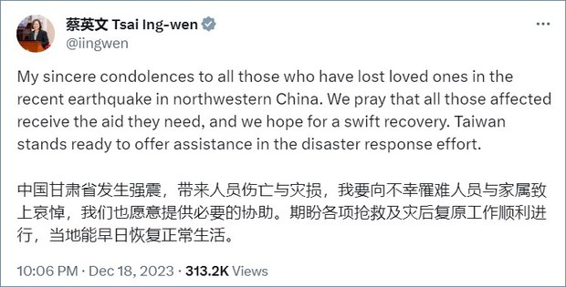  自由亚洲电台 北京时间 2023-12-20T05:48:56Z 1737228545905348711 美国多个情报机构日前发布一份共同报告，示警中国政府曾在 #2022年美国中期选举 
 期间提升相关 #介选 力度。此外，情报机构还针对中方是否会介入美国 #2024年总统大选 的问题实施调查。

https://t.co/yuzYKKTgDF https://t.co/HLH0Ds6m1B 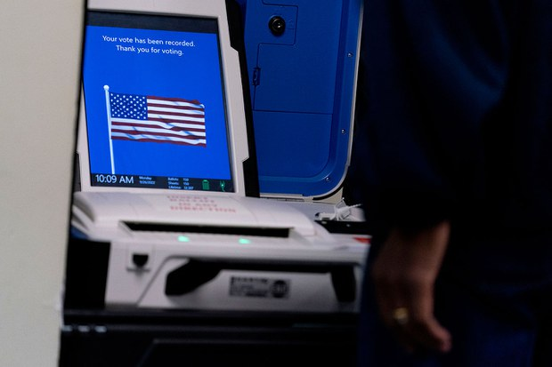  自由亚洲电台 北京时间 2023-12-20T00:53:17Z 1737154144795046282 #李家超述职  出席者阵容耐人寻味，#您怎么看？
#习近平 坐在长桌的正中间。
总理 #李强，政治局常委蔡奇和丁薛祥，统战部长石泰峰和政法委书记陈文清坐在习左边。
李家超和港澳办主任夏宝龙等人坐习右边。
https://t.co/hbPJhJC06j https://t.co/QkpYhHv5v0 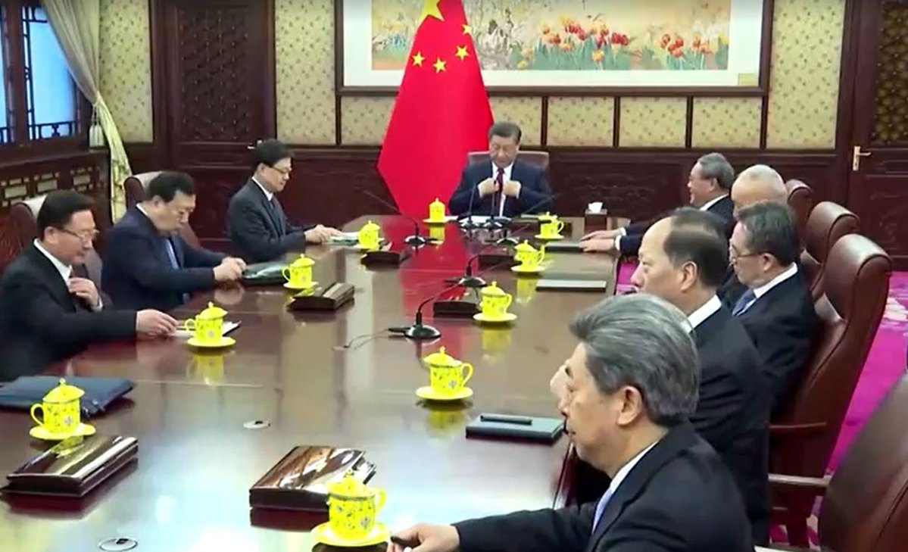  自由亚洲电台 北京时间 2023-12-20T03:03:17Z 1737186861192524254 被誉为中国“法学泰斗”、“法学界良心”的 #江平 先生本周二在北京因病逝世。江平曾出任政法大学校长，也是中国民商法学的主要奠基人之一。他一生致力于为推动中国法治化进程而呐喊的姿态，再次引发舆论缅怀。
https://t.co/7qzdfvo4kQ https://t.co/b86F1crhL2 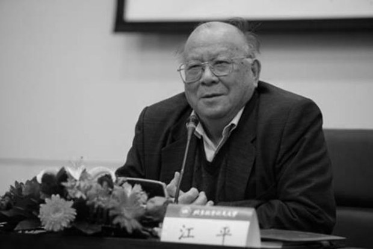  自由亚洲电台 北京时间 2023-12-20T03:19:58Z 1737191059875090902 据海外维权网19日报道，人权捍卫者、女权人士 #李翘楚 所谓煽动颠覆国家政权罪一案，当天在山东省临沂市开庭，并且只允许一位代理律师丁锡奎入场辩护。另外一位代理律师李国蓓，被法院无理拒绝进入法庭。李翘楚的父亲也只能在法庭外守候开庭结果。庭审约于北京时间下午结束，没有宣判。李翘楚遭批捕以来，家属多次申请会见均被拒绝，此次仍未获批准见面。
2020年，李翘楚因 #许志永 案被指定住所监视居住4个月后获释，但于2021年2月6日再次被带走羁押。后于2021年3月5日被批捕，并遭起诉。2023年6月曾开庭审理过一次，未判。李翘楚因患严重抑郁症，长期靠药物控制，多次申请取保候审被拒，目前被羁押于临沂市看守所。 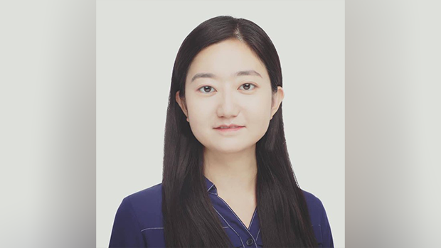  自由亚洲电台 北京时间 2023-12-20T03:39:05Z 1737195869068558383 评论 | 陈光诚 @iguangcheng：#孙林 被害案的透视效应
https://t.co/xZY2IqT38k https://t.co/ojtySAFh6I 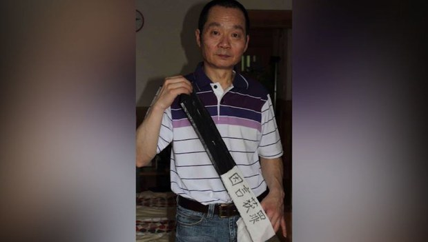  自由亚洲电台 北京时间 2023-12-20T04:08:36Z 1737203295830311268 中共 #中央经济工作会议 近日闭幕，官方媒体也连日发文，宣传相关"会议精神"。但有学者指出，当局 #禁止唱衰经济 的举动，恐将对正常的市场运作造成不利影响。
https://t.co/bAB18nASXs https://t.co/mMKUwOiFi2 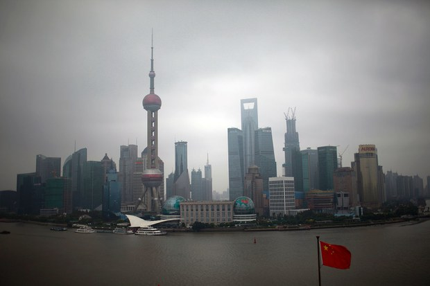  自由亚洲电台 北京时间 2023-12-20T01:29:03Z 1737163145171419280 【#变态辣椒：重要的事情说三遍】
多个国家的十多位高层官员和行内专家第三次提名维吾尔族阶下囚 #伊力哈木·土赫提 来年的 #诺贝尔和平奖，其在2020年和2023年同样被提名。现年五十三岁的土赫提因“分裂国家“罪名成立被判无期徒刑，多年来被禁止与家人联络；支持者认为当局口中所谓的罪行，其实是提倡汉族和维吾尔族之间的和平对话。 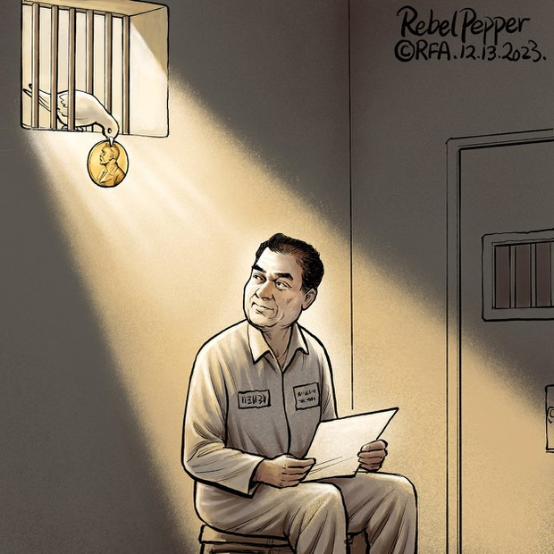  自由亚洲电台 北京时间 2023-12-20T00:16:45Z 1737144950272524757 据当地警方通报，12月13日的中国 #国家公祭日 当天，浙江省台州市一男子因身贴日本国旗并与制止群众发生争吵被警方拘留。该事件引发中国民间舆论热议。
https://t.co/itVk1VzsWl https://t.co/np54Uz4xCM 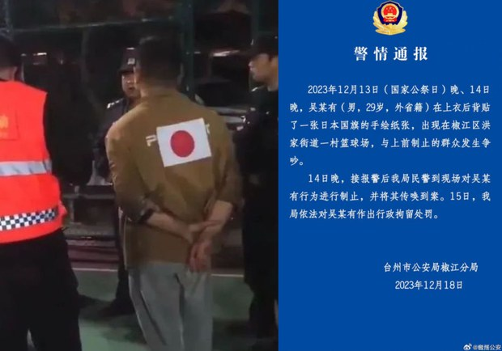  