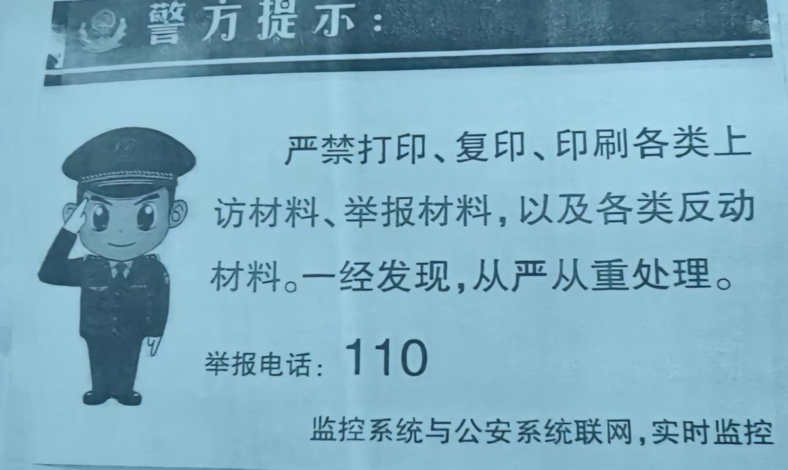

谁将十万横扫三江 北京时间 2023-12-20T19:31:35Z 1737435572183163339 RT @whyyoutouzhele: 网友投稿
12月18日，北京网友拍到墙上张贴“严禁打印、复印、印刷、各类上访材料、举报材料、以及各类反动材料“的警方提示。
引发评论区集体评论嘲讽。 https://t.co/R66mZcu76p   谁将十万横扫三江 北京时间 2023-12-20T03:47:22Z 1737197954954678661 RT @whyyoutouzhele: “确实”
2023凤凰网财经年会，经济学家管清友表示，上证指数能维持在3000点已经相当牛了。
“3000点已经不足以反映当前的基本特征，其实你要看创业板沪深300，那可比3000点惨多了。” https://t.co/zF6z0rJz87   