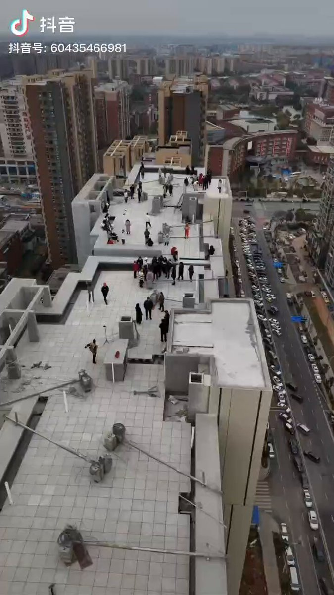
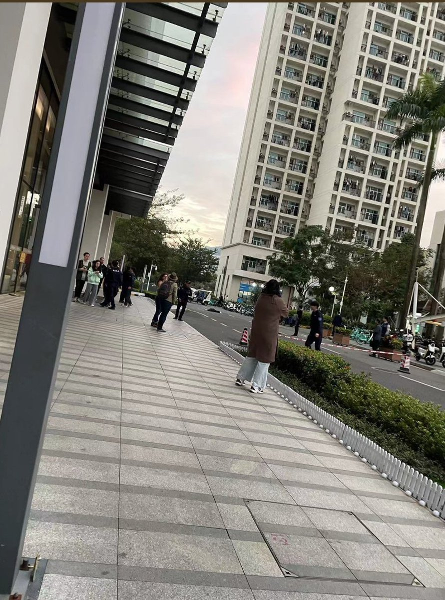
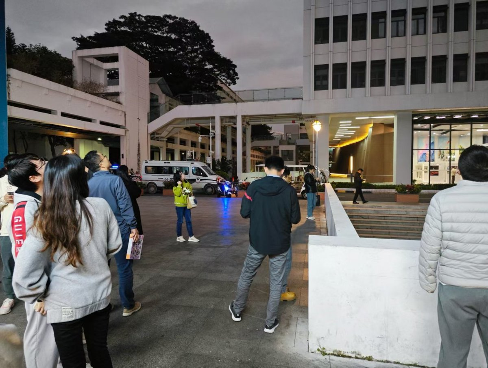
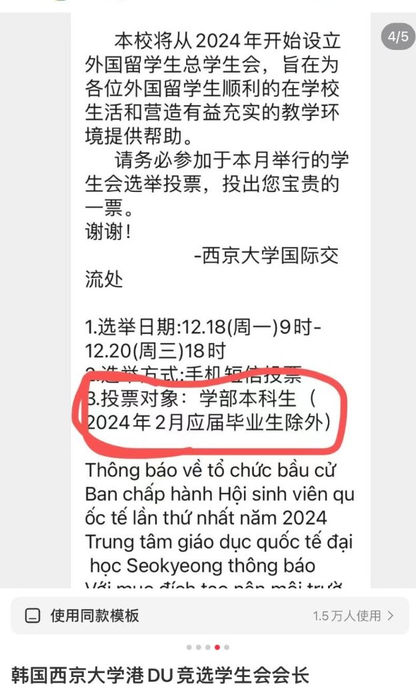

A李老师不是你老师 北京时间 2023-12-19T21:24:16Z 1737101542967116121 12月18日，长沙天心区海伦堡业主在楼顶催房维权 https://t.co/DECZ96guIe   A李老师不是你老师 北京时间 2023-12-19T19:20:10Z 1737070313769140240 12月19日下午5点左右，深圳
清华大学深圳国际研究生院一名学生跳楼 https://t.co/YvgtW2vsUZ   A李老师不是你老师 北京时间 2023-12-19T20:09:28Z 1737082720738525387 网友投稿
12月19日，山东青岛街头，一名老人静坐挂牌抗议 https://t.co/lZt1rhm6ho   A李老师不是你老师 北京时间 2023-12-19T20:21:37Z 1737085775823446058 12月19日，韩国西京大学外国人学生会会长选举，一名香港留学生因其竞选资料中未标明“中国香港”而只标识了“香港”，引起中国留学生不满，指责其是港独。 https://t.co/GYrcihzU4g   A李老师不是你老师 北京时间 2023-12-19T20:27:45Z 1737087322686947763 网友投稿
近日一段视频显示，某中学宣布由于天气寒冷，每天到班时间从早上5点50改到6点10分之前，引起同学们击掌欢呼。 https://t.co/9oCxxysvLy   A李老师不是你老师 北京时间 2023-12-19T20:30:34Z 1737088029196443683 “确实”
2023凤凰网财经年会，经济学家管清友表示，上证指数能维持在3000点已经相当牛了。
“3000点已经不足以反映当前的基本特征，其实你要看创业板沪深300，那可比3000点惨多了。” https://t.co/zF6z0rJz87   A李老师不是你老师 北京时间 2023-12-19T07:28:18Z 1736891164656025813 截至北京时间4时，甘肃临夏州积石山县6.2级地震已造成86人遇难、96人受伤。震中及周边民房和水、电、路等基础设施不同程度损坏。   A李老师不是你老师 北京时间 2023-12-19T08:05:38Z 1736900559297278126 https://t.co/Y7DzO0AGy7   A李老师不是你老师 北京时间 2023-12-19T02:57:14Z 1736822948353245467 12月19日凌晨，甘肃临夏积石山连续发生多次地震。
12月18日23时59分在甘肃临夏州积石山县发生6.2级地震，震源深度10千米。截至12月19日00时48分，共记录到余震32次，最大震级4.0级。 https://t.co/fbV5KKExbK   