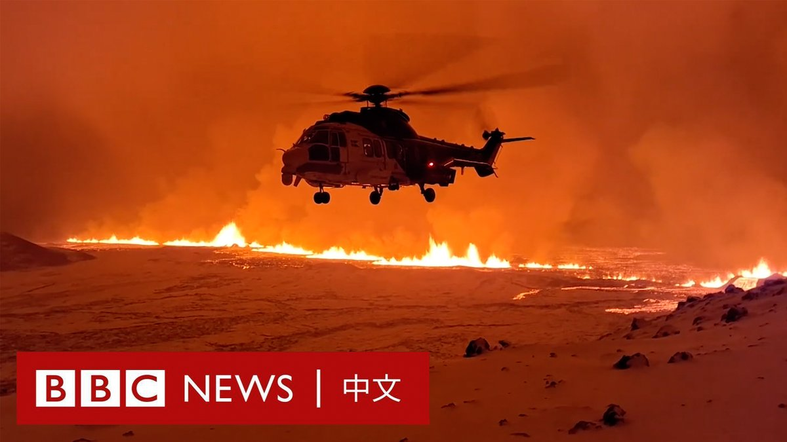
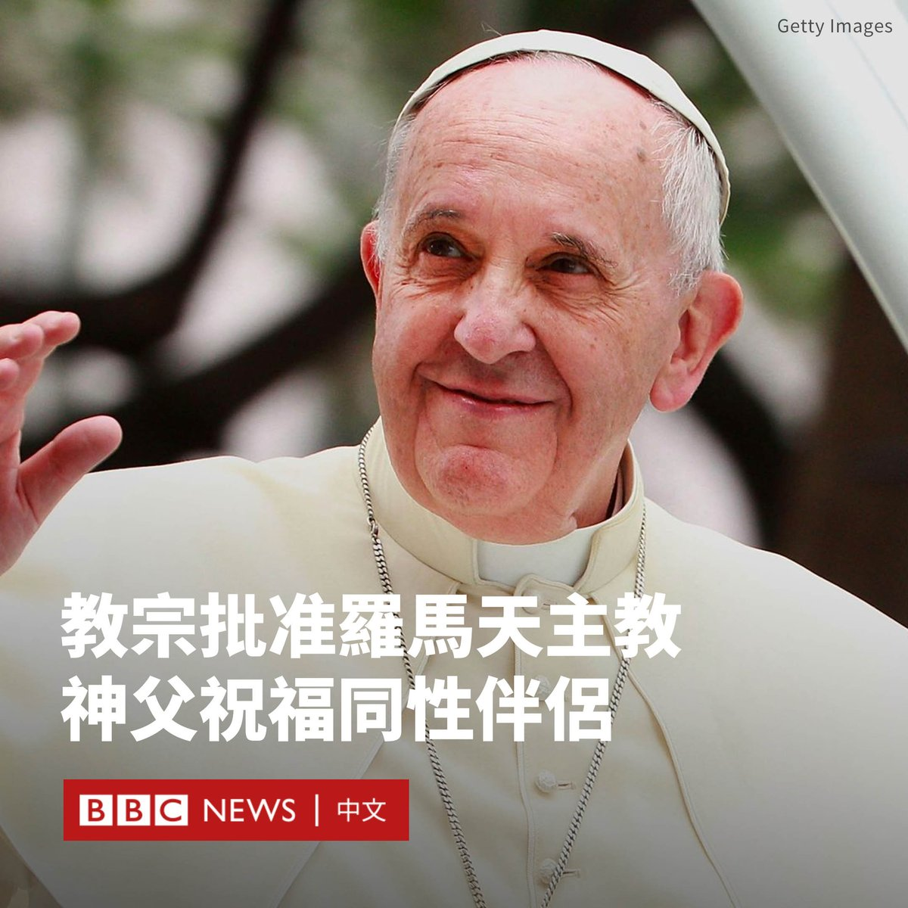
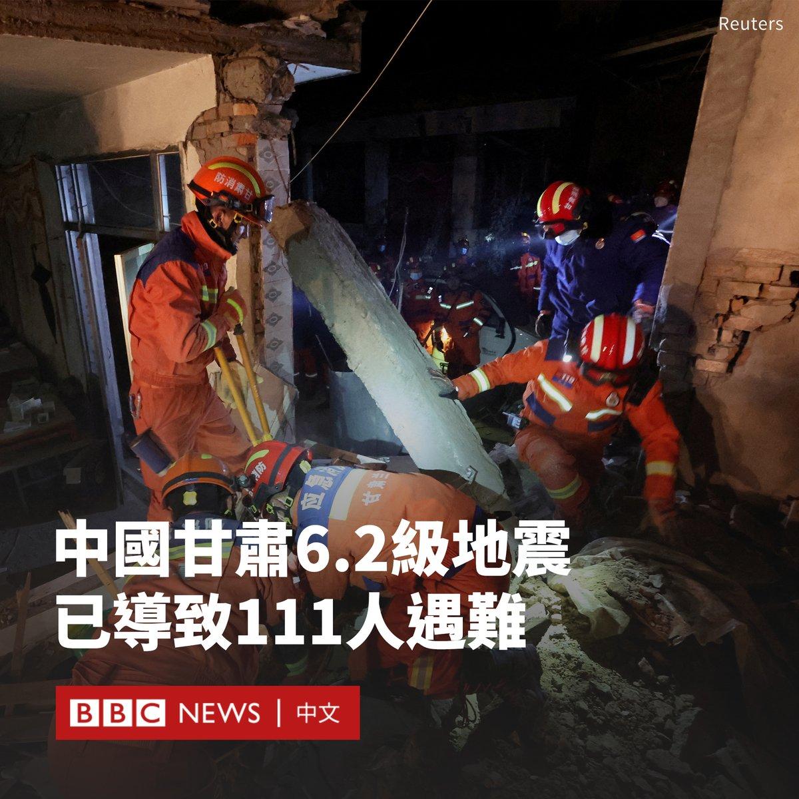

D英国广播公司BBC 北京时间 2023-12-19T18:20:13Z 1737055224425320489 在数周密集的地震活动后，冰岛西南部雷克雅内斯半岛的火山周一（12月18日）晚喷发。

此前，4000多名当地居民已经被疏散，地热温泉也已经关闭。雷克雅未克附近的凯夫拉维克国际机场仍然开放。

画面显示，熔岩从地面裂缝中喷涌而出。冰岛气象局表示，地表的裂缝长约3.5公里，仍在迅速增加。

有目击者表示，火山喷发使首都雷克雅未克一半的天空“都被红光照亮”，可以看到滚滚浓烟。   D英国广播公司BBC 北京时间 2023-12-19T16:07:48Z 1737021901631795652 中国甘肃6.2级地震已致118人遇难。此次地震的震央位于较贫困的积石山县，有分析指当地廉价的自建砖房可能是导致伤亡过高的原因。https://t.co/sl1aWacPP6   D英国广播公司BBC 北京时间 2023-12-19T14:07:01Z 1736991507717169585 教宗方济各（Pope Francis）宣布允许神父祝福同性伴侣，这对于罗马天主教会的LGBT群体来说是重要的里程碑。

梵蒂冈表示，在特定情况下，可允许神父祝福同性和“非常规”伴侣，但这不应是正式教会仪式的一部分，也不应该与民事结合或婚礼有关。

梵蒂冈表示，其仍认为婚姻是男性和女性之间的事情。

教宗方济各于周一（12月18日）批准了一份由梵蒂冈发布的文件，宣布了这项改变。

梵蒂冈表示，这应该是“上帝欢迎所有人”的标志，但文件中指出，神父必须根据具体情况做出决定。

教义部部长费尔南德斯（Víctor Manuel Fernández）总主教表示，这份新声明在“教会关于婚姻的传统教义”方面仍然“坚定”。

根据声明，接受祝福的人“不应该被要求事先达到道德完美”。

在天主教会中，祝福是一种祈祷或恳求礼仪，通常由神父进行，请求上帝对被祝福的人或人们予以善意的眷顾。

虽然天主教会没有改变根本立场，但这份声明代表了其立场上的柔化。

梵蒂冈在2021年表示，神父不能祝福同性婚姻，因为上帝不能“祝福罪恶”。   D英国广播公司BBC 北京时间 2023-12-19T10:53:49Z 1736942886665777637 据新华社报道，中国西北部甘肃临夏州积石山县发生6.2级地震，目前已造成至少111人遇难。

据报道，地震发生在当地时间周一（12月18日）23点59分，震源深度10千米。

此次地震的震央位于青藏高原北部边缘紧邻黄河的一个偏远山区，属于地壳构造活跃地区。震央距离兰州市约100公里。

地震也导致临近的青海省多地震感强烈。

地震发生时的画面显示，建筑物猛烈摇晃，很多砖石掉落在街道上。

据报道，地震引发多地山体塌方，造成道路中断，还有桥梁支座发生偏移。甘肃省官员表示，有超过4700栋房屋在地震中受损。

当地媒体播出的画面显示，官方派出救援人员在瓦砾中进行搜救。

由于当地属于高海拔地区，加上近期席卷中国北部的寒潮，当地夜间温度低，据报达到零下14°C。

据报道，当地后来又发生了多次余震。

官方媒体报道称，中国国家主席习近平作出指示，要求全力开展搜救，最大限度减少人员伤亡。

中国国务院已派出工作组前往灾区，并调拨帐篷、折叠床、棉被等救灾物资。   D英国广播公司BBC 北京时间 2023-12-19T08:21:14Z 1736904485291557275 【最新消息】据新华社报道，中国西北部甘肃临夏州周一（12月18日）晚上发生6.2级地震，目前已造成至少111人遇难。 https://t.co/jR8rfk0TwH   