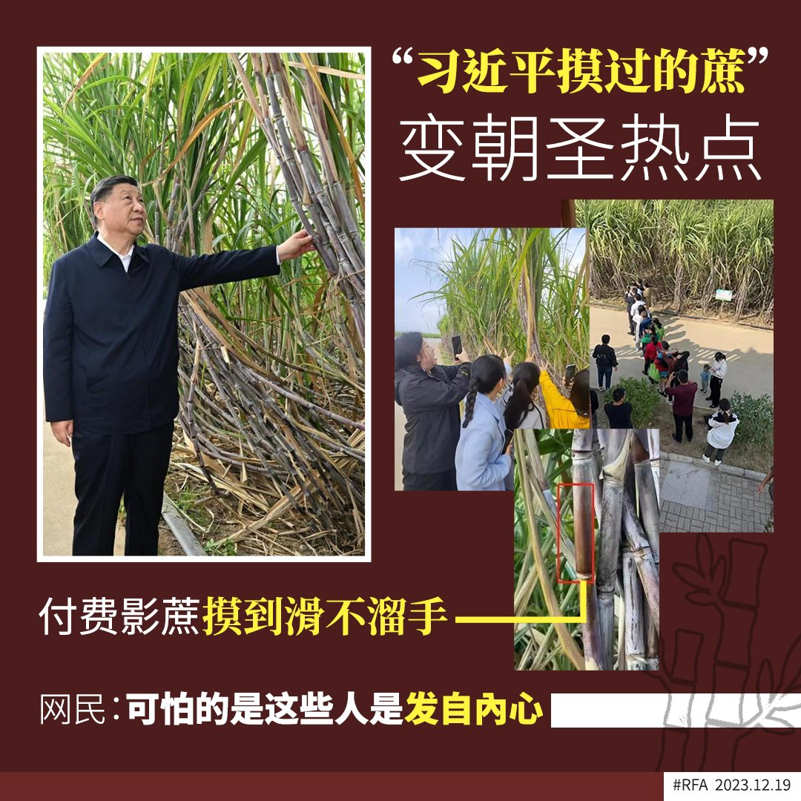
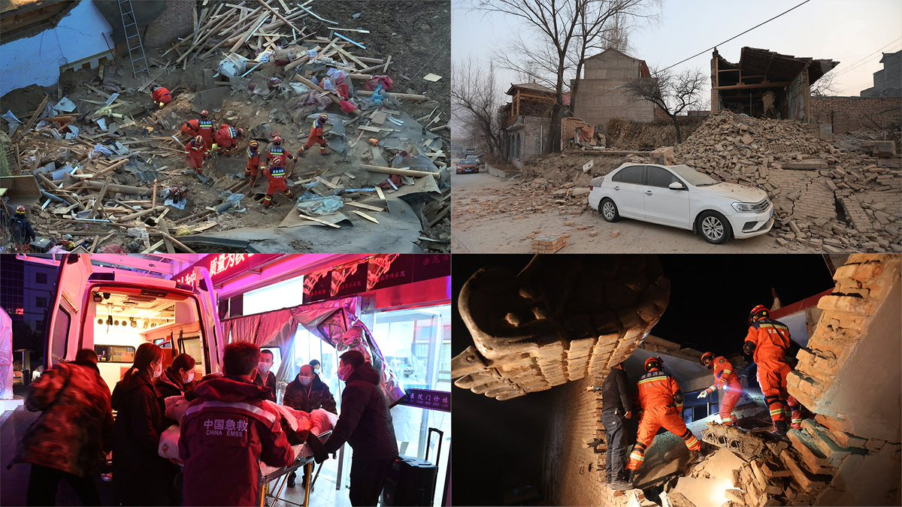
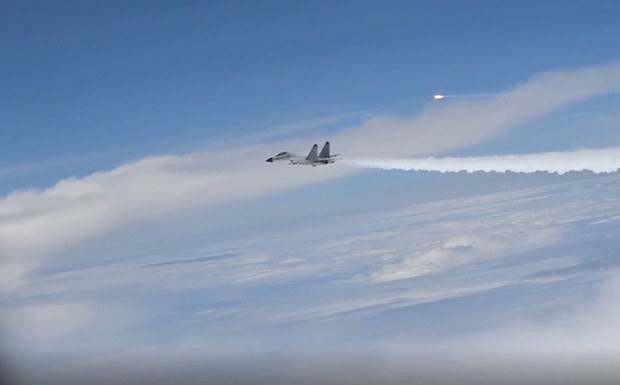
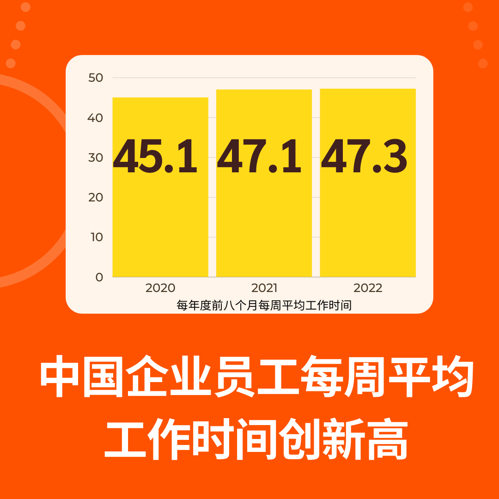
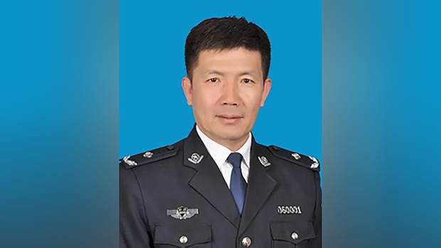
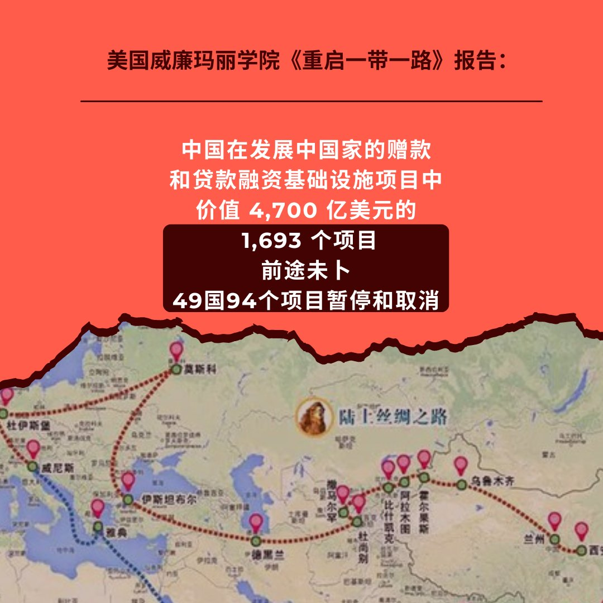
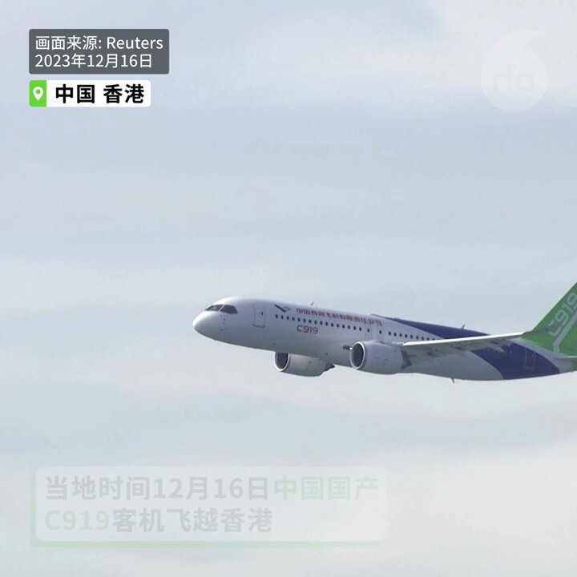

自由亚洲电台 北京时间 2023-12-19T14:35:56Z 1736998782259306726 【“习近平摸过的蔗”变朝圣热点】
【付费拍蔗 甘蔗皮被摸到光滑】
《新华社》报道，14日 #习近平 到广西来宾巿考察，在国家现代农业产业园万亩甘蔗基地，了解甘蔗良种繁殖技术，期间被他驻足摸了几摸的几棵甘蔗，立即成为当地村民“朝圣”热点，数百人排队缴交20元人民币与蔗合照，结果甘蔗表面被摸到光滑。

经常把“安全”挂嘴边的习近平谓，广西是中国蔗糖主产区，要把这项特色优势产业做强做大，为保障国家糖业安全以及促进蔗农增收致富发挥更大作用，他“祝愿乡亲们的生活和甘蔗一样甜蜜”，一旁的官员与民众随即报以喝采声。

当习近平驻足在一棵甘蔗前伸左手摸蔗的照片曝光后，大批神情兴奋的村民挤在甘蔗林四周，排队跟“习大大摸过的甘蔗”合照来沾点福气，甘蔗因此被摸个不停，原本粗糙的表皮变得光滑。当局为管理人流，特别画出排队路线并收取20元的拍蔗费。

以往习近平坐过的椅子、端详过的茶杯、用过的麦克风、毛巾等物品都成为展品，这次轮到摸过的甘蔗，不少在墙外的网友都表示难以置信，认为都快2024年了，中国竟仍有这样的个人崇拜，纷留言“看来未来要进博物馆了”、“可怕的是，这些人是发自内心的”、“这样的社会没人追求真理，只有崇拜权力”；但也人觉得那可能是一种自保的行为，“毕竟生活在丛林法则的社会，人们都想尽量靠近权力核心”。

#习近平摸过的蔗
#广西
#个人崇拜   自由亚洲电台 北京时间 2023-12-19T15:50:41Z 1737017594262253979 【甘肃积石山强震逾百人死亡】
【民眾夜半逃生大量房屋倒塌】
#甘肃 #积石山县 周一深夜发生6.2级浅层 #地震，导致当地众多民众伤亡，大量建筑物倒塌，有人被埋在倒塌的建筑物中。截至当天上午，地震造成118人遇难，360人受伤。
https://t.co/GLyeBZ2Iot https://t.co/o1V5ECAIyU   自由亚洲电台 北京时间 2023-12-19T06:29:49Z 1736876446935892000 据英国《金融时报》报道，美国印太司令部司令海军上将约翰·阿奎利诺（John Aquilino）周一（12月18日）在东京对外表示，自习近平与拜登11月中旬在旧金山会晤以来，中国战机已经几乎停止了对美国军机的危险拦截行动。
https://t.co/oASu1fbVhe https://t.co/VSpyZWJTgE   自由亚洲电台 北京时间 2023-12-19T11:23:45Z 1736950418390094324 【甘肃6.2强震 逾百人罹难】
【房屋倒塌严重 零下12度救灾困难】
#甘肃 省临夏州 #积石山县 18日深夜11时59分发生规模6.2 #强震，灾情波及邻省青海。地震已致甘肃105人遇难，186人受伤。青海则有11人遇难。 https://t.co/P3u7yEwDQC   自由亚洲电台 北京时间 2023-12-19T11:40:24Z 1736954607861960838 RT @RFA_Chinese: 【C919客机飞越维港】
12月16日，中国国产 #C919客机 首次飞越香港维多利亚港，吸引了众多航空爱好者和媒体。这架由中国商飞公司研制的飞机于上午10点30分（0230GMT）从香港国际机场起飞。 据民航处称，这架飞机从西边进入，两次飞越…   自由亚洲电台 北京时间 2023-12-19T11:41:54Z 1736954984770510886 RT @RFA_Chinese: 欢迎收听和订阅播客【＃亚太报道】 https://t.co/MjLNSvVMqc
香港法院审理 #黎智英 案；中国“#改革开放”45周年；社科院专家呼吁“帮一把”生娃；中国网红“踢馆”日本餐厅；#中国气球 逾越 #台海。 https://t.c…   自由亚洲电台 北京时间 2023-12-19T06:34:21Z 1736877587916574826 【#您怎么看】 近日，中国国务院新闻办公室对外表示，今年十一月份，全国企业就业人员每周平均工作时间为48.9小时，这一数字平均到每周五天工作的话，相当于每天9.78小时。这一数据又一次创下了二十年来的新高。对此，您怎么看？ https://t.co/ES5Jt2lTcb   自由亚洲电台 北京时间 2023-12-19T08:58:15Z 1736913804251013455 欢迎收听和订阅播客【＃亚太报道】 https://t.co/MjLNSvVMqc
香港法院审理 #黎智英 案；中国“#改革开放”45周年；社科院专家呼吁“帮一把”生娃；中国网红“踢馆”日本餐厅；#中国气球 逾越 #台海。 https://t.co/Pn62dWLQh0   自由亚洲电台 北京时间 2023-12-19T06:26:52Z 1736875704317604334 专栏 | #夜话中南海：新被美国制裁的涉疆中共官员之一：#伊犁 恶警 #高琪
https://t.co/BNub9eKgcq https://t.co/CNU043xmZ8   自由亚洲电台 北京时间 2023-12-19T06:31:36Z 1736876896267419750 【#您怎么看】 近日，美国威廉玛丽学院援助数据研究实验室（AidData）发布《重启一带一路》报告中指出，在不包括利息的情况下，中国在全球范围内的应收账款已经达到约1.1万亿美元，80%的贷款流向了陷入财务困境的国家。报告中还这样说： https://t.co/HrM6oIKgO9   自由亚洲电台 北京时间 2023-12-19T06:51:16Z 1736881845491617938 评论 | 魏京生 @WEI_JINGSHENG：#自由贸易 还能忽悠人吗？
https://t.co/19TuOsLkgS https://t.co/58yLgRVuQS   自由亚洲电台 北京时间 2023-12-19T09:19:30Z 1736919149627248717 【C919客机飞越维港】
12月16日，中国国产 #C919客机 首次飞越香港维多利亚港，吸引了众多航空爱好者和媒体。这架由中国商飞公司研制的飞机于上午10点30分（0230GMT）从香港国际机场起飞。 据民航处称，这架飞机从西边进入，两次飞越维多利亚港，高度分别为1,500英尺和1,000英尺。
你会坐C919吗？ https://t.co/I5Mj7YiS0w   自由亚洲电台 北京时间 2023-12-19T04:59:55Z 1736853825661858117 今年12月18日是中国经历数十年政治动乱后被迫进入"#改革开放"的四十五周年。虽然中共现任领导人 #习近平 自称致力于深化改革，但当局针对社会的全方位管控也日益加剧。中国由 #邓小平 开启的这条所谓"改革开放"路线能否持续正受到外界质疑。
https://t.co/38HwLzLqcw https://t.co/WZCRydPIjO   自由亚洲电台 北京时间 2023-12-19T05:01:09Z 1736854136027771163 美国《华尔街日报》周一（12月18日）发表文章指出，虽然中国上周五公布的11月份经济数据有所好转，但其数据一团乱麻，需谨慎对待。
https://t.co/yx2TjjVrnM https://t.co/YhGQXLgWgR   自由亚洲电台 北京时间 2023-12-19T05:24:47Z 1736860082187759913 #中国民主党 12月16日下午于洛杉矶当地中领馆外举行了呼吁中国当局停止迫害政治犯 #牛腾宇 及其母亲可可并要求中国当局立即释放牛腾宇的集会活动。
https://t.co/rnEcqAXJZO https://t.co/1l3HMVlcnN   自由亚洲电台 北京时间 2023-12-19T05:28:51Z 1736861106734596394 为确保 #2023年亚运会 安全，杭州市警方建立了一个追踪维吾尔大学生的项目，以“预测和控制”与“恐怖主义”相关的人员，并对任何“异常行为”自动报警。被视为“异常”的行为包括某些类型的购买、VPN使用、在线沟通，甚至在未指定的宗教中心聚会。
https://t.co/0vazmrriEj https://t.co/HdH8pbUN2y   自由亚洲电台 北京时间 2023-12-19T02:43:11Z 1736819415461900330 近日，日本东京一家中华料理店因张贴"禁止中国人和韩国人入内"的标语，有中国网红前来"踢馆"，双方发生争执。事态一出，掀起舆论热议。该事件缘何而起，双方矛盾又为何进一步激化？
#中华西太后
https://t.co/Uzkp5JhrNi https://t.co/OW9F7oaoMy   自由亚洲电台 北京时间 2023-12-19T03:18:46Z 1736828366848930124 香港《壹传媒》创办人 #黎智英 涉嫌违反《港版国安法》案件正在法庭审理，加拿大两大反对党纷纷呼吁港府释放黎智英。加拿大香港组织也发声明，支持黎智英和香港民主自由，一些艺术家和团体透过新年挂历筹款，帮助被囚禁在香港的政治犯。

https://t.co/VNdHC6XAva https://t.co/vhB11ZZI1J   自由亚洲电台 北京时间 2023-12-19T01:01:19Z 1736793777602441454 在 #台湾大选 即将来临之际，中国介入台湾选举的问题持续受到舆论关注。台湾检方近日也约谈了多达四十一名涉及接受中方招待赴对岸旅游的 #里长。有一个团队的4名里长才刚下飞机，就遭约谈。 https://t.co/hSTaem1jYI   自由亚洲电台 北京时间 2023-12-19T01:53:46Z 1736806975915405814 据美国《华尔街日报》报道，多年来，花旗集团(Citigroup)、摩根大通(JPMorgan)等外资银行为争取 #中国高净值人群 的业务展开激烈竞争，帮助这些客户购买香港股票、美国房地产和欧洲藏画。但随着中国大陆经济和香港股市疫情以来的不断下行，这些银行的业务模式受到了冲击。
https://t.co/8HNXtbTgLs https://t.co/MzMEI1GHDr   自由亚洲电台 北京时间 2023-12-19T00:19:49Z 1736783333718479176 台湾的国防部继十天前发布消息披露，中方在12月7日施放一枚空飘气球逾越海峡中线之后，18日再次发现有2枚 #中方空飘气球 逾越 #台海中线。这已是本月 以来，台湾发现的第三起中方气球逾越台海中线事件。

https://t.co/NtYgDC8sIe https://t.co/De8Apr9Q8l   