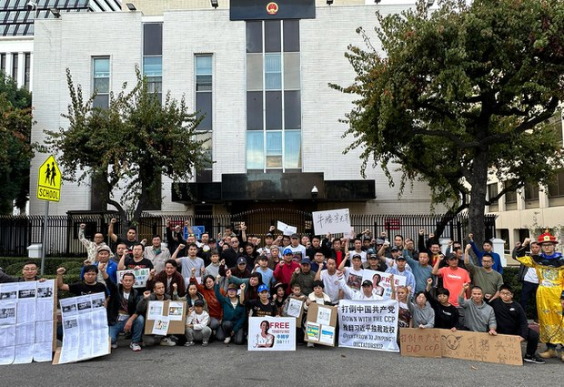
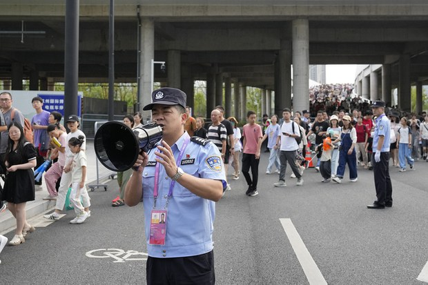
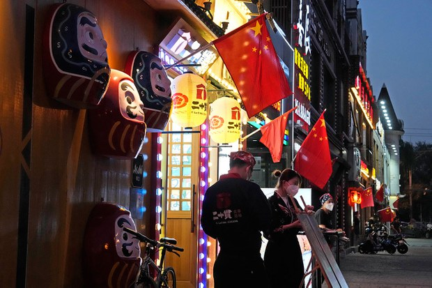
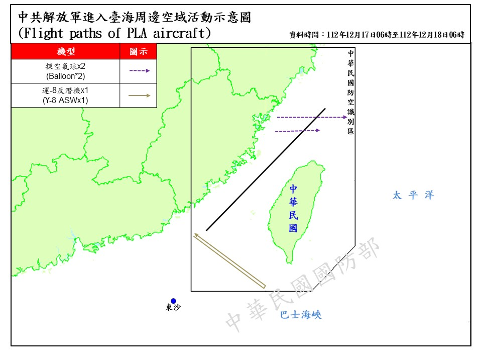

自由亚洲电台 北京时间 2023-12-19T05:24:47Z 1736860082187759913 #中国民主党 12月16日下午于洛杉矶当地中领馆外举行了呼吁中国当局停止迫害政治犯 #牛腾宇 及其母亲可可并要求中国当局立即释放牛腾宇的集会活动。
https://t.co/rnEcqAXJZO https://t.co/1l3HMVlcnN   自由亚洲电台 北京时间 2023-12-19T05:28:51Z 1736861106734596394 为确保 #2023年亚运会 安全，杭州市警方建立了一个追踪维吾尔大学生的项目，以“预测和控制”与“恐怖主义”相关的人员，并对任何“异常行为”自动报警。被视为“异常”的行为包括某些类型的购买、VPN使用、在线沟通，甚至在未指定的宗教中心聚会。
https://t.co/0vazmrriEj https://t.co/HdH8pbUN2y   自由亚洲电台 北京时间 2023-12-19T02:43:11Z 1736819415461900330 近日，日本东京一家中华料理店因张贴"禁止中国人和韩国人入内"的标语，有中国网红前来"踢馆"，双方发生争执。事态一出，掀起舆论热议。该事件缘何而起，双方矛盾又为何进一步激化？
#中华西太后
https://t.co/Uzkp5JhrNi https://t.co/OW9F7oaoMy   自由亚洲电台 北京时间 2023-12-19T03:18:46Z 1736828366848930124 香港《壹传媒》创办人 #黎智英 涉嫌违反《港版国安法》案件正在法庭审理，加拿大两大反对党纷纷呼吁港府释放黎智英。加拿大香港组织也发声明，支持黎智英和香港民主自由，一些艺术家和团体透过新年挂历筹款，帮助被囚禁在香港的政治犯。

https://t.co/VNdHC6XAva https://t.co/vhB11ZZI1J   自由亚洲电台 北京时间 2023-12-19T01:01:19Z 1736793777602441454 在 #台湾大选 即将来临之际，中国介入台湾选举的问题持续受到舆论关注。台湾检方近日也约谈了多达四十一名涉及接受中方招待赴对岸旅游的 #里长。有一个团队的4名里长才刚下飞机，就遭约谈。 https://t.co/hSTaem1jYI   自由亚洲电台 北京时间 2023-12-19T01:53:46Z 1736806975915405814 据美国《华尔街日报》报道，多年来，花旗集团(Citigroup)、摩根大通(JPMorgan)等外资银行为争取 #中国高净值人群 的业务展开激烈竞争，帮助这些客户购买香港股票、美国房地产和欧洲藏画。但随着中国大陆经济和香港股市疫情以来的不断下行，这些银行的业务模式受到了冲击。
https://t.co/8HNXtbTgLs https://t.co/MzMEI1GHDr   自由亚洲电台 北京时间 2023-12-19T00:19:49Z 1736783333718479176 台湾的国防部继十天前发布消息披露，中方在12月7日施放一枚空飘气球逾越海峡中线之后，18日再次发现有2枚 #中方空飘气球 逾越 #台海中线。这已是本月 以来，台湾发现的第三起中方气球逾越台海中线事件。

https://t.co/NtYgDC8sIe https://t.co/De8Apr9Q8l   