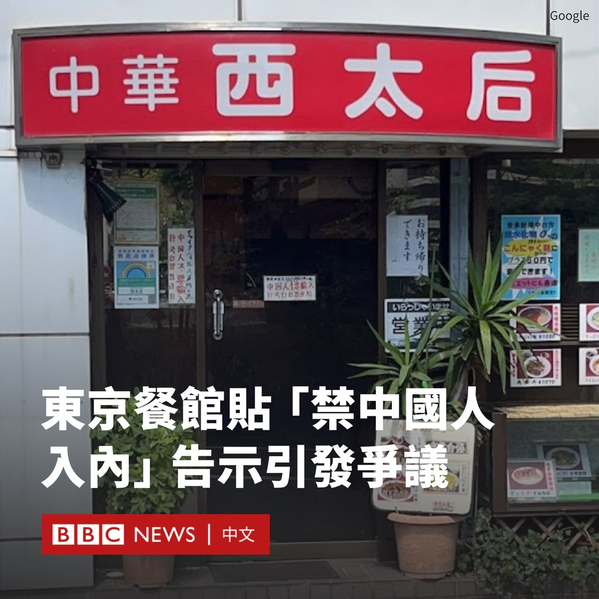
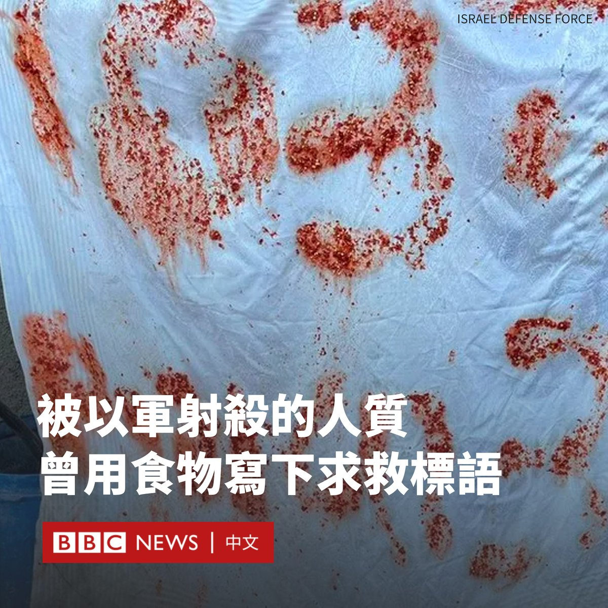
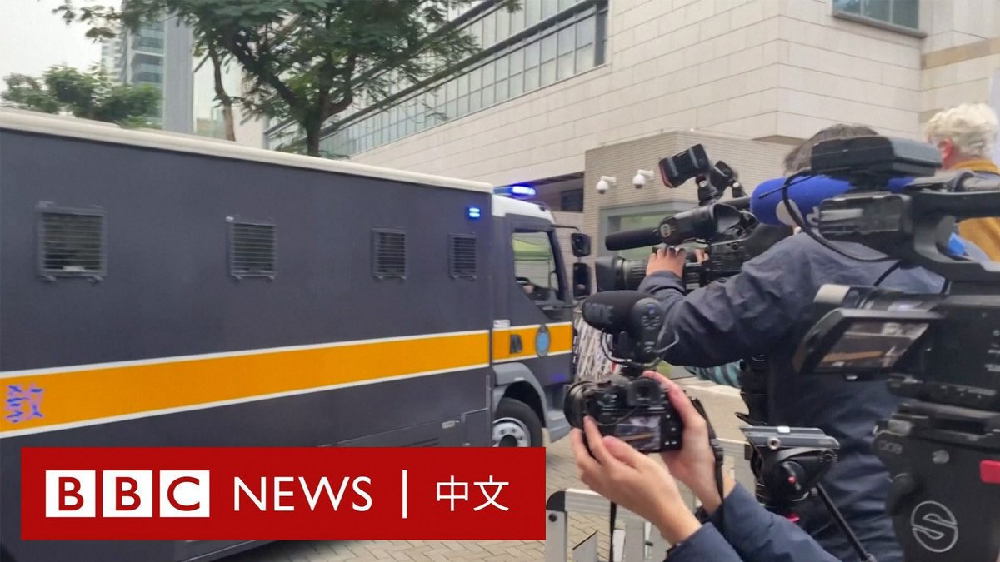
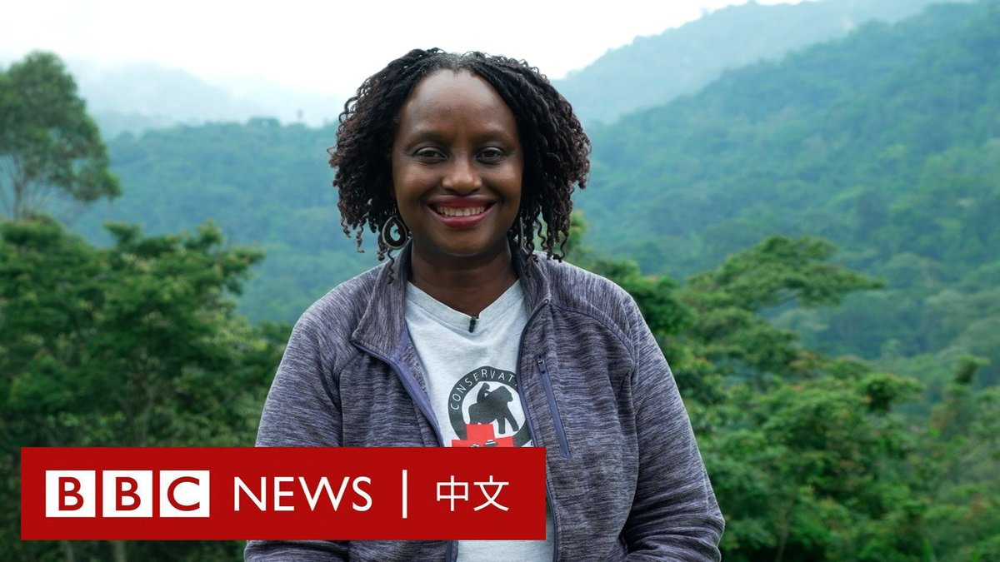

D英国广播公司BBC 北京时间 2023-12-18T18:29:09Z 1736695088305369577 在日本东京，一家中华料理店因张贴“禁止中国人入内”的告示，在过去几天成为一场交锋的中心。

这家位于东京中野区的餐馆名为“西太后”。照片显示，该店曾在门口贴了一张纸，上面用日语写有“为预防中国病毒”，并写有“中国人不要输入”的中文，以及“韩国人禁止入店”的韩文。

据中国官方媒体《环球时报》报道，拥有百万粉丝的视频博主“油头四六分”最早在12月9日发布影片，指责该餐馆的行为属于仇恨言论。

影片中，这名博主走进店中与老板争执，认为这一做法违法，但老板要求他离开，他随后报了警。

警察到来后表示，仅能将他的意见转达给店家，而无权强制店家撤下标语。该博主随后称向中国驻日本大使馆、东京法务局等机构申诉。

一些在日本的中国内容生产者也加入去该店与老板交涉的行列。在一段影片中，名为“东瀛小野亮”的博主将一大包日圆纸钞扔在店门口，并称要让店主“这辈子都给中国人炒饭”。

这些影片在中国社交媒体引发轩然大波。许多中国网民批评该店铺的行为是“种族歧视”，还有人质疑“为何讨厌中国还要开中餐馆”。

不过，也有网友批评一些行为浮夸的网红在借机“博眼球”、“假装爱国”。

据报导，在该事件后，这家店收到了很多骚扰电话。警方在该店周围加强了安保。

在中日关系恶化的背景下，还有一些日本政客和民众前往该店表示支持。

据报导，该店目前已撤下这个引发争议的标语，但改贴有包括“香港独立”与“8964”等字样的海报与贴图。

在一份新贴出的中文告示中，这家店主表示，由于其“妻子身体不好，为了预防感染”，谢绝刚抵日本的中国人入内，但欢迎长居日本的中国人进店。   D英国广播公司BBC 北京时间 2023-12-18T19:34:58Z 1736711650403860784 香港壹传媒创办人黎智英周一（12月18日）开审，是香港国安法下首例被控“外国势力勾结罪”的审判。

据BBC中文记者现场观察，身穿灰色西装的黎智英在犯人栏内被狱警包围。审讯以英语进行。
https://t.co/6ZholYuPnY   D英国广播公司BBC 北京时间 2023-12-18T14:17:55Z 1736631859977859367 以色列称，上周五（12月15日）在加沙遭以军士兵误杀的三名以色列人质曾用吃剩下的食物书写求救标语。

以色列国防军称，这些人已在遭枪杀地点附近的建筑物里呆了“一段时间”。

据信，加沙地带仍有大约120名人质被哈马斯和其他巴勒斯坦武装组织扣押。以色列正面临越来越大的压力，要求其与这些组织达成协议以让更多人质获释。

这三名人质分别是28岁的尤塔姆·海姆（Yotam Haim）、22岁的萨马·塔拉尔卡（Samer Talalka）和26岁的阿隆·沙姆里兹（Alon Shamriz）。

他们于周五在加沙城的西杰亚（Shejaiya）街区被杀。当时，以色列军队正在与哈马斯进行交火。

以色列官员承认，其士兵杀害手持白旗的三人违反了“交战规则”。

据一位不愿透露姓名的以色列军方官员称，这些人赤膊从一栋大楼里出来，其中一人拿着一根缠有白布的棍子。

这位官员补充说，其中一名士兵感到受到威胁，指称他们是“恐怖分子”并开枪。两人立即死亡，第三人受伤后返回楼内。

该官员说，在听到希伯来语的呼救声后，指挥官曾命令部队停火，但受伤的人质后来再次出现，遭到枪杀。

目前尚不清楚这三名人质是被绑架者抛弃还是逃跑出来。

以色列国防军周日（12月17日）表示，已对该建筑进行了搜查，发现织物上写着“SOS”和“救命，3名人质”的字样。

10月7日哈马斯对以色列南部发动袭击，造成约1200人死亡，另有200多名人质被劫持并带到加沙。

以色列发起了大规模报复行动，称其目的是摧毁哈马斯。哈马斯控制的加沙卫生部称，加沙已有超过18,000人在以色列的报复行动中丧生。   D英国广播公司BBC 北京时间 2023-12-18T11:19:04Z 1736586850536706057 【现场画面】香港亲民主派媒体大亨黎智英被控“串谋勾结外国势力”案在西九龙法院开审。

76岁的黎智英自2020年12月以来一直被羁押，如果罪名成立，他可能会被判终身监禁。

随着案件开审，法院外已戒备森严。据报道，预计此案审讯将持续80日。该案不设陪审团，由三名国安法指定法官审理。 https://t.co/ZoooUQDpd8   D英国广播公司BBC 北京时间 2023-12-18T12:23:36Z 1736603091234164873 乌干达以山地大猩猩而闻名，但由于气候变化导致的栖息地流失，这种濒危动物面临灭绝的危险。

格拉迪斯·卡莱马-齐库索卡（Gladys Kalema-Zikusoka）是一名保育者，她通过近30年的努力，成功将山地大猩猩的数量从300只增加到500只左右。 https://t.co/l40QEFMRBY   