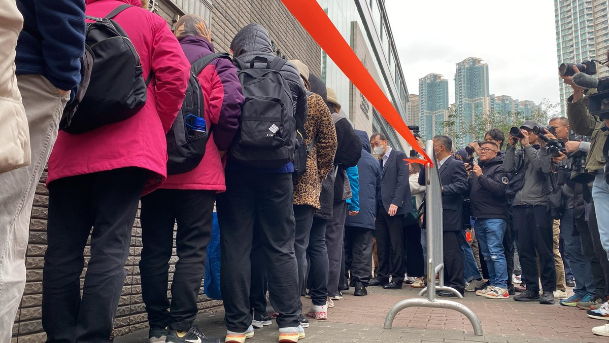
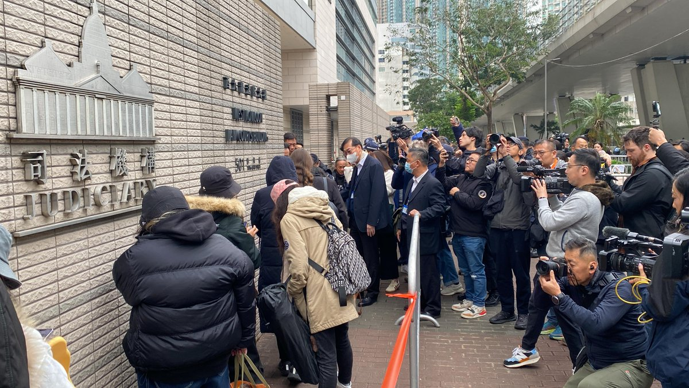
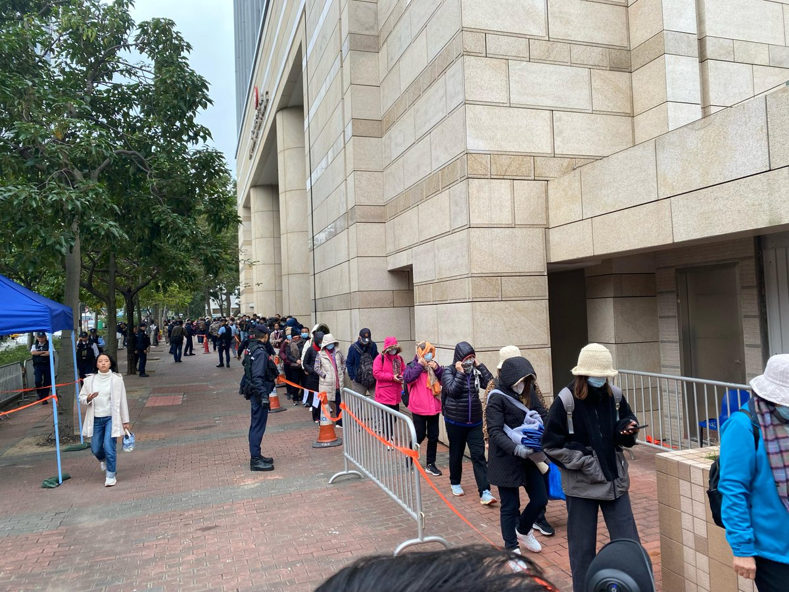
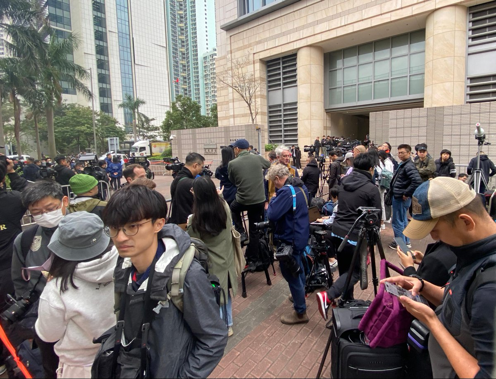
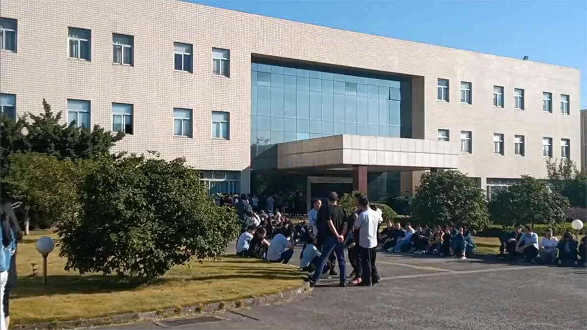
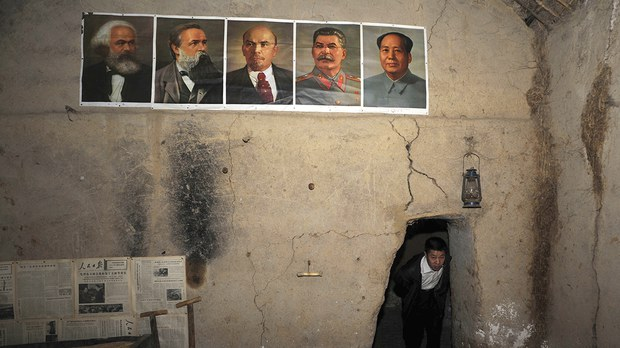

自由亚洲电台 北京时间 2023-12-18T10:30:48Z 1736574706529300647 【黎智英案开审市民记者冒寒排队】
【港警法院外荷枪实弹 严密布防】
壹传媒创办人 #黎智英、《苹果日报》3间公司及6名　《苹果日报》前高层，被控串谋勾结外国或境外势力危害国家安全罪、以及串谋发布煽动刊物罪，周一（18日）开审，预计审讯80日。本案不设陪审团，由3名《国安法》指定法官杜丽冰、李素兰及李运腾审理。

黎智英另外被控两项违反《国安法》控罪，包括与李宇轩等人串谋勾结外国或境外势力罪，以及勾结外国或境外势力罪。涉案的壹传媒前高层等人先前已认罪，部分人会在黎智英案以“从犯证人”身份作供。

案件借用西九龙裁判法院审理，警方现场布防严密，在西九龙裁判法院一带所有马路出入口均布满十多辆警车，装甲车亦在西九法院大楼门外驻守，记者目测至少数百名警力，包括俗称PTU的机动部队。现场架设铁马和雪糕筒等，附近路段十字路口、西九龙法院大门外，有不少私家车和的士被截查，警方安排警犬、金属探测同埋反光镜仔细搜查车辆。

由于法院旁听座位有限，周日（17日）下午已有传媒冒寒提前到法院外通宵排队。在案件开审前两至三个钟，亦已有大约20、30名市民排队等待入场旁听；另超过100名记者在现场采访，当中大部分人通宵等候。记者只能够在指定采访区内采访，当有大批记者一齐采访的时候，隔几分钟就有大批警员将记者赶入采访区内。

另外现场有多位包括纽西兰、澳洲、瑞士、加拿大、美国和英国的领事馆人员到场排队旁听，不过他们不愿意透露姓名和表达任何意见，要求记者询问领事馆方面回应；天主教香港教区荣休主教陈日君枢机亦在早上9点左右到场。所有旁听人士及司法人员入法庭前，需接受安检。

基于案件受公众关注，司法机构作出特别安排，除了审讯正庭，亦开放法院大楼另外两个法庭及四楼法庭延伸区，让公众及传媒以视像直播旁听，大楼八楼陪审员集合处亦会设有旁听案件的公众席，公众入庭票总数超过300张。

#苹果日报
#国安法
#无陪审团   自由亚洲电台 北京时间 2023-12-18T06:23:08Z 1736512379985293554 台湾大选在即，美国 #国防安全合作局 周五宣布，总额约3亿美元的新一轮军售设备将用于维持台湾“迅安系统”。有学者表示，美方此举是在向 #台海两岸 释放信号。
详阅：
https://t.co/1MKZmUU6U8   自由亚洲电台 北京时间 2023-12-18T04:28:13Z 1736483460183621961 RT @RFA_Chinese: 【悬赏500万通缉民主人士，呼吁周庭回头是岸】
香港 #国安署 公布新通缉名单，承诺每捉拿一名通缉犯会悬赏100万，又称 #周庭 尚未正式成为逃犯，还有机会返港报到。
最新追捕的五人当中，首次有美国公民 #邵岚。华盛顿谴责中国试图在海外实施国安…   自由亚洲电台 北京时间 2023-12-18T04:51:56Z 1736489425310200308 【镇压藏文化新举措: 派警监视宗教节日参加者】
西藏 “燃灯日”期间，#拉萨 警察出动了部队，禁止信徒聚集，并限制寺庙参观。而 #玉树 四藏人则因展出“玛尼石”雕刻遭逮捕。
详阅：
https://t.co/YKyq0A6dGB   自由亚洲电台 北京时间 2023-12-18T05:16:43Z 1736495664920432687 【劳工通讯 | 杭州工人罢工，终获偿金】 #钱塘区 下沙经济开发区 #得力纺织 有限公司因搬厂补偿金引发罢工, 大批职工聚集厂区。一周后，厂方妥协，发布《关于补偿方案的公告》，承诺对被解雇员工作补偿。
详阅：
https://t.co/hqPofRKrPT https://t.co/DUvLBbXdgn   自由亚洲电台 北京时间 2023-12-18T05:37:33Z 1736500908697981201 维吾尔教育家与诗人 #阿卜都赛买提·肉孜 被证实在新疆狱中死亡，当局告诉其亲属，他没有受酷刑，并已将他的遗体直接运到墓地埋葬。
详阅：
https://t.co/eRQwzlULZH   自由亚洲电台 北京时间 2023-12-18T05:49:55Z 1736504018891940341 【军事无禁区：美军援台四大后勤难题】
"打仗在某种意义上说就是打后勤，正所谓兵马未动，粮草先行。美国若要协防台湾，抗击中国入侵，最困难的也是后勤问题"。
详阅：
https://t.co/P4ykU9j7Fm   自由亚洲电台 北京时间 2023-12-18T06:01:39Z 1736506973883875747 【金正日去世12周年，朝鲜发射短程导弹】
导弹飞行约570公里后坠落东部海域。这也是时隔26天后，朝鲜再次发射弹道导弹，可能是针对当天停靠釜山的美国海军 #弗吉尼亚级 核动力攻击型潜艇“#密苏里”号SSN-780。
详阅：
https://t.co/PILyuOpKip   自由亚洲电台 北京时间 2023-12-18T00:59:15Z 1736430869575782856 RT @RFA_Chinese: 评论 | #余杰：马恩列毛习，五大魔头聚首大学课堂
https://t.co/A8LHZzxMN8 https://t.co/JcFwil0j6R   自由亚洲电台 北京时间 2023-12-18T00:59:34Z 1736430952241373425 RT @RFA_Chinese: 【#您怎么看】 12月15日，中国国家安全部官微发文，称经济安全是国家安全的重要组成部分，唱衰中国经济是对中国特色社会主义制度及道路进行攻击、否定。您赞成该说法吗？您对中国的前景还持乐观态度吗？ https://t.co/4fjxAI7eva   自由亚洲电台 北京时间 2023-12-18T01:00:17Z 1736431131665301602 RT @RFA_Chinese: 仅今年11个月，就有近7千家 #农家乐倒闭。
贵阳曾经营农家乐的黄先生说，农家乐诞生超过二十年，如今纷纷倒闭，其真实原因并非因为品质差和宰客，而是消费者迅速减少，经营环境恶化所造成：“现在只有退休的老人，特别是刚退休的人还可以消费。现在百货商场…   自由亚洲电台 北京时间 2023-12-18T01:06:27Z 1736432683306131937 RT @RFA_Chinese: 【台湾141架F16V全部升级完毕，能对抗中国歼10歼11歼16吗？｜#兵家常事】
12月3号，台湾最后一架F16V战机完成飞行测试，至此，台湾空军全部141架F 16 AB型战斗机都成功升级为F 16V。有人说F16是老战斗机，那么F 16V…   自由亚洲电台 北京时间 2023-12-18T01:19:19Z 1736435921052910020 【日本-东盟通过130项合作计划，避谈中国】
#ASEANJapan50 成员国首脑在 #东京 召开峰会, 强调各方尊重法治、加强 #海洋主权 安保合作。但联合声明避开南海问题，也没提及中国霸权主义行动。
详阅：
https://t.co/HGoc239EWH   自由亚洲电台 北京时间 2023-12-18T01:44:03Z 1736442145064591586 【安徽教会成员以“诈骗罪”刑拘，期满未释】合肥 #甘泉教会 多位教徒遭刑事拘留，15天期满后未获释，家属也无法探视，相关人员或面临起诉风险。
详阅：
https://t.co/MSfEH9d5os   自由亚洲电台 北京时间 2023-12-18T02:54:15Z 1736459811326181687 【高耀洁追思会美国举行，中国官媒只字不提】
民间组织“#中国妇权”及“#基督徒公义联盟”在纽约举办悼念会以表达对高耀洁的敬仰。#高耀洁 揭发河南“血浆经济”大量传播艾滋病，遭中国政府监控。2009年成为历年逃离中国流亡者中年纪最大的一人。
详阅：
https://t.co/BXvALWluzb   自由亚洲电台 北京时间 2023-12-18T03:27:30Z 1736468178476147048 【南海谈判无进展，菲称中国“真正的挑战”】
正在参加日本和东盟（#ASEAN）峰会的菲律宾总统 #马科斯 接受 #日本 媒体专访时表示，菲律宾与中国虽已恢复有关共同勘探南海油气的讨论，但谈判“几乎没有取得任何进展”。
详阅：
https://t.co/UfoKdMtDAh   自由亚洲电台 北京时间 2023-12-18T04:02:57Z 1736477101786648791 【年终回顾：二O二三年的中国政治末路】
“2023年即将过去，在这一年的中国政治领域中，不仅承袭了2022年的诸多乱象，并进一步出现了许多重大创新, 正在末路狂奔”。— 《#中国透视》
详阅：
https://t.co/UMcALo6BvK   自由亚洲电台 北京时间 2023-12-18T00:41:42Z 1736426454739489196 【李翘楚“颠覆国家政权”案12月19日开庭】
女权活动人士 #李翘楚 长期关注 #中国劳工 及民间维权等议题：曾协助在2017年遭北京“清理低端人口”运动驱赶的民众；又曾参与反对 #996式 加班运动和反性骚扰“米兔”（#MeToo）运动。    
详阅：
https://t.co/SaGm5v6N1K   自由亚洲电台 北京时间 2023-12-18T00:59:57Z 1736431045916922157 RT @RFA_Chinese: 【许成钢：中国经济将步入苏联东欧后尘】
【#四项基本原则 如“紧箍咒” 中国经济丧失灵活性】
最新一期 #亚洲很想聊 节目 https://t.co/wHZoW3iqKy
美国斯坦福大学中国经济与制度研究中心 资深研究员 #许成钢，深入解析为何…   自由亚洲电台 北京时间 2023-12-18T01:02:19Z 1736431643622011008 RT @RFA_Chinese: 【终局已近 ｜“#动物庄园”动画剧场(大结局)】
数不尽的烂尾工程，辩不明的东升西降，刹不住的 #加速师，喊不醒的 #中国梦...
三年来，"动物庄园”陪您看尽盛世荒唐，感谢大家的支持厚爱！只是天下没有不散的筵席，小编今日在此别过。终局已近，各…   自由亚洲电台 北京时间 2023-12-18T01:04:38Z 1736432225967600032 RT @RFA_Chinese: 自由亚洲电台（RFA）专门制作网页，纪念中国医生 #高耀洁  
请点击 。https://t.co/fQlTbyR88x 
（前RFA记者/主持人 #北明 @RealBeiMing 撰写，章丽制作） https://t.co/uCca5nbgEn   自由亚洲电台 北京时间 2023-12-18T01:05:04Z 1736432335032066399 RT @RFA_Chinese: 【“二大爷”邓海燕（下）：极权之下  大部分中国人处在原子化生存状态 ｜#观点】
https://t.co/UEF71hTPMV
前刑警“#二大爷”#邓海燕 表示，在极权环境下大部分中国民众处在原子化生存状态，生老病死只能靠自己，他们没有权力和…   自由亚洲电台 北京时间 2023-12-18T02:20:33Z 1736451331299144126 美国 #CECC （国会及行政当局中国委员会）就黎智英案开庭发声明,  称审判是一场政治迫害。委员会主席克里斯·史密斯（#ChrisSmith）和共同主席杰夫·默克里(#JeffMerkley)等议员曾提名 #黎智英 为诺贝尔和平奖。
详阅：
https://t.co/1t0lyvcGTG   自由亚洲电台 北京时间 2023-12-18T00:04:14Z 1736417026548105429 【应对数据安全事件，中国推四级分类机制】
详阅：https://t.co/f9BBR1H7Pg
#黑客 去年泄露上海警方个人信息库，近日工信部发布草案，规定涉及损失超10亿元，影响超1000万人的 #敏感信息 的“特别严重”事件，必须发出红色警告，涉案机构必须建立24小时工作轮班以解决事件。   