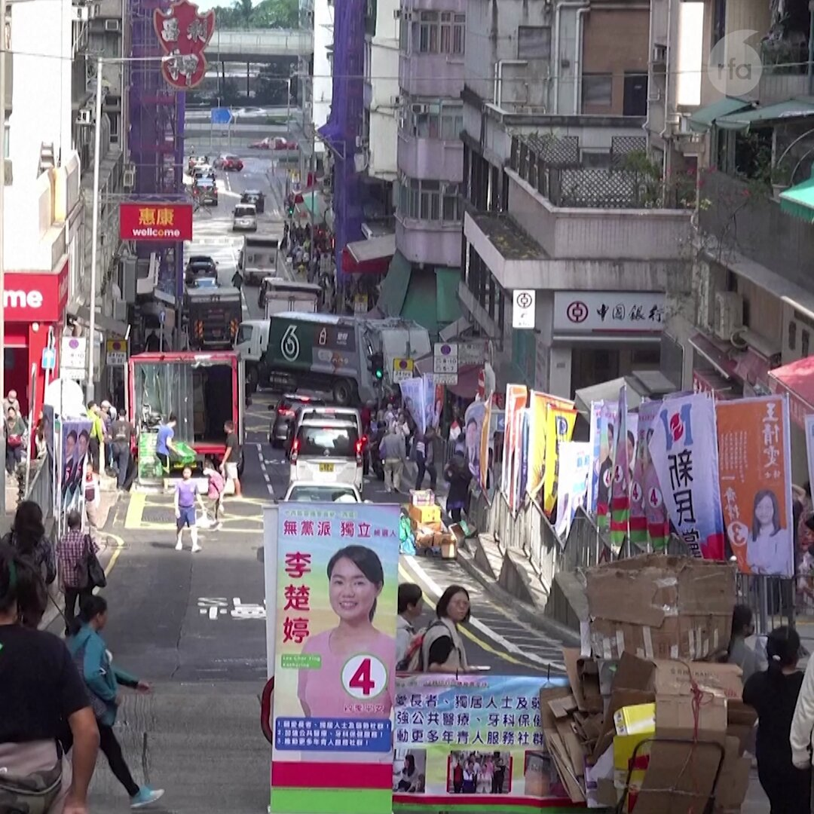

自由亚洲电台 北京时间 2023-12-17T04:08:58Z 1736116227716567325 【苹果禁令范围扩大?】广东、浙江、江苏、安徽、山西、山东、辽宁及世界最大 #iPhone 工厂所在地 #河北 的多家 #国企 和政府部门在过去两个月内, 指示员工只能带本地品牌手机上班。
详阅：https://t.co/IoatKMXgTY   自由亚洲电台 北京时间 2023-12-17T01:21:03Z 1736073967524348017 【香港投票率跌破记录，市民: 回不去从前了】
首届"爱国爱港" #香港 区议会选举结束，在官方使尽浑身解数“#谷票”情况下，投票率也只得27%，创下历史新低，不仅不足北京期盼的三成，更低于同样没有独立民主派和本土派参与的2021年立法会选举。
尽管投票日当日电子选民登记册系统故障，致使延迟投票至凌晨，特首 #李家超 称选举“圆满成功”。但市民又是不是这样看的呢？   