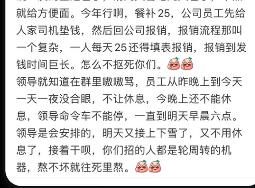
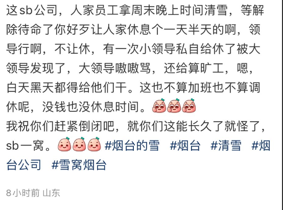

谁将十万横扫三江 北京时间 2023-12-17T22:00:37Z 1736385917836038448 RT @whyyoutouzhele: 网友投稿
近日山东烟台暴雪，往年市中心区域都是有固定的扫雪环卫工人，今年因为政府没钱了，傍晚发微信公众号号召市民扫雪以及外包公司扫雪。结果有外包公司员工吐槽已经三年没给补贴了。 https://t.co/GbPATW6Qyp   谁将十万横扫三江 北京时间 2023-12-17T13:16:17Z 1736253962402386153 RT @whyyoutouzhele: 12月15日，一名名叫侯志涛的律师发布视频称，其因现在遭受六盘水政法系统迫害，向全社会求助。
据其自述，自2023年11月20日起，他和他的同时陆续被抓，自己也面临搜捕，罪名是寻衅滋事。… https://t.co/lmt2NcRqgj   