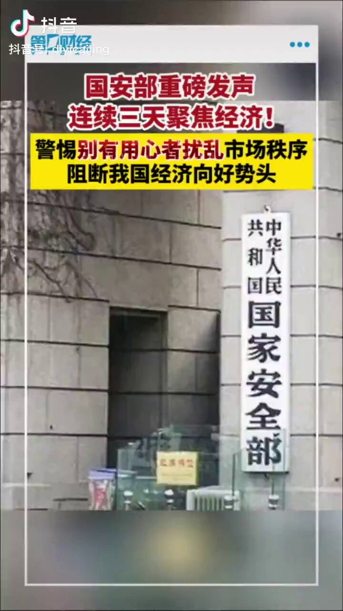
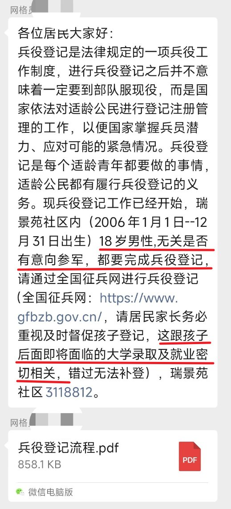

A李老师不是你老师 北京时间 2023-12-16T18:16:58Z 1735967246202114141 12月16日，山东药品食品职业学院一号教学楼大厅地面坍塌 https://t.co/7E04qFrVbD   A李老师不是你老师 北京时间 2023-12-16T02:31:21Z 1735729273753739311 12月15日，国安部发表文章《国家安全机关坚决筑牢经济安全屏障》，提出要警惕别有用心者唱衰中国经济。据悉，这已经是国安部连续三天发文聚焦经济问题。
一方面金融界的专家学者媒体们遭遇封嘴和警告
另一方面，国家安全部门出面干涉经济问题
这本身就已经充分说明了我国经济问题当前的严峻和危机。 https://t.co/3ZlQSrz6w1   A李老师不是你老师 北京时间 2023-12-16T00:30:58Z 1735698977163514020 12月15日，山东省淄博市张店区网格员敦促辖区内18岁男性登记兵役，并称与之后的大学录取及就业密切相关 https://t.co/XA2Jq9QG2s   A李老师不是你老师 北京时间 2023-12-16T00:33:28Z 1735699604518113642 北京地铁昌平线追尾事故的地铁残骸 https://t.co/k1cSyrto8b   