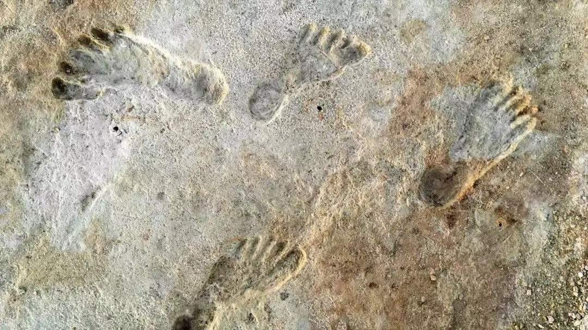

Petrichor 北京时间 2023-12-16T13:26:40Z 1735894189378802124 中共一共有102条党内法规是与廉政有关的。详细到管到你吃饭，“四菜一汤”还是“三菜一汤”。这么严，为什么还有贪官?

如果几个官员腐败，那确实是他信仰缺失等等，如果是一片官员腐败，那肯定是制度出了问题。正像一个鱼塘，有几条鱼死，那可能是鱼本身的问题;便若有成片的鱼死亡，那必定是鱼塘的水有问题了。权力必须受到制衡，这句话很多人都知道。但是后面还有句话很多人不知道，权力不但要受到制约，而且还要形成封闭的环。不能有一个环节缺失，只要有一个关键环节缺失，那么其他的环节都无效。特别是对第一把手的制约，缺漏太多。

这两年，第一把手腐败的案件大幅度上升。其中有不少地方的政协领导出了问题，不了解中国政治的人，以为政协腐败严重。实际上，这些出事的政协领导此前多半担任过地方的书记，犯案多半是在他任第一把手时。   Petrichor 北京时间 2023-12-16T13:28:50Z 1735894731484279099 中央领导去地方调研，地方肯定要做准备，但很多准备其实是造假，有的连“群众”都是干部扮装的。有的地方，白天开会讲一套，到了晚上，私底下又会说，白天讲的不算，现在和你讲些真实情况。

大家都想讲真话，可是为什么真话这么难?因为中共国不少制度设计，违背了一条政治学基本原理：由上及下的政策指令信息与由下及上的政策效果信息不能走同一条管道。谁要是违反了这套规律，毫不例外，得到的信息在相当程度上是不真实的。

设想中央肯定不希望下面的干部说假话，老百姓也不喜欢干部说假话，不希望政府说假话。但是想一想，如果我是这个政策的制定者和实行者，又要我来评价这个政策的效果，要是我说这个政策效果不好，这不是打自己耳光?如果这个政策不是我制定的，是上级政府制定的，我去实行，如果其他部门或地方都说好，就我说这个政策不好，上级部门会不会说我执行能力不行?于是假话就难以避免。   Petrichor 北京时间 2023-12-16T09:54:12Z 1735840720236265635 为“为人民服务”的人服务，人要美、心要甜、态度要极其认真和负责。 https://t.co/hW9ZX4M3Fw   Petrichor 北京时间 2023-12-16T01:41:58Z 1735716845062140034 【老照片】1944年9月2日，20 岁的乔治.布什驾驶TBM“复仇者”鱼雷轰炸机在执行轰炸小笠原群岛的作战任务中，遭日军击中坠毁。
老布什这一战机上的另外两名机组人员，在爆炸中丧生。也有一种说法是还有一名机组人员跳伞，但最终活着的只有老布什一人。
老布什落水后打开充气筏，在大海中漂浮了四个小时，他一度发现有日本小船向自己靠近，感觉自己要被俘虏了，但随后他发现有美军飞机为自己提供掩护，用机枪扫射驱赶走了这些小船，美国“芬巴克”号潜艇最终来救了他。
非常巧合的是，当时这一潜艇上有一台摄影机，于是老布什被从大海里救上来的情景被记录在了胶卷之中。   Petrichor 北京时间 2023-12-16T01:49:22Z 1735718708876607627 【在美国新墨西哥州一座古老湖泊沿岸留下的人类足迹，或许证明了人类抵达美洲的时间比考古学家所认为的（16,000年前）要早5,000年。】
今年，美洲的人类历史故事可能迎来了新的起点。此前人们普遍认为，最早的美洲移民，大约在16,000年前通过连接亚洲和北美洲的白令海峡从亚洲大陆迁徙而来，他们沿着太平洋海岸向南行进最后定居美洲（北美和南美）。这被称为美洲人类起源的标准理论。但另有科学家发现，有一些遗址的存在，暗示人类可能比这个标准理论所认定的时间要更早就已经到达了美洲大陆。例如来自智利南部的削制石器和烧焦的动物骨头可以追溯到18,500年前，墨西哥一个洞穴中的疑似石器可以追溯到26,000年前。但是这些发现都只是间接证据，它们并没有提供人类活动的明确证据，因此大多数考古学家仍对此持怀疑态度。但在今年，研究人员验证了另一个引人注目的结论，将这一标准时间提前了至少5,000年。早在2021年，美国新墨西哥州白沙国家公园的研究人员，就宣布了一个或许是颠覆性的发现：在一座古老湖泊泥泞的岸边，留存有明显的人类足迹（下图），它的年代可追溯到21,000到23,000年前。这个年代来自这些足迹周围的相同地层中留存的一些草本水生植物的种子。研究人员对这些种子进行了放射性碳测年，推断其年代为21,000到23,000年前。但这些种子也可能从溶解于湖水中的沉积物那里吸收了更为古老的碳元素而增加了它们的测量年代（老碳效应的影响），因此学界对此年代仍存在疑虑。于是今年，白沙团队使用了周边的来自陆生植物的花粉和嵌入在足迹之间以及下方的沉积物中的石英颗粒，重新测定了该足迹的年代。新的测定年代数据与最初论文完全吻合，证明这一时间是正确的。它由此证明，这些足迹是在上一个冰河时代的顶峰时期留下的，当时的冰川覆盖着加拿大。这说明人类必定是在这些冰川形成之前就已经进入了美洲（而不是冰削期时的16000年前）。新的研究结果发表在了今年Science杂志上。科学家对这一足迹年代的重新确定，表明美洲的人类历史故事迎来了新的起点，人类抵达美洲的时间是末次冰期时而不是冰消期时。它还可能引发考古学家对其他有争议的遗址重新进行评估，并可能促使人们更快地挖掘其他冰河时代的沉积物，以寻找更多的证据和惊喜。   Petrichor 北京时间 2023-12-16T02:02:48Z 1735722085912133772 邻居之间关系这么坏。被害夫妻面对凶手，不够智警，打不过就该逃。男人操起的武器（木棍）不够长。女人不知使用工具，赤手空拳上前，送着挨揍。 https://t.co/5KnU0bJskQ   