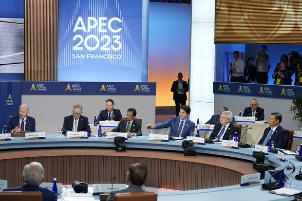
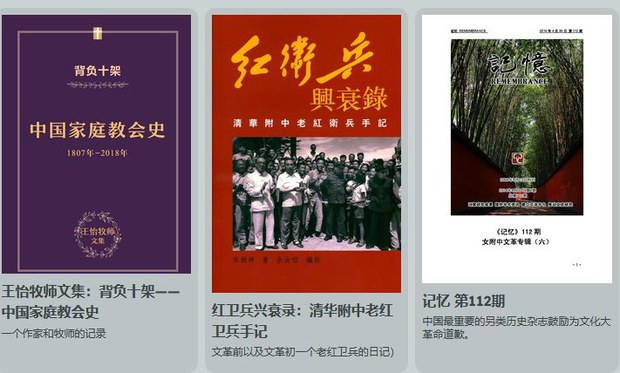
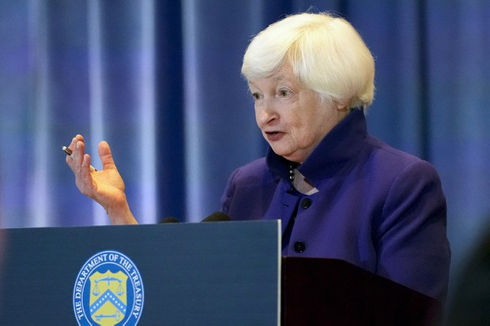
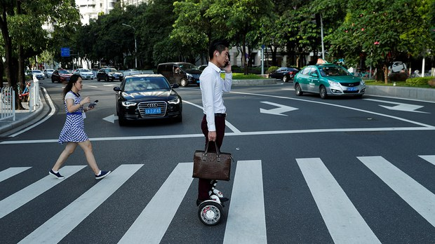
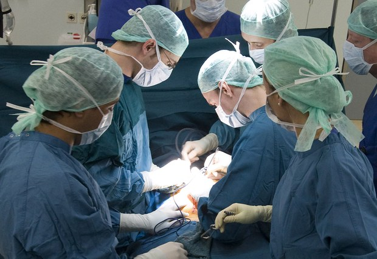
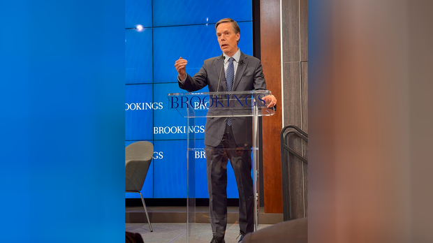

自由亚洲电台 北京时间 2023-12-16T13:28:06Z 1735894550042771583 据德国之声的综合消息，德国《明镜》周刊、英国《金融时报》和法国《世界报》等媒体周五（12月15日）同一时间刊发报道，比利时极右翼政党“弗莱芒利益”（Vlaams Belang）政客、前弗莱芒地区议员弗兰克·克莱曼（Frank Creyelman）通过短信从一名化名丹尼尔·吴（Daniel Woo）的中国特工处接受任务，试图影响德国、法国以及欧盟的政治活动。
https://t.co/EcT7UcZe6X   自由亚洲电台 北京时间 2023-12-16T13:29:59Z 1735895024204906789 评论 | #余杰：马恩列毛习，五大魔头聚首大学课堂
https://t.co/A8LHZzxMN8 https://t.co/JcFwil0j6R   自由亚洲电台 北京时间 2023-12-16T13:32:03Z 1735895542377611699 专栏 | #周嘉有话说：#美中关系 还有救吗？(下）
#周孝正
https://t.co/n1LT1fs12M https://t.co/ql4oPiMDqS   自由亚洲电台 北京时间 2023-12-16T13:47:38Z 1735899462990737428 专栏 | #财经时时听：面对 #通缩 和金融风险2024 #中央经济工作会议 如何部署？
https://t.co/qCQZReBnQK https://t.co/UwYR9EaH8O   自由亚洲电台 北京时间 2023-12-16T06:26:42Z 1735788500979720583 欢迎收听和订阅播客【＃亚太报道】 https://t.co/MjLNSvVMqc
中国发布 #人体器官捐献和移植新规；“#农家乐”等消费场所大规模倒闭；“#青年失业率”何时再公布？；#人工智能 被用于亲中反美宣传；多位香港市民因订阅被通缉人士网络频道遭拘捕 https://t.co/TBh6PGnSfe   自由亚洲电台 北京时间 2023-12-16T06:36:39Z 1735791005327335518 #事实查核 ｜美国国务院资助了澳机构研究“洋五毛”？
https://t.co/kA2blMZh9z https://t.co/nhHBBZjya6   自由亚洲电台 北京时间 2023-12-16T07:02:19Z 1735797462668058848 近日，“#中国民间档案馆”网站（https://t.co/rNvapf5usU）在美国上线，该网站致力于向公众提供遭到中国当局屏蔽的敏感史料。本周五，“中国民间档案馆”馆长张彦@iandenisjohnson 接受了本台专访。
https://t.co/WwIszXCsbB https://t.co/1XiVaN6CT0   自由亚洲电台 北京时间 2023-12-16T07:07:57Z 1735798880288284698 【#您怎么看】 12月15日，中国国家安全部官微发文，称经济安全是国家安全的重要组成部分，唱衰中国经济是对中国特色社会主义制度及道路进行攻击、否定。您赞成该说法吗？您对中国的前景还持乐观态度吗？ https://t.co/4fjxAI7eva   自由亚洲电台 北京时间 2023-12-16T07:11:26Z 1735799759313768668 【#您怎么看】 您心目中的年度汉字是什么？用哪一个字最能代表今年中国状况？ 这些是部分网友心目中的年度汉字，您怎么看？ 您觉得，还有哪些？ https://t.co/HSvk8pCfHu   自由亚洲电台 北京时间 2023-12-16T08:58:46Z 1735826768710246506 RT @RFA_Chinese: 【台湾141架F16V全部升级完毕，能对抗中国歼10歼11歼16吗？｜#兵家常事】
12月3号，台湾最后一架F16V战机完成飞行测试，至此，台湾空军全部141架F 16 AB型战斗机都成功升级为F 16V。有人说F16是老战斗机，那么F 16V…   自由亚洲电台 北京时间 2023-12-16T02:40:30Z 1735731575801909398 美国财政部长 #耶伦 周四（12月14日）在 #美中贸易全国委员会 成立 50 周年晚宴上表示，将于2024年再次访问中国，寻求与北京保持沟通，深化互信与合作。
https://t.co/Qh9dNC4SEq https://t.co/Jwqf1E0G7K   自由亚洲电台 北京时间 2023-12-16T04:44:41Z 1735762825988186502 48.9小时！
中国国务院新闻办公室12月15日官宣今年11月份全国企业就业人员 #每周平均工作时间。这一数据又一次创下了二十年来的新高。
您每周工作几个小时？
https://t.co/iOBKoDzDDe https://t.co/9NynHw173O   自由亚洲电台 北京时间 2023-12-16T05:41:58Z 1735777243572642022 中国公布 #器官捐献和移植条例
杨医生认为：“中国的器官移植不是给老百姓的，这是专门给赵家人的一个服务。”
您怎么看？
https://t.co/7MAGTWnQfY https://t.co/qyRPXrHYzP   自由亚洲电台 北京时间 2023-12-16T06:04:11Z 1735782835611635922 专栏 | #夜话中南海：#二十大 上落选中委的那批人
https://t.co/7YYSEsKiHz https://t.co/32DIhMvQZy   自由亚洲电台 北京时间 2023-12-16T06:13:23Z 1735785149089095892 美国驻华大使：不要指望 #中美关系 很快改善
https://t.co/SJlr5hEfFw https://t.co/MUZo1LmD1p   自由亚洲电台 北京时间 2023-12-16T00:52:33Z 1735704408225427647 香港国安警察开先例，拘捕订阅通缉人士经营的付费平台帐号民众。
#许智峯：”国安目前的做法，是步步进迫和把执法的’红线’模糊化，之前说出版、转发帖文都有罪，现在开订阅有罪说法的先例，同时把看我们帖文也说成有罪，下一步是否曾点贊也是有罪呢？"
https://t.co/H93BGVq1K9 https://t.co/hNx9Dkkghd   自由亚洲电台 北京时间 2023-12-16T03:55:53Z 1735750544470515752 12月14日，澳大利亚战略政策研究所 @ASPI_org 发布报告指出，2022年以来，至少有三十个 #油管 频道使用人工智能语音，宣扬中国政府的政绩或国际形象。这些视频目前总共吸引了一亿多人次观看及七十多万人订阅。
#大外宣 
https://t.co/9VRiOvQLIW https://t.co/axUDse29oi   自由亚洲电台 北京时间 2023-12-16T02:09:15Z 1735723712878612882 近日，一部讲述西藏精神领袖 #达赖喇嘛 经历的纪录片《#伟大的十四世：达赖喇嘛》在台湾上映。导演罗克利夫接受自由亚洲电台专访表示，影片希望呈现由达赖喇嘛自己述说他的故事。

https://t.co/nEjUKednFf https://t.co/VOvjbbcB4l   