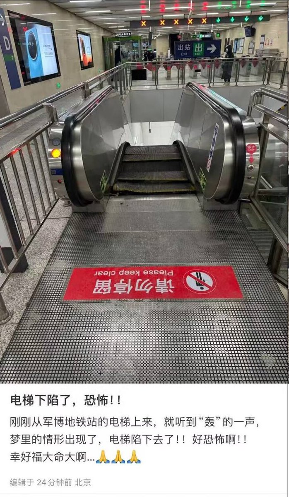
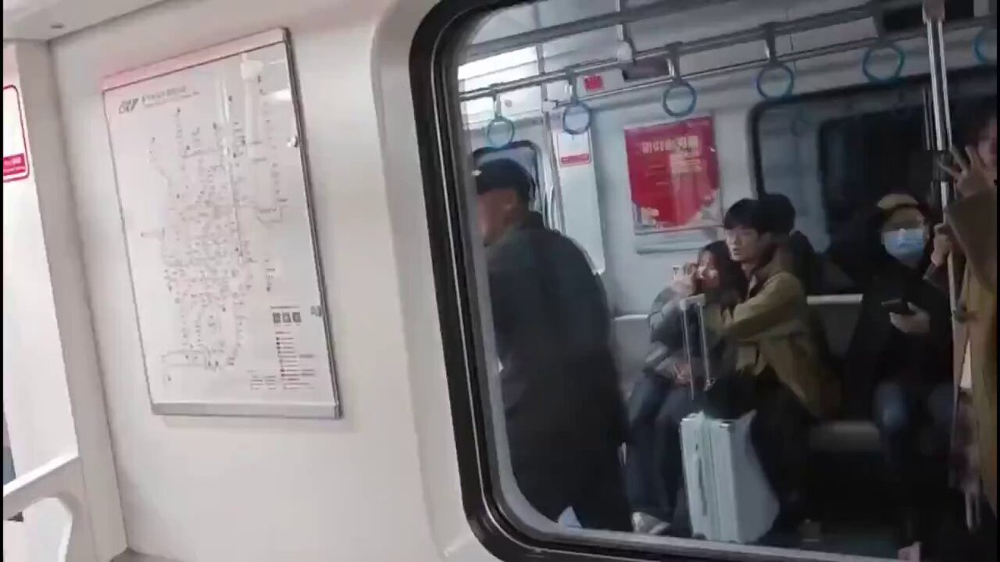
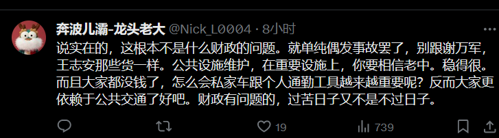
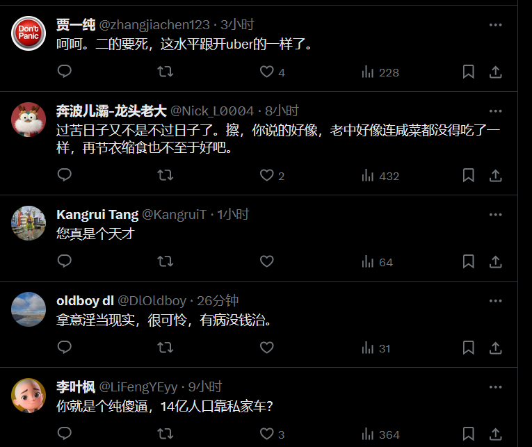
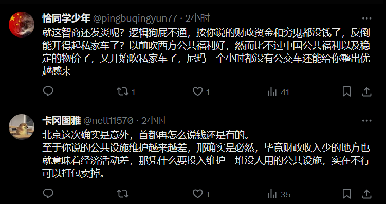

谁将十万横扫三江 北京时间 2023-12-16T13:18:28Z 1735892123038437568 RT @Pandazhq: 《中国六四真相》里的王震：

4月20日，王震对学生在新华门外大規模聚会尤其恼火，当天在见到杨尚昆時，他说：“过些小鬼懂个屁呵！动不动就想闹事，是不是有人要打倒共产党啊！”

当天，他打电话给邓小平说：“小平同志，这些学生要造反啦，他们冲击新华门了！…   谁将十万横扫三江 北京时间 2023-12-16T13:20:53Z 1735892732437315962 RT @HuPing1: 中国新冠疫情究竟死了多少人？这是一个非常严肃、非常重要的问题。
几个官方数据都不靠谱
按照中国疾控中心公布的数据，从去年12月6日解封到今年2月9日，共有87,468人死亡（2月9日之后，疾控中心的数据不再更新）。…   谁将十万横扫三江 北京时间 2023-12-16T10:29:06Z 1735849504224759935 北京1号线军事博物馆地铁站，小事故拿拿味儿 https://t.co/ZX9cL1lz99   谁将十万横扫三江 北京时间 2023-12-16T10:29:41Z 1735849648215273501 RT @Th_McCarthy: 随着各地财政耗尽。各种公共设施维护会越来越差。东北垮塌的体育馆只是先兆。北京撕裂的地铁也是预兆。真正大的还没来。很多地方公交车已经欠司机快一年的工资了。三年大健康彻底抽干了财政资金池和穷鬼们的存款。未来私家车和个人通勤工具会越来越重要。澳洲时候…   谁将十万横扫三江 北京时间 2023-12-16T10:30:27Z 1735849840473674189 堆这个雪人的人涉嫌唱衰中国经济 https://t.co/Nv2vvGkqHx   谁将十万横扫三江 北京时间 2023-12-16T10:41:03Z 1735852508239872370 12月13日重庆轻轨磨擦火星临停 https://t.co/6WJXvLp5KH   谁将十万横扫三江 北京时间 2023-12-16T10:51:17Z 1735855085346083283 评论区很多粉红说博主蠢，大多是认为在博主所设想的情况下自己是开车的那位，经济好的时候，你在北京工作是租多少钱的房子？有京牌吗？ok，如果你不是在限制车牌的地方，小区有你的停车位吗？单位附近有吗？你说附近大把地方随便停，那你不就是行走的税收吗？只是现在考虑税收成本没收而已。昌平线脱轨后的第二天，因为换成了人工驾驶降速，地铁站内外都排起了很长很长很长的队伍，每站只能挤上两三个人。人工驾驶普遍化以后，你能保住工作吗？
A 租更贵的房子保住工作
B 开车耗油买月卡保住工作
C 换离家近的工作
你觉得哪一项能改善你的生活质量？   