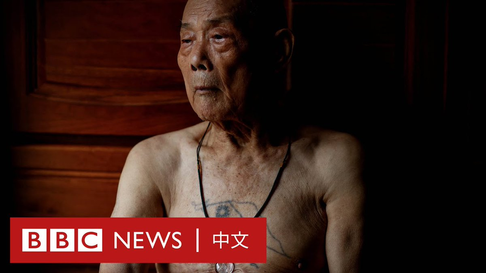
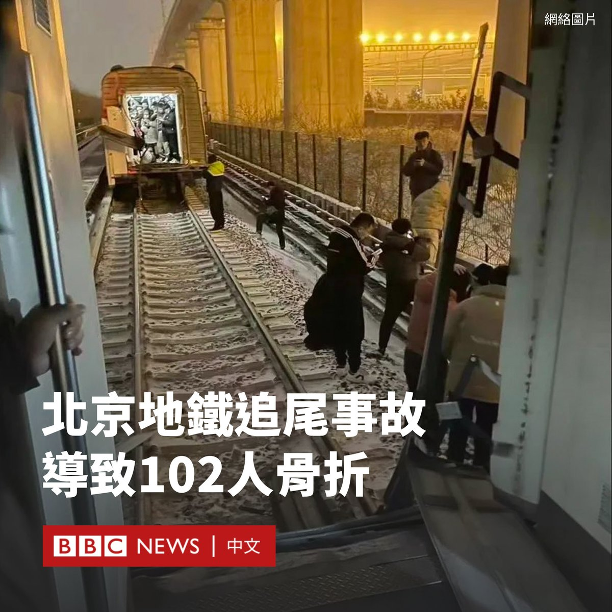
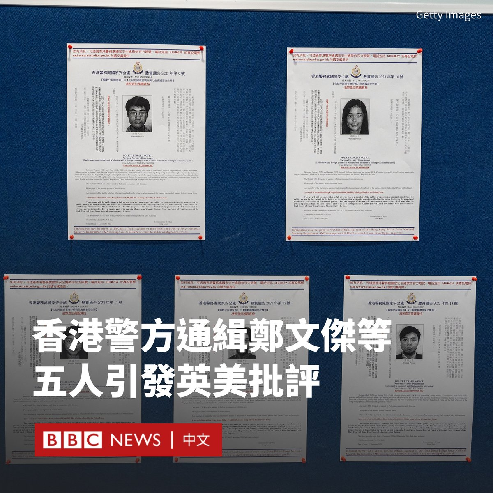
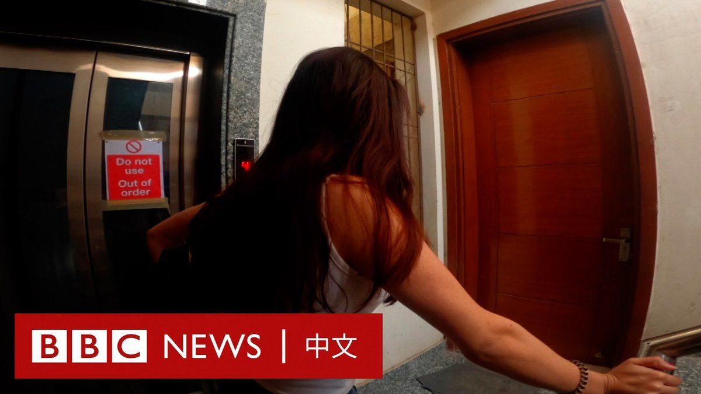

D英国广播公司BBC 北京时间 2023-12-15T22:51:39Z 1735673981615694155 台湾将在一个月后迎来大选。随着两岸关系紧张，此次选举已演变成将在多大程度上对抗北京、展示台湾继续追求其独特身份的决心的选择题。

然而，围绕“统独”议题的讨论不仅影响着选民手中的选票，同时也引起了世代之间的分歧。特别是对于很多经历过两岸历史纠葛的老人来说，对于“中国”的理解是复杂的。 https://t.co/lnJJpXejAO   D英国广播公司BBC 北京时间 2023-12-15T18:35:48Z 1735609595668623715 分析人士认为，夏立言选择此刻访问中国大陆，体现出国民党与北京依然能近距离互动。另一方面，中国大陆的邀请也表现出北京对于此次台湾大选的重视程度。https://t.co/tO7OfWEP5L   D英国广播公司BBC 北京时间 2023-12-15T17:25:13Z 1735591834930569653 在俄罗斯总统普京（Vladimir Putin）马拉松式的年度记者会上，他被自己的AI“分身”问到是否有“很多替身”。 https://t.co/WrKBtoPfZ2   D英国广播公司BBC 北京时间 2023-12-15T15:53:27Z 1735568741281431598 中国北京市当局表示，北京地铁周四（12月14日）晚高峰期间发生追尾事故，导致102人骨折。

该事故发生在晚上七点左右。运营方最初表示，地铁昌平线一趟列车的最后两节车厢与前车在西二旗至生命科学园站之间“发生分离”。

在中国，此类事故并不常见。北京及该国北方多地最近几天遭到暴雪侵袭，交通出现延误。

事发地点位于北京北部，附近有众多互联网和初创公司，客流量很大。

北京市交通委员会周五（12月15日）称，经过初步调查，事故原因为“雪天轨滑导致前车信号降级，紧急制动停车”，但后车未能有效刹车从而发生追尾。

据中国媒体报道，事发时巨大的冲击力使一些乘客从车厢中被甩出去，摔到铁轨上。

社交媒体上流传的影片显示，有乘客躺在地上，一些人称自己肋骨疼。

还有画面显示，一些乘客打破车厢窗户逃生，还有人穿过厚厚的积雪沿着铁轨离开。

北京市交通委员会在声明中称，截至当日晚11点，共有515人送医院检查，其中骨折102人。

据报道，截至周五上午，423人已出院，67人仍在住院治疗。事故没有造成人员死亡。   D英国广播公司BBC 北京时间 2023-12-15T12:58:07Z 1735524617463492722 香港警方宣布追加通缉五名流亡海外的香港活动人士，并对每人悬赏100万港元（12.8万美元）。

这些人中包括33岁的前英国领事馆雇员郑文杰（Simon Cheng），他曾于2019年香港示威运动期间卷入一场备受关注的失踪事件。

他后被证实在到中国大陆出差途中，遭警方在香港西九龙高铁站的内地口岸区拘留。警方指其涉嫌嫖娼。但郑文杰否认该指控，并称他遭遇酷刑逼供。

另外四人是许颖婷、邵岚、霍嘉志和蔡明达。他们都被控“危害国家安全”或“煽动分裂国家”等多项罪行。

42岁的霍嘉志和46岁的蔡明达，是YouTube频道“升旗易得道”主持人，该频道拥有41万订阅者，主要讨论时政议题。当局指他们发布多段涉嫌煽动颠覆政权的影片。

香港国安处总警司李桂华表示，“他们出卖国家，不顾香港人利益”，并强调国安处会追究到底。

英国外交大臣卡梅伦（David Cameron）批评此举“对我们的民主和基本人权构成威胁”。

中国驻英国使馆发言人回应称，中国“坚决反对英方诋毁中国香港特区法治，庇护通缉犯，干涉香港事务”，已就此向英方提出“严正交涉”。

与此同时，美国国务院发言人马修·米勒（Matthew Miller）则对此举表示“强烈谴责”，称香港当局在美国境内没有管辖权。

今年七月，香港宣布对其他八名活动人士进行类似的悬赏。虽然他们尚未被捕，但有人因涉嫌资助他们而遭拘捕。   D英国广播公司BBC 北京时间 2023-12-15T08:46:59Z 1735461414742142980 两名在印度被迫从事性工作的乌兹别克斯坦女子讲述了她们所遭受的虐待、恐吓和暴力。她们对BBC说，自己遭到了人贩子的殴打和威胁。

德里警方逮捕了两名人口贩运者，他们以在迪拜工作的幌子引诱来自中亚国家的年轻贫困女子，随后将她们带到印度。

许多女子表示，由于她们涉嫌违反移民法而遭到起诉，因此“被困”在印度。   