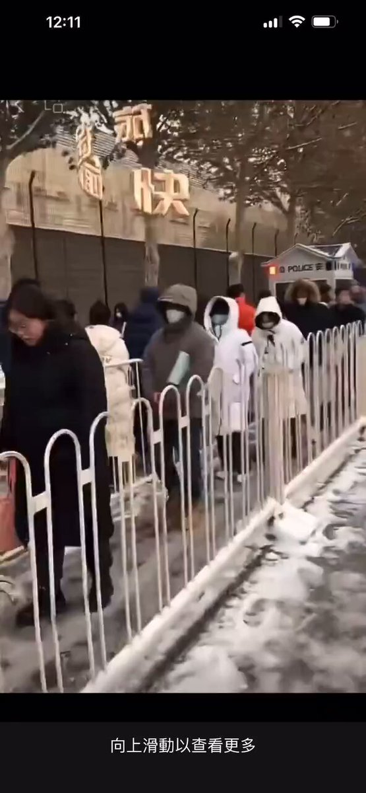
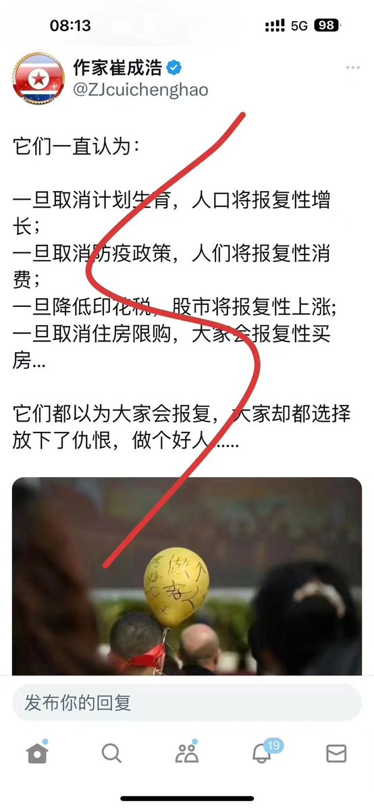
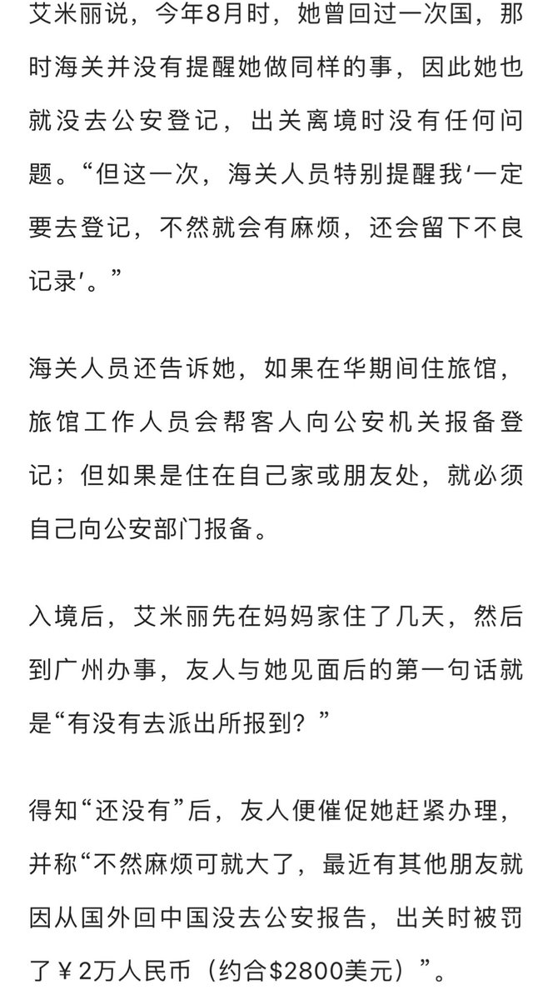
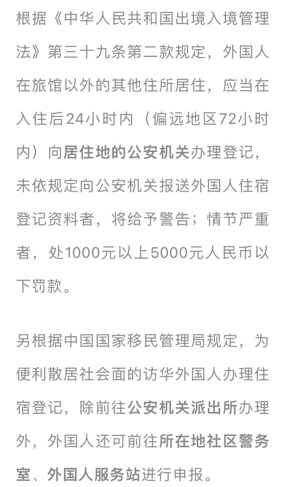

Petrichor 北京时间 2023-12-15T12:31:28Z 1735517908334182683 哪天中国驻美大使馆签证处门前美国人一大早排起长队面试申请去中国签证，那个时候中国的国家最高领导人一定是公民一人一票选的德高望重之人，绝不会是个只会说假大空话、野心勃勃、眼高手低的草包！ https://t.co/n66XmlW8xr   Petrichor 北京时间 2023-12-15T11:14:56Z 1735498650132828290 中共对待知识分子特别是敢于说真话的知识分子是刻薄的，生活在中共的治下，日子很苦，许多知识分子被迫害死了。

我很想知道张大千的女儿是否挺过文革？ https://t.co/lIe4UHCBE1   Petrichor 北京时间 2023-12-15T12:17:14Z 1735514325442326637 看了这个视频，看到一家房屋就这样被强拆，心中愤愤不平。不知道这是哪个国家发生的事情？这个国家还有法制吗？这个国家的统治者是谁？可以肯定不是民选的。 https://t.co/QjFKEUMkJx   Petrichor 北京时间 2023-12-15T05:31:18Z 1735412171889074258 转发：

某985法学院课堂上，教授说：“大案看政治，中案看影响，小案看关系……”话音未落，就有一位学生突然站起来，猛地把课本摔到地上，反问教授说：“那什么时候看法律？老子不学了！”

教授见状看了看那位同学，然后指着地上的课本说：“我劝你还是把课本捡起来，我可以很负责任地告诉你：期末考试一定是看法律的！”   Petrichor 北京时间 2023-12-15T05:43:07Z 1735415144736284750 旋转中

 https://t.co/IHGVoXUtx3   Petrichor 北京时间 2023-12-15T03:27:02Z 1735380898860724246 再加一条：一旦把访华签证费降低25%，外国人将报复性地涌到中国旅游和访问。 https://t.co/B6D93x5UX9   Petrichor 北京时间 2023-12-15T03:39:59Z 1735384155892937181 20世纪80年代，苏联军队东德276个地点有777处兵营，其中包括47个机场及116个训练场。共含24个师，33.8万名士兵，并编成五支集团军及一支航空集团军除战斗人员外，驻军外围还包括20.8万人左右的军属及社会编制人员，以及约9万名军人子女。住东德苏军有4200辆坦克，8200辆装甲车辆，3600门各型火炮，10.6万辆机动车辆，690架飞机，680架直升机以及180架火箭炮及导弹系统。

柏林墙倒，东西德统一，驻德的苏军一直停留在东德境内。对于没钱的苏联来说，这30万大军明显是一块烫手山芋。这些军人回国之后如何安置？用了5年这些人才回到俄罗斯。

德国主动拿出300多亿马克，将近110亿美元酬劳苏军，并在俄罗斯各地建造很多房屋提供给苏联士兵居住，德国政府为了早日送走这些大神，还贴心地派遣专业人士，对安置在德国边境地区的苏军进行工商管理、会计等专业的培训。

避免他们回国之后失业，而法国、西班牙、意大利等西欧国家，也拿出了75亿美元的贷款和援助，就这样，驻德苏军在1994年年底，才全数撤离德国境内，大军整整撤离了60个月，然而等到他们回来时，苏联已经不复存在。   Petrichor 北京时间 2023-12-15T04:03:48Z 1735390149565898813 I heard that some overseas Chinese strongly demand that the host country adopts reciprocal treatment for Chinese visitors. “Foreigners holding passports of the People’s Republic of China who live anywhere in the country they are visiting should report to the resident within 24 hours after check-in (within 72 hours in remote areas). Registration with the local police agency, and those who fail to submit foreigner accommodation registration information to the police agency in accordance with regulations will be given a warning; in serious cases, a fine of not less than US$1,000 but not more than US$5,000 will be imposed.”

Diplomacy should always be reciprocal, and do not do to others what you do not want others to do to you. If you don't let people use Google and browse the Internet, then foreign countries should take reciprocal measures to treat them, prohibit the CCP's foreign propaganda in any form, and file cases for review and trial of overseas propaganda personnel.

No one wants to go to Xi’s country unless necessary. White people don’t dare not go, and overseas Chinese don’t dare to go either.   Petrichor 北京时间 2023-12-15T02:24:07Z 1735365063618212242 听说有些海外华人强烈要求所在国对中国访客采取对等的待遇，“持中华人民共和国护照的外国人在访问国任何地方居住，应当在入住后24小时内（偏远地区72小时内）向居住地的警察机关办理登记，未依规定向警察机关报送外国人住宿登记资料者，将给予警告；情节严重者，处1000美元以上5000美元以下罚款。”

外交上理应一律对等，己所不欲，勿施于人。 你不让人用Google，看外网，那么外国应该采取对等措施待之，禁止中共任何形式的大外宣，对海外大外宣人员予以立案审查、审判。

非必要，习国没人想去了。白人不敢不去，海外华人也不敢去。   