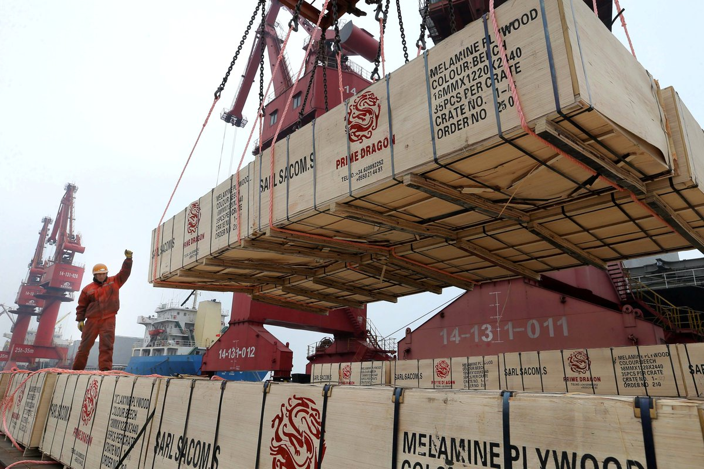
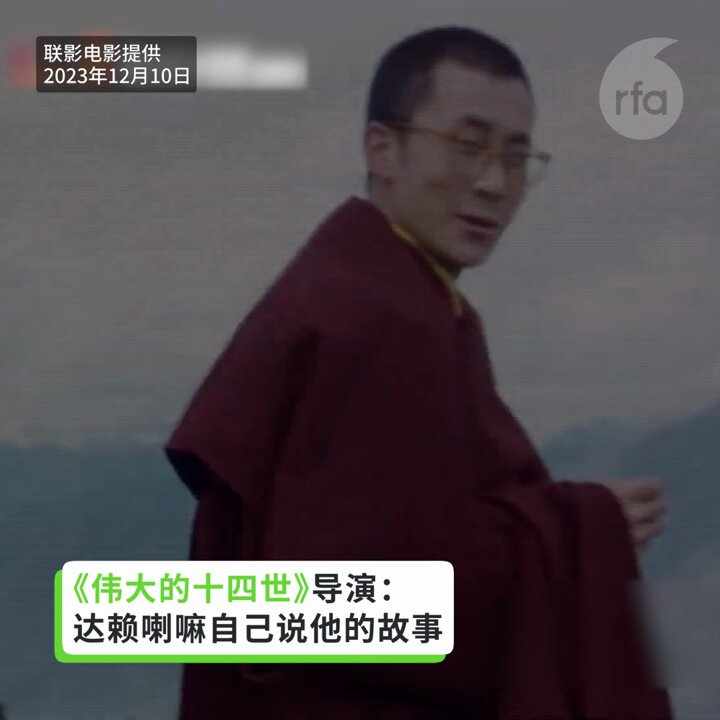
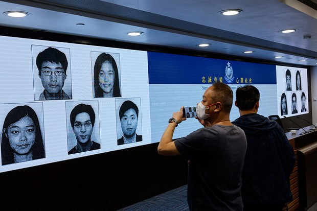
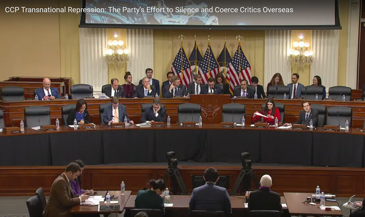
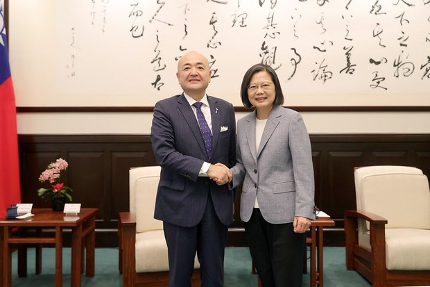
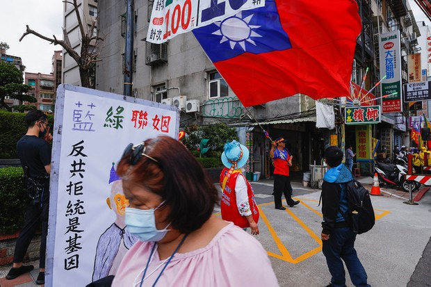
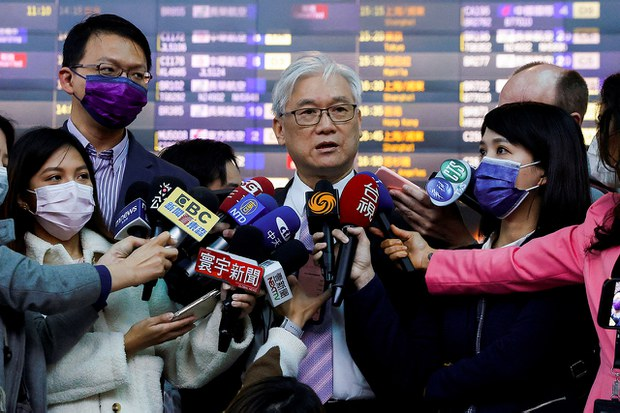

自由亚洲电台 北京时间 2023-12-15T22:49:24Z 1735673418714902825 RT @RFA_Chinese: @【大名李颖   “李老师”接受《纽约时报》专访】
本月12日，纽约时报发布了对推特（Twitter，现改称X）名人“#李老师不是你老师”@whyyoutouzhele… https://t.co/yJgSmORvQd   自由亚洲电台 北京时间 2023-12-15T23:29:43Z 1735683563822120999 仅今年11个月，就有近7千家 #农家乐倒闭。
贵阳曾经营农家乐的黄先生说，农家乐诞生超过二十年，如今纷纷倒闭，其真实原因并非因为品质差和宰客，而是消费者迅速减少，经营环境恶化所造成：“现在只有退休的老人，特别是刚退休的人还可以消费。现在百货商场都没什么人去。”
https://t.co/dkEOnmwTNh https://t.co/YP5LLHQrOM   自由亚洲电台 北京时间 2023-12-15T23:58:50Z 1735690891908809101 经济领域分析师 #刘纪鹏、#洪榕、#水皮 等多位经济评论人士遭到全网封杀
中国政府要求统计部门在发布统计数据解读时要"#正确引导社会预期"。 这是中共中央政治局会议后出现的新词。
接下来会发生什么？
https://t.co/MUcqTDfK4x https://t.co/k03Bbxenbc   自由亚洲电台 北京时间 2023-12-15T20:56:36Z 1735645029291704599 【中国商务部认定台湾构成贸易壁垒】
【台陆委会：具政治目的】
中国商务部15日公布对台湾贸易壁垒调查结果表示，台湾对中国贸易限制措施构成贸易壁垒。
台湾陆委会回应，两岸都是WTO会员，陆方却刻意绕开WTO贸易争端机制，明显具有政治目的，呼吁陆方遵照WTO争端解决机制与程序进行纠纷调处。
https://t.co/2Vsed8wQuI   自由亚洲电台 北京时间 2023-12-15T16:26:09Z 1735576967603531876 【青年失业率8月後不再公布】
【中国国家统计局：等待统计工作完善适时发布】
11月中国本地户籍劳动力 #失业率 为5.1%；外来户籍则为4.7%。从今年8月起，中国国家统计局不再公布青年失业率，最后一次停留在7月份，高达21.3％，创下历史新高。
中国国家统计局称，“目前国家统计局正在对 #青年失业率 相关方法制度进行完善，待相关统计工作进一步完善之后，将适时发布有关情况。”
https://t.co/mOjIaAQ7YR   自由亚洲电台 北京时间 2023-12-15T17:27:10Z 1735592322723979339 【纪录片 #伟大的十四世达赖喇嘛 在台商业首映】
【导演：让 #达赖喇嘛 自己说他的故事】
《伟大的十四世：达赖喇嘛》是一部讲述达赖喇嘛一生故事的纪录片。美籍导演萝丝玛丽表示，这部片的后制受COVID-19疫情延迟，但因祸得福，资助者不再惧怕北京。导演希望由达赖喇嘛自己说他的故事。 https://t.co/wiS7MAZI8b   自由亚洲电台 北京时间 2023-12-15T10:51:29Z 1735492748499677198 RT @RFA_Chinese: 【台湾141架F16V全部升级完毕，能对抗中国歼10歼11歼16吗？｜#兵家常事】
12月3号，台湾最后一架F16V战机完成飞行测试，至此，台湾空军全部141架F 16 AB型战斗机都成功升级为F 16V。有人说F16是老战斗机，那么F 16V…   自由亚洲电台 北京时间 2023-12-15T10:54:02Z 1735493389724823872 RT @RFA_Chinese: #台湾 的总统 #蔡英文 在2020年大选中提出“#抗中保台”的主张，获得了台湾选举史上最高的817万张选票。四年之后，#中国 因素还是左右 #台湾选举 的关键吗？ 而三位候选人的两岸政策又有何不同？https://t.co/Md9XaWPG6…   自由亚洲电台 北京时间 2023-12-15T10:54:18Z 1735493456607244500 RT @RFA_Chinese: 【江西辟谣“机关事业单位降薪”网民反击】
【多地曝出事业编制降薪】
近期，有关“#江西省政府决定对机关事业单位降薪”的报道引发广泛关注，本周四，江西省政府有关部门接受赤焰新闻采访时指该消息是“谣言”，不过，江西等地的网民并不买账，公开当地 #减…   自由亚洲电台 北京时间 2023-12-15T06:32:49Z 1735427651266044396 #调查报道 | #萨摩亚 想要吸引 #中国 游客，却招来了梦想家和骗子 https://t.co/yWId0AvMtj https://t.co/jhfvkcmE1d   自由亚洲电台 北京时间 2023-12-15T06:38:20Z 1735429041484869859 港警国安处周四（14日）宣布，悬红一百万万港币通缉五名身处海外的港人，指他们涉及多项违反《#港区国安法》罪行，当中包括美国公民邵岚。她在接受本台访问时表示，这是首次有 #美国公民 被港府以《国安法》#悬红通缉，呼吁美国政府正视。 https://t.co/WkVIvzUZZn https://t.co/SNDkW01iD9   自由亚洲电台 北京时间 2023-12-15T06:31:58Z 1735427435938893883 欢迎收听和订阅播客【#亚太报道】 https://t.co/MjLNSvVMqc

#香港 警方再度通缉5名海外港人；#中国 多地 #事业单位降薪；#房企 “#爆雷” 引发 #债务危机 担忧；美议员敦促中国停止 #跨境镇压；#台湾大选 与 #中国 因素 https://t.co/RI7qeFnGGM   自由亚洲电台 北京时间 2023-12-15T06:34:41Z 1735428120688169345 【兵家常事】第二期：台湾141架F16V全部升级完毕，能对抗中国歼10歼11歼16吗？
美东时间今晚7pm上线，敬请期待：
https://t.co/2yPhmDzxSb https://t.co/rHsgjvHgt6   自由亚洲电台 北京时间 2023-12-15T08:46:04Z 1735461183690350819 RT @RFA_Chinese: 欢迎收听和订阅播客【#亚太报道】 https://t.co/MjLNSvVMqc

#香港 警方再度通缉5名海外港人；#中国 多地 #事业单位降薪；#房企 “#爆雷” 引发 #债务危机 担忧；美议员敦促中国停止 #跨境镇压；#台湾大选 与 #中…   自由亚洲电台 北京时间 2023-12-15T04:42:16Z 1735399830963606013 #评论 | #陈破空：#北京 或在 #菲律宾岛礁 动武，测试 #美国？ https://t.co/r3DtAodMgs https://t.co/150zkc5kOn   自由亚洲电台 北京时间 2023-12-15T03:25:56Z 1735380622141735250 美国国会特设委员会在华盛顿当地时间12月13日晚举行听证，两党议员共同敦促 #中国 政府，停止 #跨国镇压、停止 #连坐 异议人士的家属、停止侵犯 #人权。https://t.co/HJ56j7GcAH https://t.co/5GXq85fyya   自由亚洲电台 北京时间 2023-12-15T03:27:01Z 1735380894159126909 #北京地铁 昌平线一列车周四（14日）晚，在行驶途中突发 #事故，两节车厢从连接处 #脱节 断开。据北京市交通委员会最新通报，目前无人员死亡，但已发现30多人受伤。 https://t.co/mVDlJf8xna https://t.co/myYmhBKg2H   自由亚洲电台 北京时间 2023-12-15T01:06:49Z 1735345609559949394 近日，日本岸田内阁的"#安倍派"人士遭到撤换。而在 #台湾大选 前夕，日本驻台代表履新，也引发舆论对有关 #台日关系 发展的瞩目。 https://t.co/CqngCMDeUa https://t.co/pDgZDJJ7hI   自由亚洲电台 北京时间 2023-12-15T00:16:14Z 1735332880908509431 #台湾 的总统 #蔡英文 在2020年大选中提出“#抗中保台”的主张，获得了台湾选举史上最高的817万张选票。四年之后，#中国 因素还是左右 #台湾选举 的关键吗？ 而三位候选人的两岸政策又有何不同？https://t.co/Md9XaWPG6A https://t.co/1lfF8NrzMB   自由亚洲电台 北京时间 2023-12-15T00:18:17Z 1735333397768306989 据路透社报道，台湾的 #国民党 周四（14日）表示，该党副主席 #夏立言 正在中国大陆与台湾社区人士会面。目前距离 #台湾总统大选 之仅一个月，夏立言此时前往大陆受到了执政党的批评。https://t.co/3P1d6dSuCl https://t.co/S1FpPHdkzU   