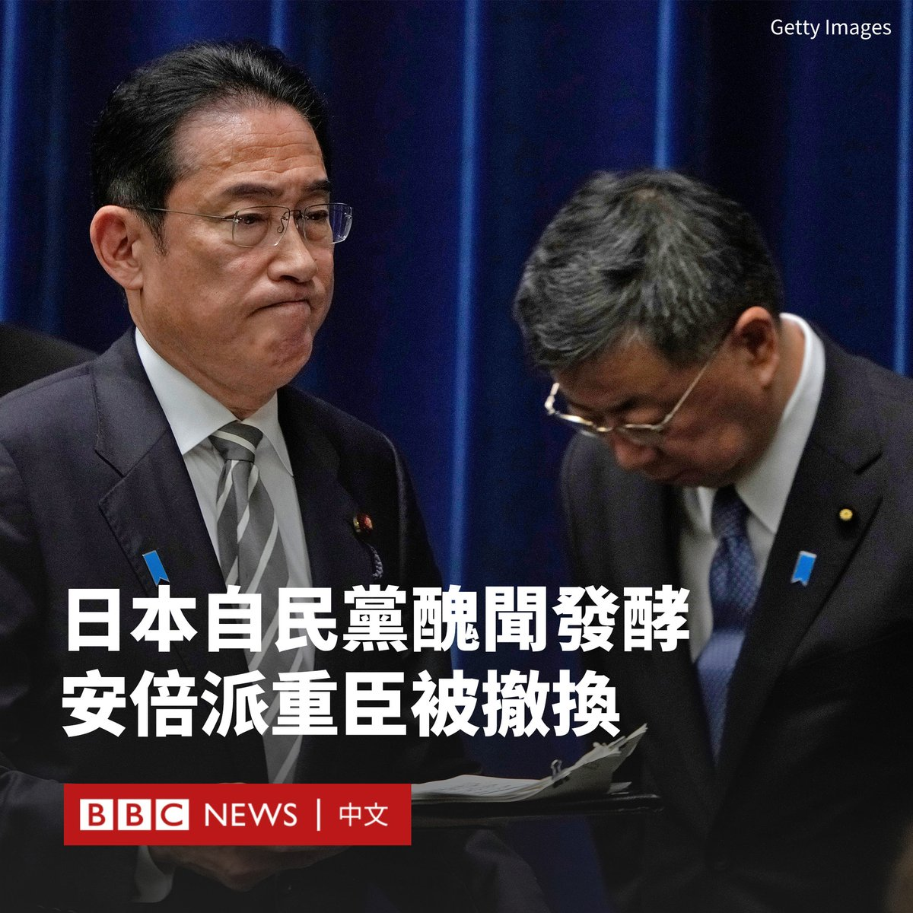
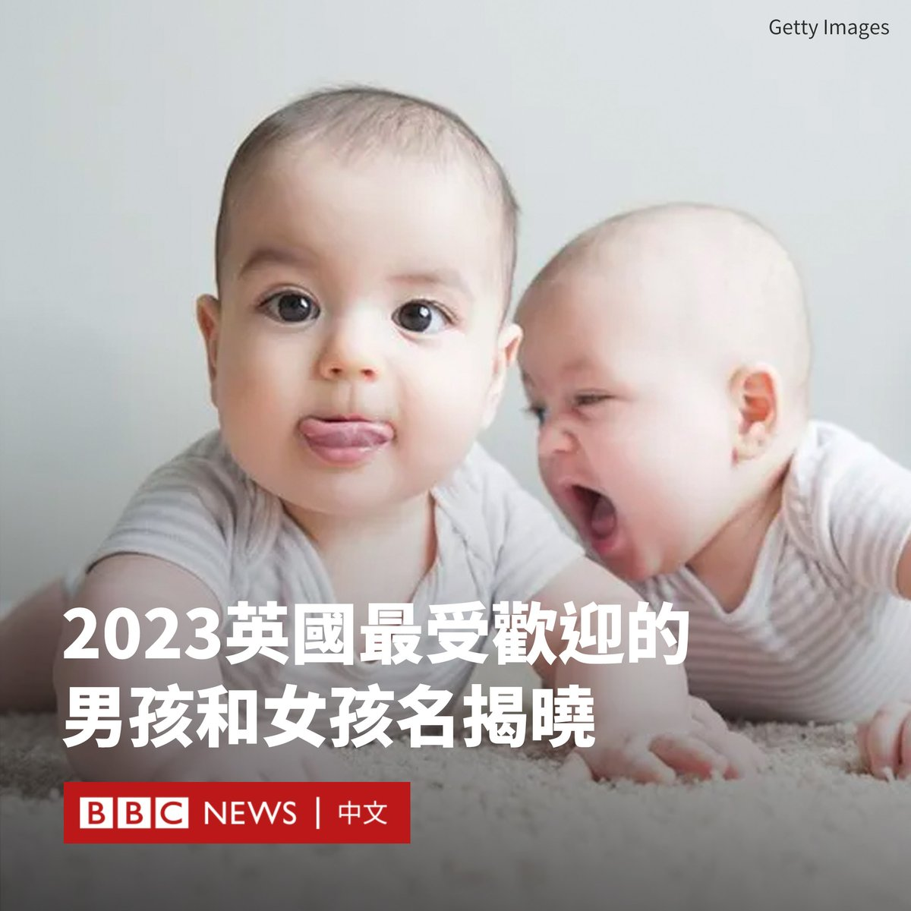

D英国广播公司BBC 北京时间 2023-12-14T21:17:57Z 1735288016015396946 以哈冲突爆发时，“无国界医生”组织的急诊科医师洪上凯在加沙前线提供人道医疗服务，他上个月平安撤离到台湾。身处同一团队的菲律宾护理师达尔文也抵达菲律宾。

两人在加沙期间和撤离过程中，目睹了一轮又一轮的空袭和物资短缺。他们向BBC中文讲述了自己的经历。

https://t.co/LJ2c6AZ7l2   D英国广播公司BBC 北京时间 2023-12-14T22:18:56Z 1735303362370019698 【更新】据北京市交通委员会消息，北京地铁脱节事故已导致逾30人受伤。当局正在调查事故原因。   D英国广播公司BBC 北京时间 2023-12-14T19:20:31Z 1735258462102413709 日本自民党内阁四名安倍派成员因涉及政治筹款丑闻，于周四（12月14日）辞职。

四人包括内阁官房长官松野博一、经济产业大臣西村康稔、总务大臣铃木淳司和农林水产大臣宫下一郎。

松野博一是这四名大臣中最重要的人物，他经常被视为首相岸田文雄的左右手和政府代表。

岸田文雄随后安排前外务大臣、岸田派的林芳正接任内阁官房长官。

此前有报道称，自民党内的最大派系安倍派（清和政策研究会）被指在2022年前的五年间秘密收取政治资金，合计有超过5亿日元（340万美元）进入了非法基金。

虽然出售政治筹款宴会入场券是法律上认可的筹措资金手段，但据报道，安倍派涉向所属议员下达销售指标，超出销售指标的资金将有机会以“回扣”方式返给相关议员，这些部分并未记入政治资金收支报告。

据报道，东京地方检察厅特搜部已开始进行调查。

日本首相岸田文雄领导的自民党政府因该丑闻进一步受到重创，其支持率自2012年以来首次降至30%以下。

与已故首相安倍晋三属于同一派系的五名高级副大臣也宣布辞职。他们的离任让自民党领导层出现不寻常的真空，即内阁中没有该党最大派系的代表。

于2021年10月上任的岸田文雄在周三表示，他将“正面应对”这些指控。   D英国广播公司BBC 北京时间 2023-12-14T20:21:42Z 1735273858545201509 “我仍然是一名农民，但却是一个‘数码农民’。”

随着TikTok等社交媒体在越南流行，“直播带货”的热潮也来到了这个东南亚的新兴市场。

从工人到农民，一些在原本默默无闻的行业里工作的人们，正尝试通过数码平台发现商机。 https://t.co/HIq3GLjDAw   D英国广播公司BBC 北京时间 2023-12-14T17:07:23Z 1735224957821731031 在纽约一条繁忙的高速公路上，一只吉娃娃犬受惊后闯入车道狂奔。几辆汽车协力对它进行引导，一名驾车者随后徒步追上它，将它解救并送还主人。 https://t.co/HVDozVWAys   D英国广播公司BBC 北京时间 2023-12-14T15:48:52Z 1735205199181222286 29岁的泰国国会议员拉差诺·斯里诺克（Rukchanok Srinork）被判处六年监禁，她被控犯有冒犯君主罪。

曼谷一家法院周三（12月13日）作出该裁决。原因是她在X（推特）上曾发布的两条帖子。在第一条中，她被指发布新冠疫苗相关信息诽谤国王，第二条则转发了据称是批评君主制的推文。

如果拉差诺最终入狱，她将失去议员身份。

据报道，这名前进党议员表示不认罪，准备对判决提出上诉。她被以500,000泰铢（14000美元）保释，条件是她不得从事类似活动。

拉差诺所在的前进党在今年的泰国众议院大选中获胜，该党曾誓言将修改冒犯君主罪的法律。由于参议院中的保守势力阻挠，该党领袖披塔·林乍伦拉（Pita Limjaroenrat）未能成为总理。

拉差诺是前进党的知名面孔。她曾出人意料地在曼谷附近的挽汶选区赢得了席位。几十年来，当地都一直由泰国最强大的政治世家掌控。

有泰国媒体给她起了个外号叫“巨人杀手”，因为她仅依靠骑着自行车走街串巷的竞选活动，就从一个重量级政治人物手中夺走了席位。

目前，前进党其他几位主要人物也面临冒犯君主罪指控，其中许多人都是参加2020年抗议的活动人士。   D英国广播公司BBC 北京时间 2023-12-14T13:38:25Z 1735172371026456847 英国2023年最受欢迎的婴儿名字揭晓！

穆罕默德（Muhammad）蝉联男孩名的第一名，而奥莉维亚（Olivia）则成功重回女孩名榜首。

“婴儿中心”（BabyCentre）的专家公布了这份榜单，其中包括前100个最受欢迎的男孩和女孩名及其拼写变体。

在女孩名榜单上，去年排名第一的索菲亚（Sophia）跌至第八位，因为该组织改变了其计数方式，将不同的拼写包括在内。

女孩名前五位是奥莉维亚（Olivia）、阿米莉亚（Amelia）、艾拉（Isla）、莉莉（Lily）和艾娃（Ava）；男孩名则是穆罕默德（Muhammad）、诺亚（Noah）、西奥（Theo）、利奥（Leo）和奥利弗（Oliver）。

该组织表示，电影、电视、音乐和王室都对名字的人气有影响，像泰勒（Taylor）这样的名字的人气翻了一番。

美国歌手泰勒·斯威夫特（泰勒丝；Taylor Swift）的歌曲《柳》（Willow）使威洛（Willow）也在榜单上攀升。

引人注意的还有以魔法或女巫为主题的名字正获得青睐，如露娜（Luna）、萨奇（Sage）和莱拉（Lyra），而威廉（William）、查尔斯（Charles）和哈里（Harry）等传统王室名字的受欢迎程度实际有所下降。   D英国广播公司BBC 北京时间 2023-12-14T12:10:42Z 1735150293031985570 香港曾因其拥有的世界一流大学而吸引着全球顶尖人才，但现在，学者们正在离开这座城市。https://t.co/JGhArSx2ej   D英国广播公司BBC 北京时间 2023-12-14T10:25:48Z 1735123896553353444 联合国发布报告称，缅甸现已超过阿富汗，成为世界上最大的鸦片生产国。

据估计，缅甸今年的鸦片产量预计将增长36%，达到1080吨，远高于阿富汗据报道的330吨的产量。

塔利班政府颁布禁毒令后，阿富汗的罂粟种植面积下降了95%。但与此同时，缅甸的种植面积在不断扩大。缅甸残酷的内战使其成为多方利润丰厚的收入来源。

联合国毒品和犯罪问题办公室地区代表杰里米·道格拉斯（Jeremy Douglas）表示：“2021年2月军事接管后造成的经济、安全和治理混乱，继续迫使偏远地区的农民靠种植鸦片谋生。”

取自罂粟的鸦片是制造毒品海洛因的主要原料。几十年来，罂粟一直在缅甸被种植，为反抗政府的叛乱组织提供资金。

随着2021年军方政变引发的内战愈演愈烈，仅在过去一年缅甸罂粟种植面积就增加了约18%。报告称，种植也变得越来越高产。

鸦片的价格上涨也刺激了更多的人种植它。疫情和缅甸经济的衰退也使罂粟种植成为更可靠和有吸引力的就业形式。

报告称，罂粟种植面积扩大最多的地区是北部的掸邦，其次是叛军与政府军交战的钦邦和克钦邦。该报告估计，今年缅甸出口了多达154吨海洛因，价值高达22亿美元。   