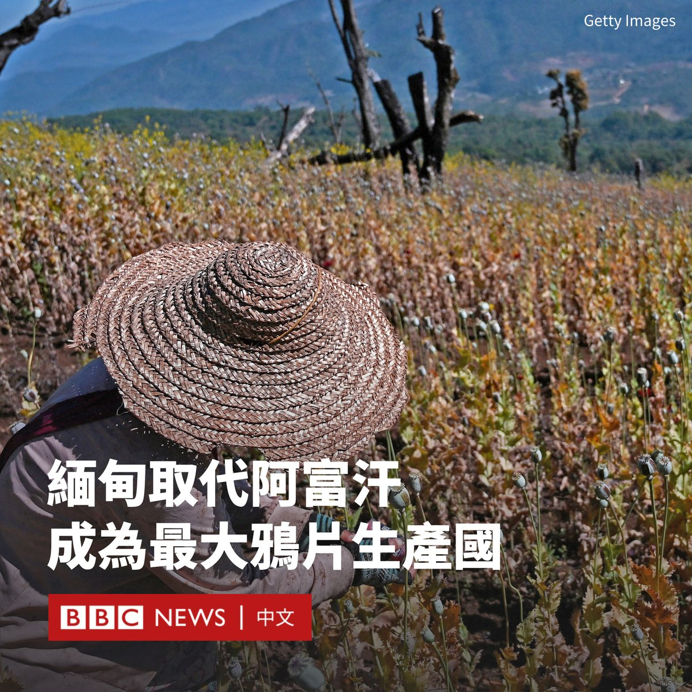

D英国广播公司BBC 北京时间 2023-12-14T10:25:48Z 1735123896553353444 联合国发布报告称，缅甸现已超过阿富汗，成为世界上最大的鸦片生产国。

据估计，缅甸今年的鸦片产量预计将增长36%，达到1080吨，远高于阿富汗据报道的330吨的产量。

塔利班政府颁布禁毒令后，阿富汗的罂粟种植面积下降了95%。但与此同时，缅甸的种植面积在不断扩大。缅甸残酷的内战使其成为多方利润丰厚的收入来源。

联合国毒品和犯罪问题办公室地区代表杰里米·道格拉斯（Jeremy Douglas）表示：“2021年2月军事接管后造成的经济、安全和治理混乱，继续迫使偏远地区的农民靠种植鸦片谋生。”

取自罂粟的鸦片是制造毒品海洛因的主要原料。几十年来，罂粟一直在缅甸被种植，为反抗政府的叛乱组织提供资金。

随着2021年军方政变引发的内战愈演愈烈，仅在过去一年缅甸罂粟种植面积就增加了约18%。报告称，种植也变得越来越高产。

鸦片的价格上涨也刺激了更多的人种植它。疫情和缅甸经济的衰退也使罂粟种植成为更可靠和有吸引力的就业形式。

报告称，罂粟种植面积扩大最多的地区是北部的掸邦，其次是叛军与政府军交战的钦邦和克钦邦。该报告估计，今年缅甸出口了多达154吨海洛因，价值高达22亿美元。   