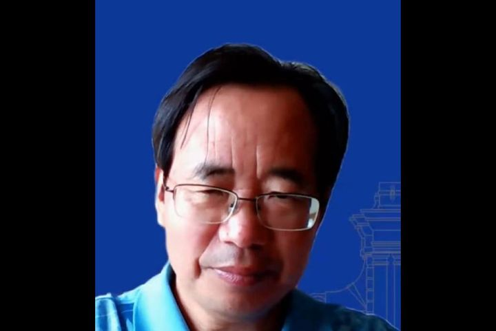

拆墙运动公号 北京时间 2023-12-14T14:39:13Z 1735187671197135257 【#2259专案组 互联网防火墙第037号嫌犯 #叶晓俊】（更新）
  性别：男，
出生日期： 1964年03月12日出生 
证件: 610103196403123650
籍贯：陕西省西安市碑林区
手机/微信，: 13901227633
手机/微信: 13261446925
学位：博士
职务:清华大学软件学院教授，博士生导师
电子邮件:yexj@tsinghua.edu.cn
工作地点:清华大学东配楼11-416室
固定电话:010-62795439
传真:010-62795439
京东用户名: th_yexiaojun
工作单位：清华大学
手机号定位:，北京市市辖区丰台区和义街道
开房记录
证件: 610103196403123650 陕西省西安市碑林区 双鱼座
日期: 201706160117
用户: 叶晓俊
房间: 6223
酒店: 敦煌市天河实业有限责任公司天河精品酒店

擅长互联网络加密和监控控制

#拆墙运动 #BanGFW #反人类犯罪 

叶晓俊，男，1964年03月12日出生，清华大学软件学院教授，近年主要围绕信息系统、数据组织与管理、数据库测试技术、数据安全与隐私保护展开研究。

详细资料见: #BanGFW拆墙运动（建墙罪犯录）（#ban_great.wall）:https://t.co/BxWMASXo03

合作伙伴：#zhinawiki   拆墙运动公号 北京时间 2023-12-14T04:41:00Z 1735037122497646788 RT @hrichina: 被控“煽动颠覆国家政权罪”而被羁押的前支联会副主席邹幸彤，获法国和德国政府颁发“人权和法治奖”。这是邹幸彤今年获得的第三个人权相关奖项。她希望她的获奖感言能“引起共呜让世界看到香港人权法治的问题，甚至这种(打压人权的)规则正在危害世界的警号”。htt…   拆墙运动公号 北京时间 2023-12-14T00:20:41Z 1734971613626368456 RT @NaNatogo103: 根据中共自己的法律，防火墙的设立、存在、运营都是非法的，且中共官方也不承认防火墙約存在。然而，中共的司法机关却仍会对翻墙这一行为进行处罚。从技术上讲，防火墙本身就是在对人们进行黑客攻击，部么人们通过VPN
翻墙来躲避它的攻击，怎么还成违法行为了…   拆墙运动公号 北京时间 2023-12-14T00:23:30Z 1734972320123322841 RT @WeiYu06292460: 一场声势浩大的“#拆墙运动”方兴未艾，走向国际。“拆墙运动”发起人之一、媒体人乔表示，中共 #防火墙 是其苟延残喘的最后一道屏障，“墙一天不倒，则拆墙运动就不能停。信息自由流通等于（人的）半条命”。

https://t.co/igarBb…   拆墙运动公号 北京时间 2023-12-14T00:21:38Z 1734971853263839387 RT @Ban_GFW3: #拆墙运动 不但推动拆除中国 #防火墙、关注中国在押 #政治犯、关注中国妇女权益、关注 #铁链女。
#拆墙运动 宗旨是拆除中国 #互联网防火墙 让中国人看到世界，让世界听到中国人的声音。

专栏 | 周末茶馆：关于中国妇女代表大会，不同的声音怎样说…   拆墙运动公号 北京时间 2023-12-14T00:23:54Z 1734972423252869299 RT @Baocaidan: 根据中共自己的法律，防火墙的设立、存在、运营都是非法的，且中共官方也不承认防火墙的存在。然而，中共的司法机关却仍会对翻墙这一行为进行处罚。从技术上讲，防火墙本身就是在对人们进行黑客攻击，那么人们通过VPN翻墙来躲避它的攻击，怎么还成违法行为了？ #…   