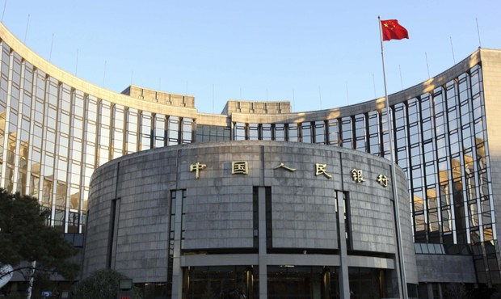
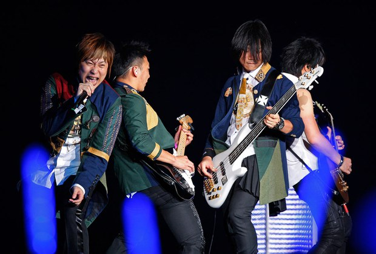
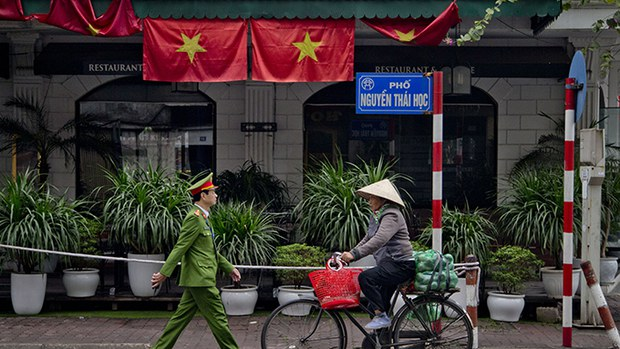
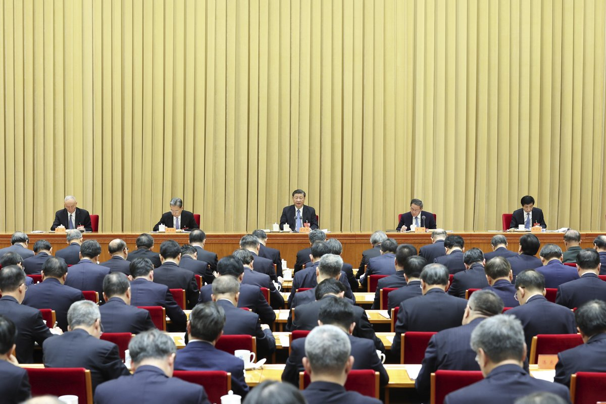
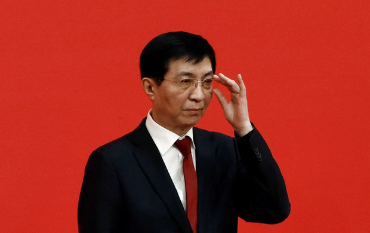
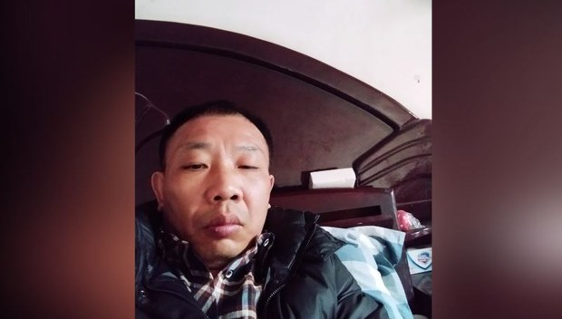

自由亚洲电台 北京时间 2023-12-14T05:50:45Z 1735054679120437409 【路透：中国芯片公司找到规避美国科技围堵办法】
据路透社13日报道，中国芯片设计公司 #灿芯 半导体，正在购买美国的设计软件并获得美国资金的支持，这显示美国政府在希望遏止中国获取美方半导体技术时面临执行困难。
报道写道，灿芯半导体的第二大股东是 #中芯国际，美国政府认为中芯国际与中国军方存在联系，因此将其列入实体名单，限制其获得美国技术。不过，有办法取得美国软件支持的灿芯半导体，目前正为6家以上的中国军事供应商提供芯片设计服务。目前，灿芯半导体仍旧在接收美国投资公司的资金，并从加州的软件公司获得敏感技术。不过，灿芯半导体与美国公司的互动目前并没有违反任何美国法律规定。   自由亚洲电台 北京时间 2023-12-14T05:57:47Z 1735056449292890588 @【大名李颖   “李老师”接受《纽约时报》专访】
本月12日，纽约时报发布了对推特（Twitter，现改称X）名人“#李老师不是你老师”@whyyoutouzhele 的专访。“李老师”的本名李颖，目前居住在意大利米兰，在新冠清零封控尚未解除时，李颖在推特上频繁上传了大量有关富士康工人抗议、白纸运动等全国民众反对“清零”封控的信息，即时性优于传统媒体，外界称“李老师以一人之力完胜世界各大媒体”。

在纽约时报的专访中，李颖表示，他的推特是中国民众的信息交流中心，各地民众会把无法发在中国互联网上的内容传给他，再由他将相关的视频与图片推广给世界，不到几周的时间，他的推特关注者便增加了50万。

不过，李颖告诉纽约时报，中国当局也因此视他为眼中钉，公安不仅经常骚扰他住在国内的父母，他在中国的银行账号、支付软件、甚至游戏账户也都被冻结。此外，中国大使馆也寄信给他在米兰工作的公司，导致他丢掉工作、失去唯一的经济收入。目前，他每周都会收到死亡威胁，甚至有男子闯入他家，为此，他在过去一年搬了四次家。

尽管如此，李颖依旧经营着他的推特帐号，希望能向中国人民传递因为受到审查而无法轻易获取的新闻资讯，他表示，他能继续坚持下去的原因，全是基于对中国国家与人民的爱。   自由亚洲电台 北京时间 2023-12-14T06:00:11Z 1735057049271325063 近两百个国家本周三在第28届 #联合国气候大会 上达成妥协性协议，同意减少化石燃料的使用。该项协议堪称里程碑式协议，表明各国政府首次作出削减化石燃料的承诺。
然而，随着中国经济增速放缓和天然气产量的提高，国际依旧聚焦中国是否能够履行其气候承诺。 
https://t.co/R08tjMJt93 https://t.co/iPnFwwaZmC   自由亚洲电台 北京时间 2023-12-14T06:13:31Z 1735060408308998648 评论 | #程晓农：经济困境的来源：债毁中国(下篇)
https://t.co/K3OpG6naBv https://t.co/a1ZsAKaW7G   自由亚洲电台 北京时间 2023-12-14T03:05:29Z 1735013085692449246 ＃五月天 是不是假唱？
＃杨丞琳 能不能过关？
https://t.co/72uVSkJ5T5 https://t.co/65vjs1hSyH   自由亚洲电台 北京时间 2023-12-14T04:17:28Z 1735031201482858518 香港女星 #周海媚 日前于北京因病逝世。其工作室官方讣告刚出，一份周海媚的病历就遭到外泄，迅速点燃舆论怒火。中国网友纷纷表示，要对相关人进行追责，北京卫健委随后也表示，#周海媚病历外泄 一事正在调查中。 

https://t.co/ERAAUEovdO https://t.co/ytPE3qOiZl   自由亚洲电台 北京时间 2023-12-14T00:33:34Z 1734974855756562589 #越南 政改真相探秘  #越共 与 #中共 有何不同？（二）
https://t.co/cu3qBH7JbD https://t.co/1LS8Xibjzd   自由亚洲电台 北京时间 2023-12-14T01:11:26Z 1734984384254750730 中共 ＃中央经济工作会议 明确指出中国必须解决 ＃房地产、＃地方债务、＃中小金融机构 等风险问题。习近平还为2024年的经济工作提出十二字方针。
旧工具能解决新问题吗？ https://t.co/8iYMBCCgrm   自由亚洲电台 北京时间 2023-12-14T01:46:51Z 1734993299839312324 ＃台湾总统选举 进入白热化，此时传出中国政协主席　＃王沪宁　主导　＃对台介选。
国台办不承认。
您怎么看？
https://t.co/Tf9BJmS7hN https://t.co/PODxMvIcui   自由亚洲电台 北京时间 2023-12-14T00:19:44Z 1734971372408123741 曾在美国时任总统奥巴马访问中国期间申请示威的湖北异议人士　＃尹旭安，自上月出狱后持续被当局监控。
尹旭安患有足以危及性命的严重高血压，但当局阻止他与外界接触，连看病都被禁止。他目前的安危备受外界关注。
https://t.co/8cUIEo8fa9 https://t.co/dsfoxRWE1J   自由亚洲电台 北京时间 2023-12-14T00:21:35Z 1734971839812599994 RT @asiafactcheckcn: 【韩国舆论战 】  

#北京 介入他国舆论又一桩，韩国国家情报院日前证实，三家中国公司在韩国投资，设立了共18个 #韩语新闻 网站，并持续散播亲中、反美日的文章。

https://t.co/Rh2JsfOMle   自由亚洲电台 北京时间 2023-12-14T00:22:13Z 1734971999812788586 RT @asiafactcheckcn: #移花接木

最近，在TikTok和X上广泛传播的 #美国军校 橄榄球赛辱骂 #拜登 的影片，经我们查核后发现，使用的音档实际上经过变造，且来源于一场演唱会。

https://t.co/4733ATVAZU   