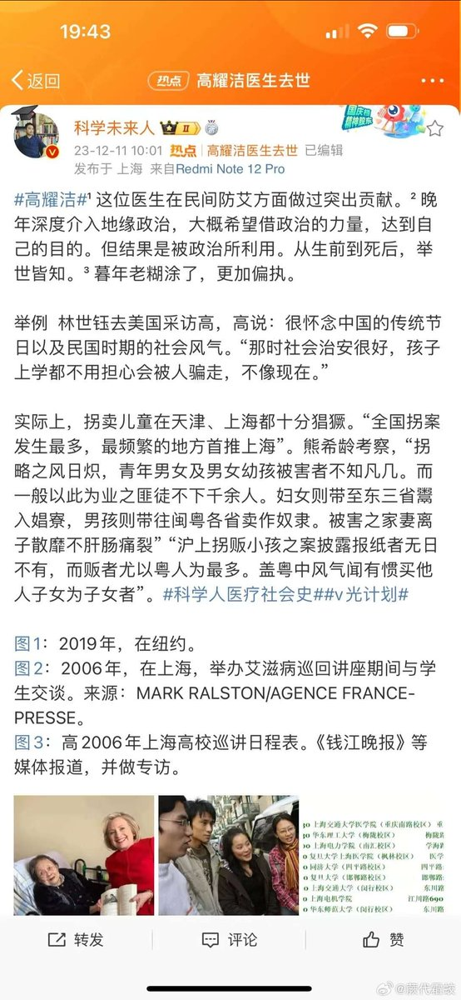
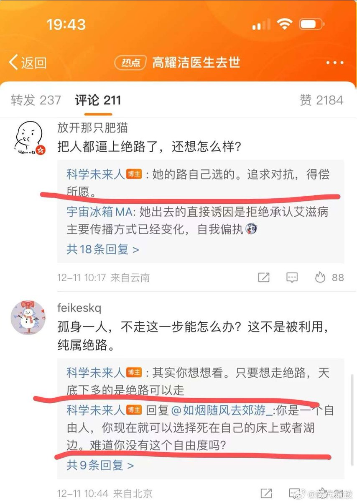
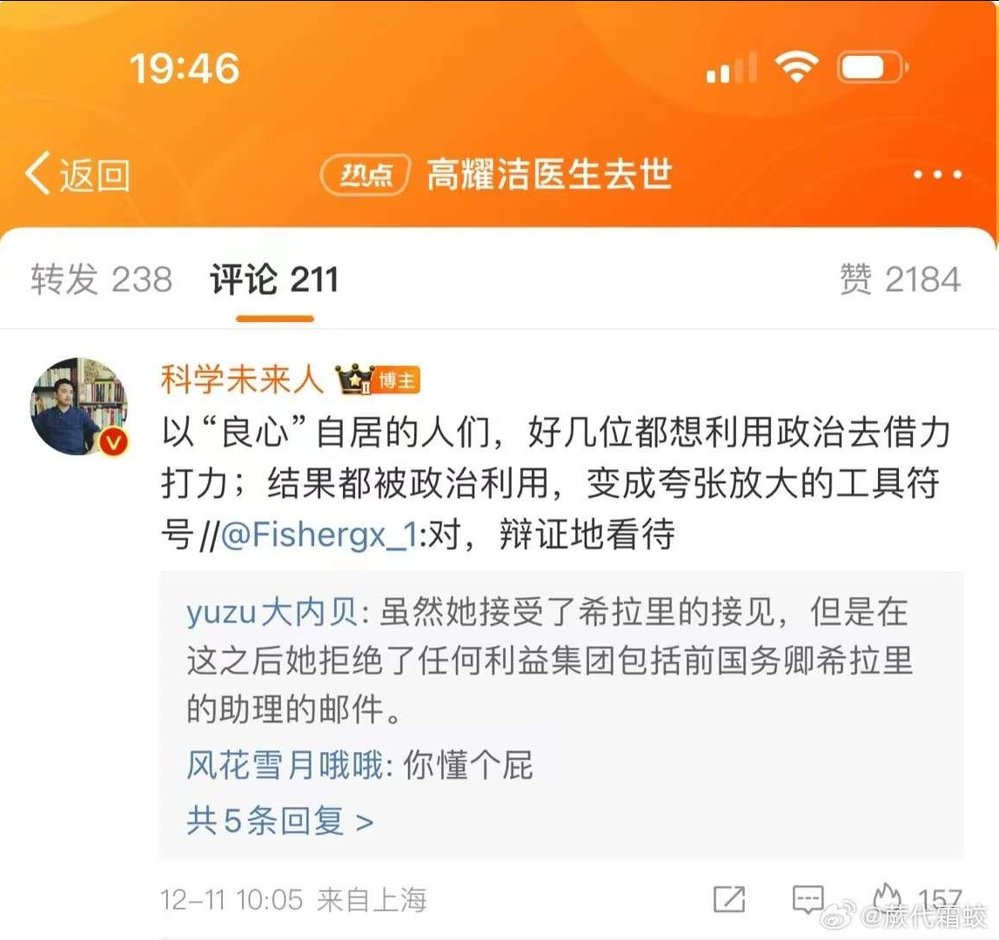
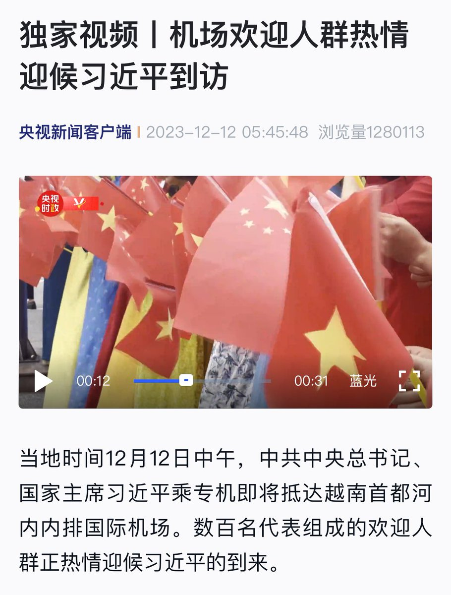
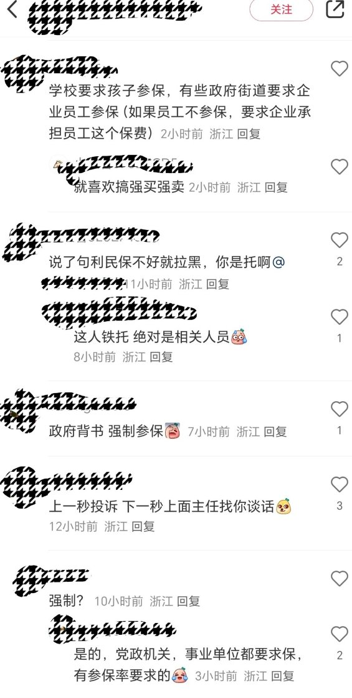

谁将十万横扫三江 北京时间 2023-12-14T19:12:28Z 1735256436677210619 RT @woyongdehuawei: 李老师撤稿：

网友投稿
12月12日X南市公安局内部发电“习近平出访期间公安局应急值守一体化运行机制工作方案”
其中目标任务提及，要紧盯“反华势力借机干扰，敌对势力反宣滋扰，境外敌媒攻击抹黑，邪教组织捣乱破坏，滞外访民滋扰闹事等” ht…   谁将十万横扫三江 北京时间 2023-12-14T16:40:02Z 1735218074108989750 活脱脱的畜生，占据了微博流量头部 https://t.co/GCaNtGNMcC   谁将十万横扫三江 北京时间 2023-12-14T16:42:01Z 1735218573814161864 转载：某一些同胞的死难，被公权力要求铭记，精确到具体数字，不许有任何质疑；而另一些同胞的死难，则被要求无视，谁敢悼念他们，甚至提及他们的存在，都被视为敌对势力搞破坏。——那么，我无法相信，被公权力主导的，对前一部分死难同胞的悼念，是真诚的。那不是哀悼，不是对同胞生命的爱和关注。它的本质其实是效忠，是公权力对国民的服从性测试。   谁将十万横扫三江 北京时间 2023-12-14T16:53:20Z 1735221421440413904 RT @lilaoshizuikeai: 刚去看了下，原视频剪了两秒，把这个画面剪没了 https://t.co/qRkqmniCDq   谁将十万横扫三江 北京时间 2023-12-14T09:05:45Z 1735103748912152990 RT @whyyoutouzhele: 12月13日，台州网友反映体制内，党员和学校被强制要求参加“台州利民保” https://t.co/rDHOu64lIz   谁将十万横扫三江 北京时间 2023-12-14T09:08:24Z 1735104417001775184 RT @whyyoutouzhele: 12月12日，媒体称，哈尔滨金融学院有辅导员在群内发布通知诱导强制学生献血，不参与献血的党员、班干部和入党积极分子将被取消评奖、评优、入党等资格。
12月13日，哈尔滨金融学院办公室一工作人员回应记者称，关于网传信息，办公室今天已经接到投…   