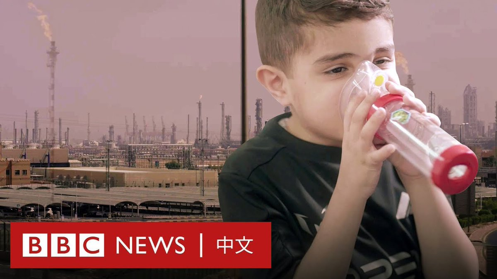
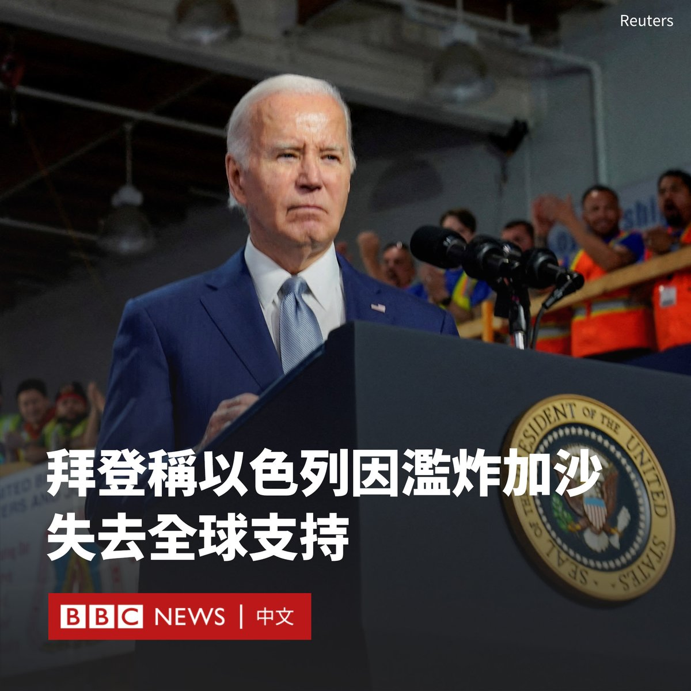

D英国广播公司BBC 北京时间 2023-12-13T14:34:33Z 1734824107991249271 BBC调查显示，多个大型油企燃除天然气导致的有毒空气污染正在距离其油田数百公里的地方蔓延，使海湾地区数百万人的健康面临风险，其中包括COP28气候大会的主席国阿联酋。 https://t.co/nIAEigvQKM   D英国广播公司BBC 北京时间 2023-12-13T15:52:00Z 1734843599563673604 美国总统拜登（Joe Biden）表示，以色列开始因其对加沙的“无差别轰炸”而失去国际支持。

拜登周二（12月12日）在一次筹款活动上对捐赠者发表了此番言论。这是他对以色列领导层迄今为止公开表达的最强烈批评。

自哈马斯10月7日对以色列发动袭击以来，拜登一直坚定不移地公开支持以色列。虽然他重申美国将继续支持以色列，但也对以色列政府发出了直接警告。

“以色列的安全可以依靠美国，但现在它比美国拥有更多。它拥有欧盟，拥有欧洲，拥有世界大部分地区。”他说道。“但他们开始因为无差别的轰炸而失去这种支持。”

不过，拜登也补充称，“毫无疑问需要打击哈马斯”，并称以色列“完全有权”这样做。

在拜登发表此番言论之际，他正面临包括来自民主党内的越来越大的压力，要求其限制以色列的军事行动。美国高级官员也对以色列的军事行动表示不满。

几天前，国务卿布林肯（Antony Blinken）说，以色列当局关于不伤害加沙平民的承诺与当地现实之间存在“差距”。

拜登还表示，以色列总理内塔尼亚胡（Benjamin Netanyahu）必须“改变”其政府以及他对“两国方案”的立场。拜登说：“这是以色列史上最保守的政府……让他非常为难。”

拜登的言论反映了美国和以色列这对盟友在战后方向问题上的新分歧。

内塔尼亚胡表示，他反对美国要求巴勒斯坦民族权力机构接管加沙的呼吁。巴勒斯坦民族权力机构目前在以色列占领的约旦河西岸部分地区当政。   D英国广播公司BBC 北京时间 2023-12-13T11:40:46Z 1734780373077524919 以哈冲突爆发时，“无国界医生”组织的急诊科医师洪上凯在加沙前线提供人道医疗服务，他上个月平安撤离到台湾。身处同一团队的菲律宾护理师达尔文也抵达菲律宾。

他们在加沙期间和撤离过程中，目睹了一轮又一轮的空袭和物资短缺。BBC中文采访了这两位刚刚撤出战地的医护人员，听听他们的经历。 https://t.co/K8Ne9dvlpx   D英国广播公司BBC 北京时间 2023-12-13T09:16:44Z 1734744127051550777 这是巴西男孩小洛伦兹（Lorenzo）第一次看到自己拥有满头秀发。

还是婴儿的时候，他在一次火灾中被严重烧伤。他幸存了下来，但是头上的大面积伤疤意味着他的头发永远不会像其他男孩那样长出来。但一项计划为他带来希望。 https://t.co/tatOqogRNc   