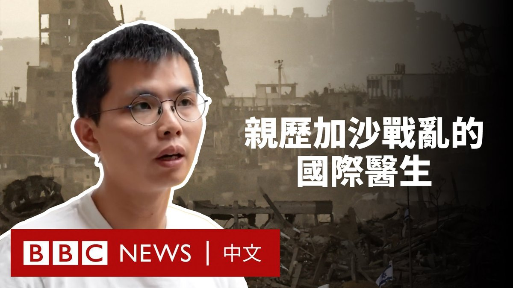
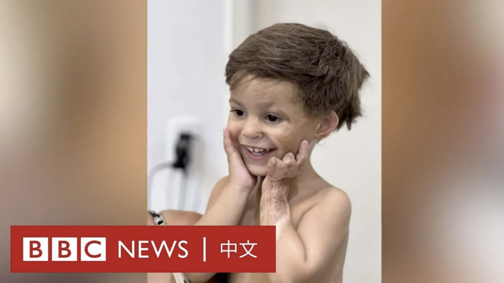

D英国广播公司BBC 北京时间 2023-12-13T11:40:46Z 1734780373077524919 以哈冲突爆发时，“无国界医生”组织的急诊科医师洪上凯在加沙前线提供人道医疗服务，他上个月平安撤离到台湾。身处同一团队的菲律宾护理师达尔文也抵达菲律宾。

他们在加沙期间和撤离过程中，目睹了一轮又一轮的空袭和物资短缺。BBC中文采访了这两位刚刚撤出战地的医护人员，听听他们的经历。 https://t.co/K8Ne9dvlpx   D英国广播公司BBC 北京时间 2023-12-13T09:16:44Z 1734744127051550777 这是巴西男孩小洛伦兹（Lorenzo）第一次看到自己拥有满头秀发。

还是婴儿的时候，他在一次火灾中被严重烧伤。他幸存了下来，但是头上的大面积伤疤意味着他的头发永远不会像其他男孩那样长出来。但一项计划为他带来希望。 https://t.co/tatOqogRNc   