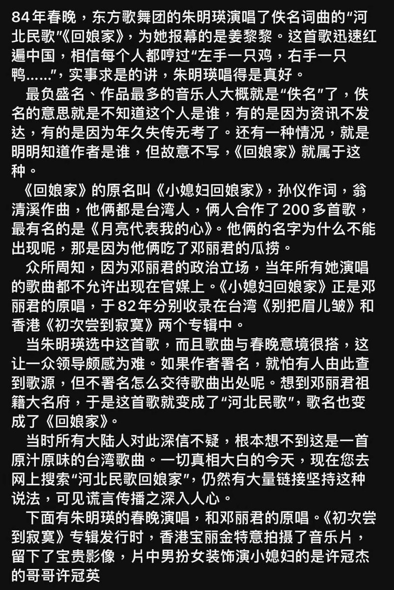
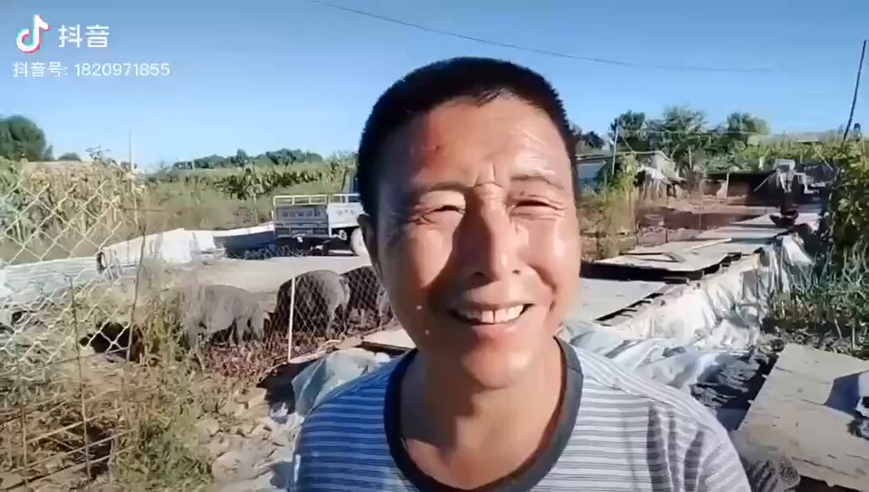

Petrichor 北京时间 2023-12-13T18:25:14Z 1734882159893082296 因人废文，在中共国是常见的事。有的人仅因为当局不喜欢，就将其全部作品从市场上下架。

由孙仪作词，汤尼（翁清溪的笔名）作曲，原主唱者为邓丽君，1982年由香港宝丽金唱片发行的歌曲《小媳妇回娘家》，被当局操纵下改成《回娘家》，拿掉原作词、原作曲的名字，谎称是河北民歌），改由朱明瑛在春晚演唱。

不尊重知识产权，非法侵权，在讲政治的实践中进行。   Petrichor 北京时间 2023-12-13T01:27:16Z 1734625982126923840 污染土地、污染江湖、污染空气。挣钱，然后海外。别忘了，高干有特供。 https://t.co/4muKA5zmTc   