自由亚洲电台 北京时间 2023-12-13T16:49:29Z 1734858066439577871 【开启十年又关闭  中国法院裁判文书不再对外公开】中国中国 #最高法院 办公厅近期下发《通知》，新推出的 #全国法院裁判文书库 仅限于法院内部检索裁判案例，律师、法学研究者以及公众无法查阅。#中国裁判文书网 的十年 #裁判文书公开 历程是否将走到尽头？
https://t.co/CngMp8kd9F https://t.co/ocA0LuLs0t 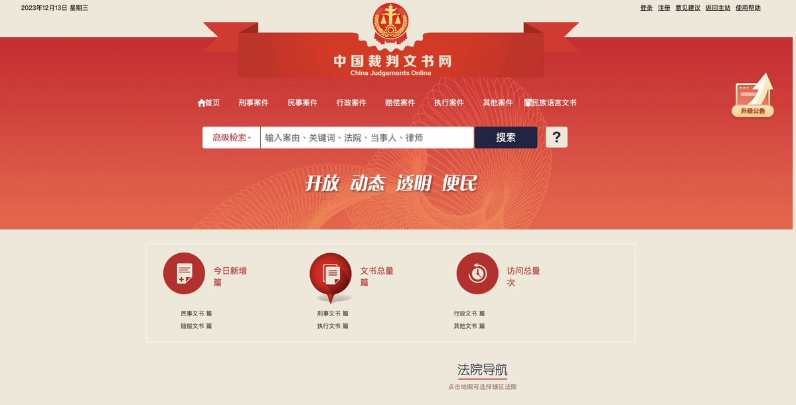  自由亚洲电台 北京时间 2023-12-13T13:07:46Z 1734802269835571472 RT @RFA_Chinese: 【欢迎加入自由亚洲电台电报群】https://t.co/UkKZmFSRkG https://t.co/Qid2LNZxJn   自由亚洲电台 北京时间 2023-12-13T11:46:26Z 1734781801908903939 RT @RFA_Chinese: 【终局已近 ｜“#动物庄园”动画剧场(大结局)】
数不尽的烂尾工程，辩不明的东升西降，刹不住的 #加速师，喊不醒的 #中国梦...
三年来，"动物庄园”陪您看尽盛世荒唐，感谢大家的支持厚爱！只是天下没有不散的筵席，小编今日在此别过。终局已近，各…   自由亚洲电台 北京时间 2023-12-13T11:47:26Z 1734782053814608374 RT @RFA_Chinese: 欢迎收听和订阅播客【#亚太报道】 https://t.co/MjLNSvVMqc

#习近平 访越构建“#共同体”；美国学者 #黎安友 表彰 #高耀洁 生平；中共中央设定明年经济目标；#黎智英 家属会晤 #英国 外相 #卡梅伦；#台湾 一国防大…   自由亚洲电台 北京时间 2023-12-13T00:27:06Z 1734610841306353966 据路透社周二（12月12日）报道，中国英国商会最近发布的年度调查表示，六成左右的 #在华英国企业 认为 #中国经济放缓 对他们的在华业务构成的挑战比 #新冠清零 措施造成的限制更大。https://t.co/bdvzUOo28e https://t.co/kAH2oz7dHm   自由亚洲电台 北京时间 2023-12-13T01:03:31Z 1734620006330114269 RT @RFA_Chinese: 【习近平抵达越南访问】
【中美竞逐对越南的影响力】… https://t.co/YsrQVj5AcM 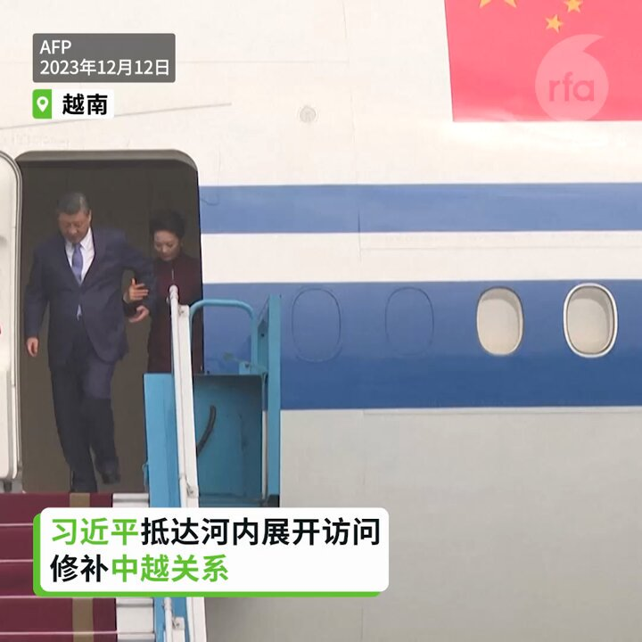  自由亚洲电台 北京时间 2023-12-13T01:59:11Z 1734634014160613615 #评论 | #唯色：《#杀劫》2023年最新修订版与前两版有何不同？(十) https://t.co/6dCLfFA3EG https://t.co/6mMleNQRdL 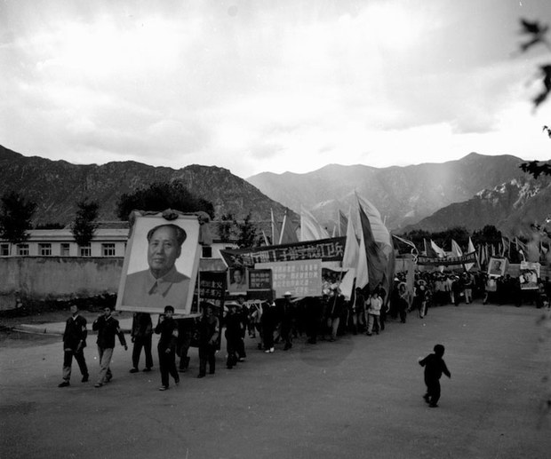  自由亚洲电台 北京时间 2023-12-13T04:50:50Z 1734677212841083223 "#无上限"的 #中俄伙伴关系 的局限性 https://t.co/cMKph8xa84 https://t.co/mjY9S8q7nG 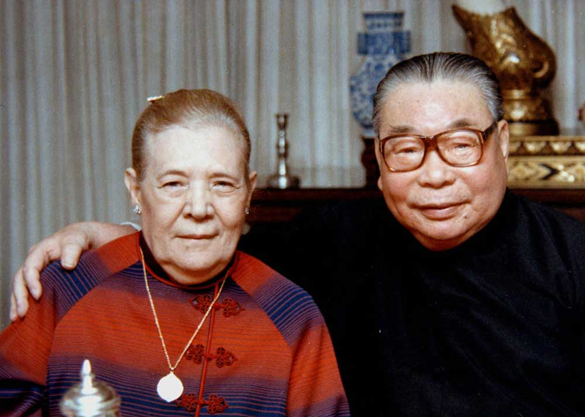  自由亚洲电台 北京时间 2023-12-13T04:52:03Z 1734677517339119699 #美国 公司发现与 #中国 #脱钩 很困难 https://t.co/LYL2ZzhXoz https://t.co/NwuvUcUNkR   自由亚洲电台 北京时间 2023-12-13T05:50:53Z 1734692323383185458 本周二，中国领导人 #习近平 正式对 #越南 开始为期两天的 #国事访问。据中国官媒报道，双方宣布将在深化全面战略合作伙伴关系的基础上，携手构建"#命运共同体"。那么，中越两国目前还是否具备所谓"同志加兄弟"般的关系基础？而面对南海主权争议，中方此举的目的何在？https://t.co/IJ0zKXN0cH https://t.co/tqkP1po3r5 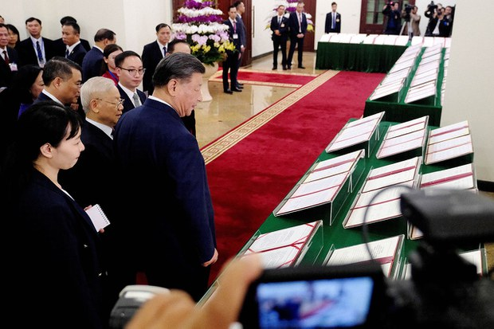  自由亚洲电台 北京时间 2023-12-13T05:52:48Z 1734692805522661563 欢迎收听和订阅播客【#亚太报道】 https://t.co/MjLNSvVMqc

#习近平 访越构建“#共同体”；美国学者 #黎安友 表彰 #高耀洁 生平；中共中央设定明年经济目标；#黎智英 家属会晤 #英国 外相 #卡梅伦；#台湾 一国防大学教授与中方合作引发防长震怒 #台海局势 https://t.co/jxQGTllVEA 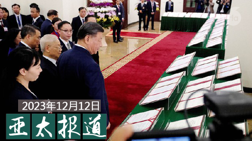  自由亚洲电台 北京时间 2023-12-13T05:58:01Z 1734694119979790726 本周二，美国国会针对在 #亚太经合组织（#APEC）#峰会 期间，部分民众因抗议中共领导人 #习近平 到访而遭遇暴力袭击的事件举行新闻发布会。克里斯·史密斯议员指出，相关事件凸显 #中国 当局公然升级 #跨国镇压 行动。https://t.co/0G2u5COBmJ https://t.co/LvViBQOAr4 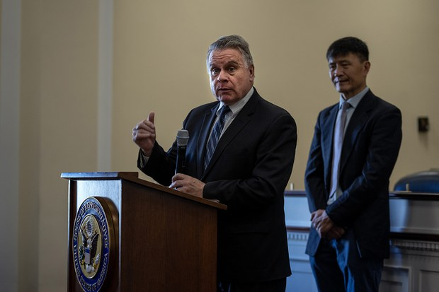  自由亚洲电台 北京时间 2023-12-13T05:59:48Z 1734694568589922611 【#变态辣椒：哭出宝宝来】#朝鲜 官媒报道显示，谈及朝鲜的 #出生率 下降，最高领导人金正恩擦去眼泪，鼓励妇女多生孩子。他在全国母亲大会上号召妇女为革命培养子女，并打击"非社会主义习俗"。作为全世界最贫穷国家的一员，朝鲜妇女的生育率只有1.8%，即使在低收入国家中也是低的。https://t.co/dxuJkpyaVk 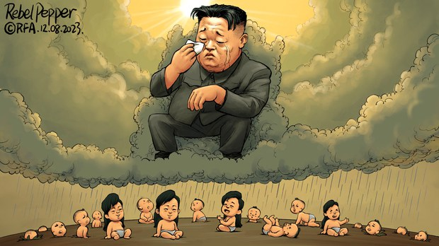  自由亚洲电台 北京时间 2023-12-13T00:08:11Z 1734606081241010458 港府计划把现有位于市中心的科学馆改建为介绍中国发展和成就的专馆，并在文化博物馆现址重建科学馆，此举引起舆论反弹，担心港府处心积虑想把 #香港 文化从博物馆移除，目的是剥夺港人的 #身份认同。https://t.co/ungPskyfmT https://t.co/z84e4U2mIT 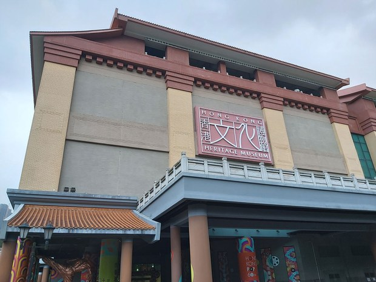  自由亚洲电台 北京时间 2023-12-13T00:09:21Z 1734606372988412104 路透社日前引述知情人士披露，中共 #中央经济会议 已在12月11日召开，并设定中国明年的经济增长目标为5%左右。连日来，官方媒体也提高了唱好经济前景的调门。但是，#中国经济 的实际状况如何呢？https://t.co/harOnvSVup https://t.co/fygW2C0Omj 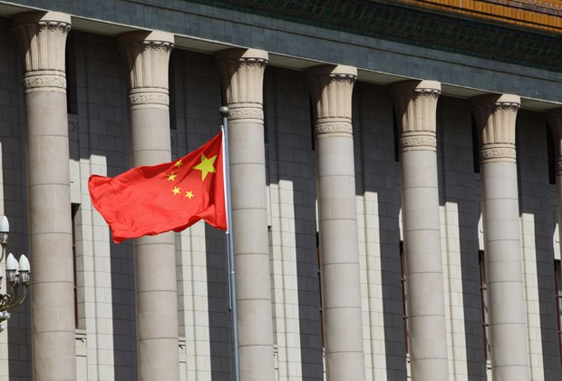  自由亚洲电台 北京时间 2023-12-13T00:26:08Z 1734610596950323401 近日有台湾媒体披露，#台湾 的国防大学教授 #葛明德 私下开设公司与 #中国 #技术合作，并多次以探亲名义进出中国。台湾的国防部长 #邱国正 在国会就此表示，“此案严重性形同叛国”。https://t.co/cCx3YxNfoH https://t.co/jcbSx2911r 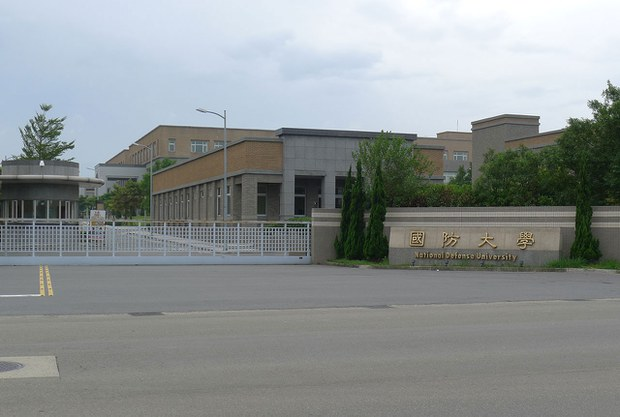  自由亚洲电台 北京时间 2023-12-13T00:28:25Z 1734611173239296209 习近平特使 #武维华 与 #阿根廷新总统 会面 https://t.co/zAJV7n2POw https://t.co/XTuTl79poH 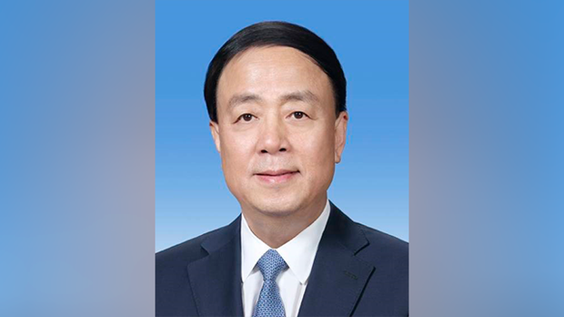  自由亚洲电台 北京时间 2023-12-13T01:58:19Z 1734633794160959967 近日，海外西藏人权组织发布报告指出，#尼泊尔 参与中国" #一带一路"倡议近六年来，当局针对 #流亡藏人 的人权侵犯与打压日益严重，尼泊尔形同"第二个西藏"。有流亡藏人告诉自由亚洲电台，藏人对尼泊尔有如与中国交换的猎物，导致他们身陷安全风险。https://t.co/V0lexur1ze https://t.co/DxhWSngseR 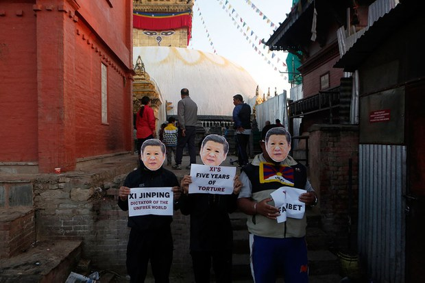  自由亚洲电台 北京时间 2023-12-13T02:47:42Z 1734646225222467929 香港传媒大亨 #黎智英 被控触犯《港区国安法》的案件将于下周一（18日）开庭。他的儿子 #黎崇恩 周二（12日）和英国新任外相 #卡梅伦（David Cameron）会面，这是黎崇恩目前接触到的最高级别英国官员，盼能为黎智英的国际营救行动带来曙光。https://t.co/av0gf0TYZY https://t.co/3VnqkZgvyg 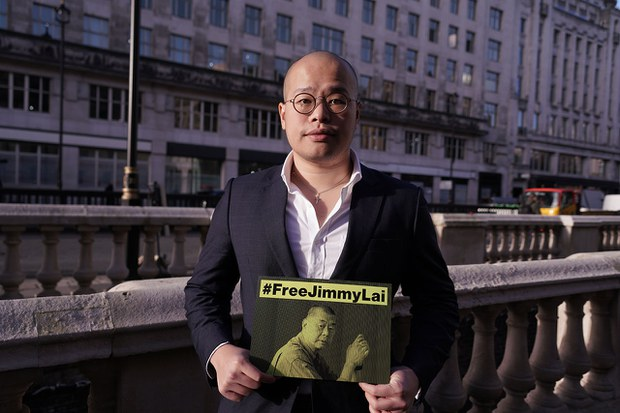  自由亚洲电台 北京时间 2023-12-13T03:47:01Z 1734661151072637146 #加拿大 政府宣布对服装品牌 #GUESS(盖尔斯)涉及 #维吾尔强迫劳动 启动调查。与此同时，有人权组织敦促加拿大政府对七个中国商业实体实施制裁，令加拿大进口商不得再进口那些使用维吾尔人强迫劳动制造的产品。https://t.co/IJUB5vPC4z https://t.co/L5WBXN5nSM   