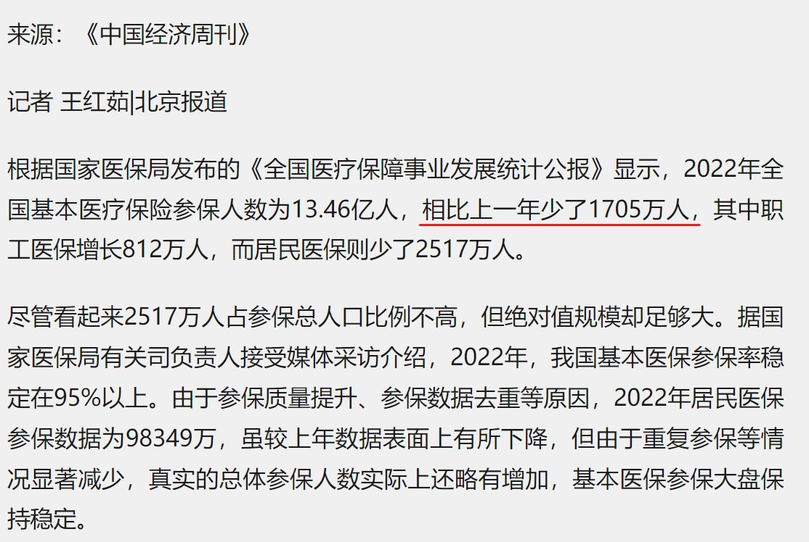
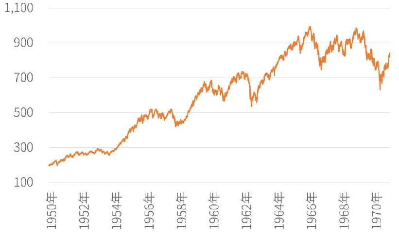
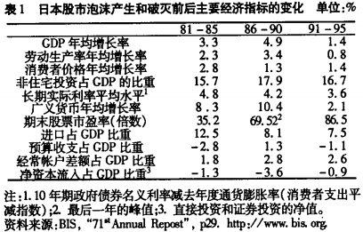
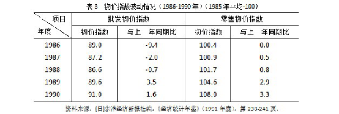
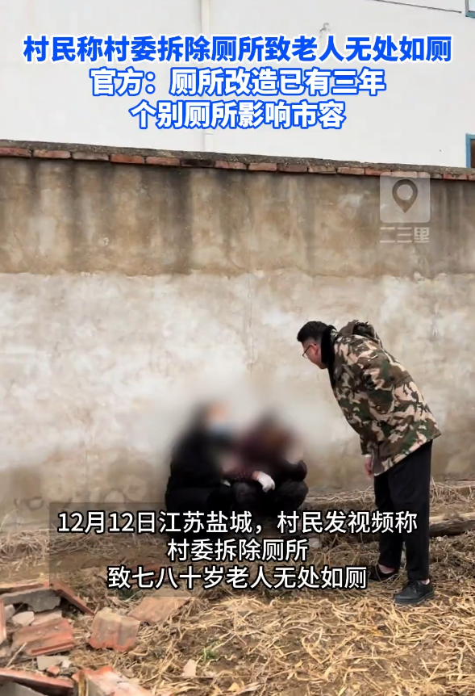

谁将十万横扫三江 北京时间 2023-12-13T19:23:50Z 1734896906650927443 RT @CDTChinese: 公务员只是一种工作，考公当然没有问题，但一个国家成为考公大国，不管出于什么原因，背后都有社会问题存在。有俄罗斯学者曾经说过，世界历史上有两种截然相反的现代化模式，一种是“以人为主体的现代化”，另一种是“以人为代价的现代化”。在后一种模式中，“体制…   谁将十万横扫三江 北京时间 2023-12-13T18:10:22Z 1734878419375308838 RT @torontobigface: 根据《全国医疗保障事业发展统计公报》的数据。
中国在2022年，参与医疗保险的人数，罕见的比去年减少了1705万人。
越来越多的人，不愿意缴纳社保，医保，没钱缴纳社保医保了。 https://t.co/9UqAFUv6zl   谁将十万横扫三江 北京时间 2023-12-13T12:24:25Z 1734791360400802050 看见评论区很多天真的家伙，说这些人为什么不去公益住宿，你去了就让你登记身份证号，然后联系户籍地警察给领回去，站这几个人就是让人拍的，让你理解成能免费住都不去，实则很多人都被送回去过，谁都不傻，有免费住宿还睡大街，什么时候党这么好心了，拿滋水枪给流浪者洗澡，给别人打地铺的地方装铁钉，忘了？
再者，底层是惯会趋利避害的，twitter上也发过很多，一点饭菜都要抢着吃，到有好事反而不会去了，可能吗？实际上，他们比一些评论者更了解共产党   谁将十万横扫三江 北京时间 2023-12-13T12:55:01Z 1734799061071577491 RT @mengtunwudaimu: 再放送，共青团小编清明节祭扫英烈时玩原神。 https://t.co/FvRspDjwfc   谁将十万横扫三江 北京时间 2023-12-13T13:24:23Z 1734806451988857146 李蓓：“在经济转轨下行之后，资金成本下行，利率下行，整个资本市场会面临重估。比如美国在50年代迎来了大牛市，日本在80年代迎来了大牛市”

PS：美国在50年代开始迎来牛市是因为战后红利引发，社会保障足够，预期向好，经济感知好→大肆消费→经济感知好→继续消费，最终抬高股市，再通过股市赚钱，消费。
中国不具备这种正向循环的前提：
1社保保障极度缺失，居民不敢消费
2仅就数据而言，中国制造业增加值占经济27.7%，和美国50年相似。但美国是依靠战后红利转移密集劳动产业，从依赖重资产变成依赖科技行业带来的经济蓬勃发展预期完成经济转型。（1938年仅制造业就占全国经济的40%，50年是27%，07年是11%）中国既缺乏高附加值产业提供就业，也缺乏转移目的国家。
3股市制度完善，驱除政治因素 图2无需多言

日本80年代也是通过经济主导产业由重化工产业转变为以电子技术产业为中心的知识密集型产业来转型的，一样淘汰了大规模的低附加值高污染的基础制造业。叠加本币对美元升值，买资源更便宜了，有利于出口规模增加，企业降低成本增加利润，基本能维持在本币升值情况下的出口占比不变，然后开始操作提高内需。中国的发展逻辑和别人基本上是反着来的，不能怪外资“恶意离场”   谁将十万横扫三江 北京时间 2023-12-13T13:56:44Z 1734814590398304357 江苏盐城政府强拆村民厕所致七八十岁老人无处如厕

官方：都跟你说了盖个新厕所补贴600元，就是不盖，偏要等我花六千雇一堆人帮你拆掉，现在不盖没得用，看你盖不盖 https://t.co/vIiFqhykL4   谁将十万横扫三江 北京时间 2023-12-13T11:50:30Z 1734782824908292218 RT @Yura8964: 铭记世界上每个极权政权带来的苦难。
记住历史不等于延续仇恨，社会变革是通过无数的事件推动的，反对任何一个国家的极权行为是身为人类该做的事情。

同理，对于中国共产党执政期间的劫难同样视而不见的“爱国者”，是最没有资格钦点日本极右翼的。极右份子一家亲，…   谁将十万横扫三江 北京时间 2023-12-13T11:50:41Z 1734782868986135002 RT @torontobigface: 今天是南京大屠杀纪念日
我本人是反对屠的好，屠的妙的这种说法的。
我觉得南京大屠杀也是可以纪念的
但是有一部分人他纪念南京大屠杀
他们根本不是在纪念这场灾难，也不是在怀念故人和过去
而是想借着纪念南京大屠杀去搞个东京大屠杀
以一场灾难，作…   谁将十万横扫三江 北京时间 2023-12-13T11:51:00Z 1734782951236538844 RT @whyyoutouzhele: 网传消息称，12月12日，西安一场独立电影放映活动，内容是一部同性恋题材纪录片《希腊酷儿革命》。
刚开始放映十几分钟，警察和文化局联合执法，叫停了放映。… https://t.co/hkx6haAWo8   谁将十万横扫三江 北京时间 2023-12-13T09:38:48Z 1734749681815835016 网友投稿：一篇讲国内航司糟糕现状的帖子，已被民主 https://t.co/a3CczKdwGZ   