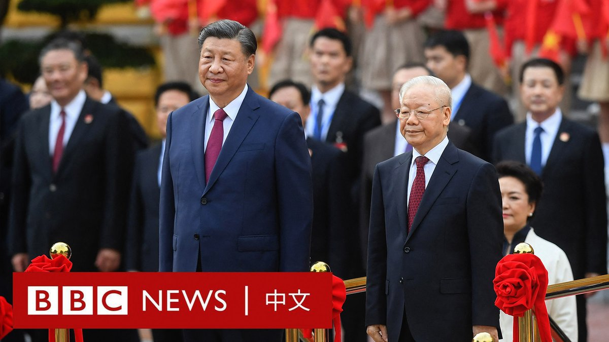
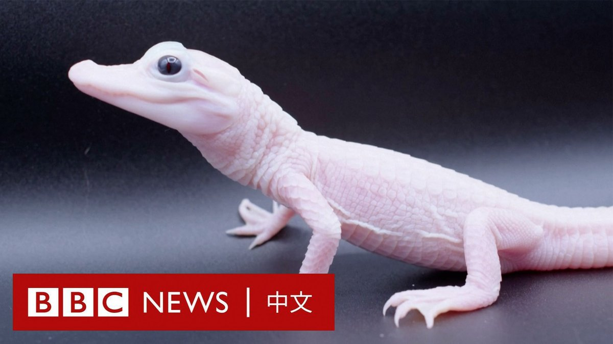
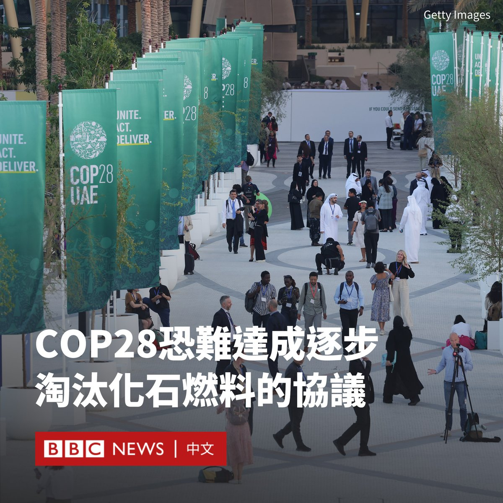
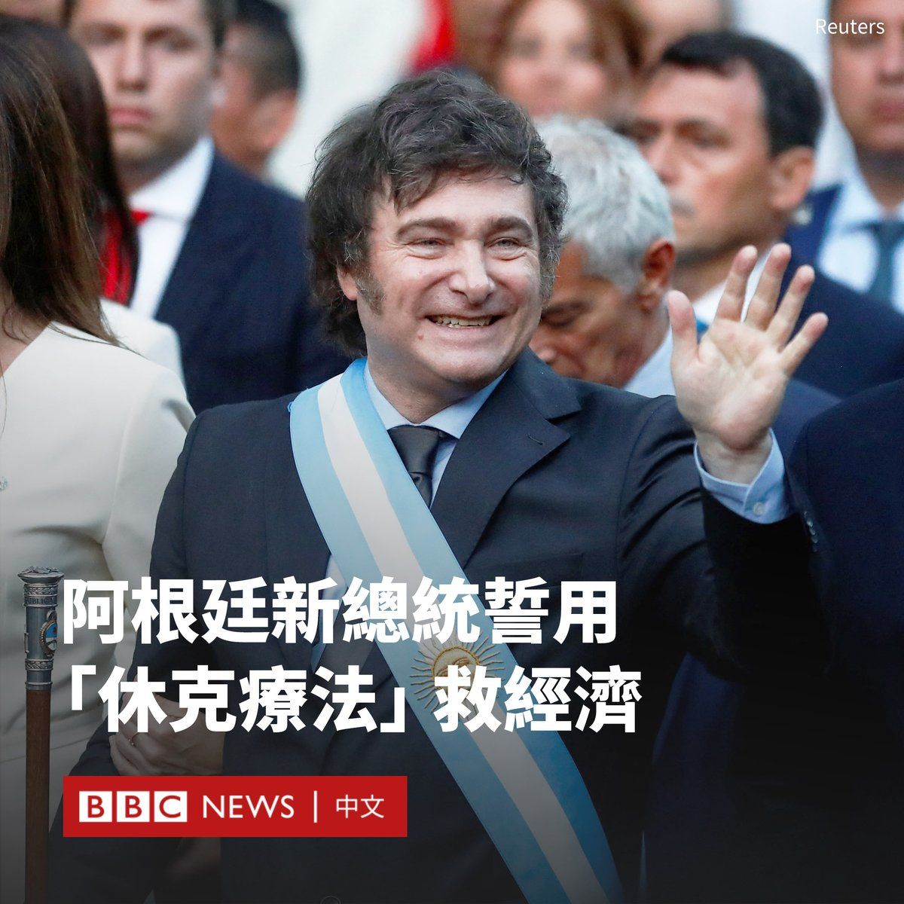

D英国广播公司BBC 北京时间 2023-12-12T21:55:36Z 1734572713459532263 近年来，中国大陆的社群平台，例如小红书或TikTok，在台湾年轻族群中流行起来。根据台湾网路资讯中心今年8月发布的报告，有超过22%的台湾成年人有使用抖音或TikTok。

一些质疑声则认为，具有中国背景的软件正在被利用对台湾进行“认知战”。我们在台北了解普通民众的看法。https://t.co/xB5mfgPAHG   D英国广播公司BBC 北京时间 2023-12-12T22:04:44Z 1734575013036966202 上世纪90年代，本是退休妇产科医生的高耀洁在一次会诊时遇到艾滋病病例，继而发现了河南存在因输血感染艾滋病的现象。从此，她自发走上艾滋病防治与救助工作，力图推动当局重视中国艾滋病蔓延的真实情况。https://t.co/QaZbU5skuY   D英国广播公司BBC 北京时间 2023-12-12T20:24:48Z 1734549862144963003 【现场画面】中国国家主席习近平在河内参加了由越共中央总书记阮富仲主持的欢迎仪式，开始对越南进行国事访问。

这是习近平时隔六年再次访问越南，旨在进一步深化北京与这个东南亚邻国的关系。今年9月，美国总统拜登（Joe Biden）也访问了越南，并宣布提升两国的外交关系级别。 https://t.co/PLcCMaYAf3   D英国广播公司BBC 北京时间 2023-12-12T15:00:01Z 1734468128321552751 在美国佛罗里达州奥兰多的一家野生动物园，一只极为罕见的粉白色小鳄鱼诞生了。

据园方介绍，这只雌性小鳄鱼身长49厘米，是世界上已知仅存的七只白变鳄鱼之一。

白变鳄鱼是美洲短吻鳄中出现的最罕见的遗传变异。它们与白化鳄鱼不同，眼睛仍然为常色。 https://t.co/OYLunK9yHV   D英国广播公司BBC 北京时间 2023-12-12T18:21:12Z 1734518757345943920 中国领导人习近平星期二（12月12日）已抵达越南展开正式访问。在北京与华盛顿竞争日益激烈的今天，越南和中国这两个爱恨交织的邻邦正小心翼翼地避免两国关系受到国内民族情绪与历史纠葛的影响，取而代之的是颂扬两国“同志加兄弟”的溢美之词。https://t.co/AkE9t5xLhM   D英国广播公司BBC 北京时间 2023-12-12T16:00:09Z 1734483261642915873 每次有关不明原因的新疾病爆发的报道登上头条时，往往伴随着各种猜测，甚至是恐惧。这些“神秘”疾病的大爆发在人类历史上常见吗，它们又是如何出现和结束的？
https://t.co/3lTCFmINrs   D英国广播公司BBC 北京时间 2023-12-12T13:02:08Z 1734438462630285565 在迪拜举行的COP28大会上，多国推动联合国达成逐步淘汰化石燃料协议的行动受挫，这招致了美国、欧盟以及气候脆弱国家的批评。

一个由100多国组成的联盟一直在推动达成一项协议，以期待首次承诺石油时代终将结束，但这遭到了石油输出国组织欧佩克（OPEC）成员的反对。

峰会主席国阿联酋公布的一份新协议草案提出了多种选择，但没有提及“逐步淘汰”化石燃料，而是“以公正、有序和公平的方式减少化石燃料的消费和生产”。

谈判代表们正在对新文本进行辩论，预计谈判将持续到夜里。寻求逐步淘汰化石燃料的国家誓言将继续推进这一立场。这次会议按计划将于周二（12月12日）结束。

新的措辞旨在吸引沙特和其他化石燃料生产大国加入，但是其可能失去数十个要求逐步淘汰化石燃料的国家的支持。

美国发言人表示，文本中有关化石燃料的部分“需要大幅加强”。欧盟的一名代表则称该草案“不可接受”，并表示欧盟可能拒绝。

小岛屿国家联盟（Alliance of Small Island States）的一位代表表示：“我们不会签署死亡证明”，并称如果没有“关于逐步淘汰化石燃料的坚定承诺”，该方将不会签署文本。

出席峰会的所有198个国家必须达成一致，否则就无法达成协议。   D英国广播公司BBC 北京时间 2023-12-12T11:21:02Z 1734413019168542830 阿根廷新任极右翼总统哈维尔·米莱（Javier Milei）在正式上任后的首次演讲中，誓言要在经济上实施“休克疗法”。他还再次表示将实施严厉的紧缩措施。

这位民粹主义领导人在去年11月出人意料地赢得了选举胜利，他誓言将彻底改革这个南美国家萎靡不振的经济。

米莱的就职典礼于周日（12月10日）在布宜诺斯艾利斯举行。他说，他将通过大幅削减开支来结束“几十年的颓废”，力争减少巨额债务并降低目前已超过140%的通货膨胀率。

“除了紧缩和休克疗法外，别无选择。”米莱说。“我们知道，短期内情况会恶化。但届时我们将看到我们努力的成果。”

几年内，53岁的米莱从一个相对默默无闻的经济学家迅速成为阿根廷总统，他的右翼政治观点包括限制堕胎权，放宽枪支法和否认气候变化。

他经常被拍到在竞选活动中挥舞电锯。他的不拘一格常被人们比作美国前总统特朗普（Donald Trump）和巴西前总统博尔索纳罗（Jair Bolsonaro）。

在竞选期间，他称将用美元取代阿根廷货币，并关闭该国的中央银行、裁撤多个政府部门。

上任数小时后，米莱就签署了一项法令，将阿根廷政府中原先的18个部门裁撤为9个。

阿根廷货币比索长期处于自由落体状态，贫困率飙升至40%，根据国际货币基金组织（IMF）的数据，阿根廷经济陷入严重衰退。   D英国广播公司BBC 北京时间 2023-12-12T10:18:23Z 1734397252263948377 在意大利小镇上，一群残疾人士全年都在努力训练，最终在马背上与非残疾选手同场竞技，夺得金牌。

但对他们付出的回报远远超出了奖牌，他们在一次又一次旋转与腾空中克服了羞耻和恐惧。 https://t.co/4Mhs2qeCP7   