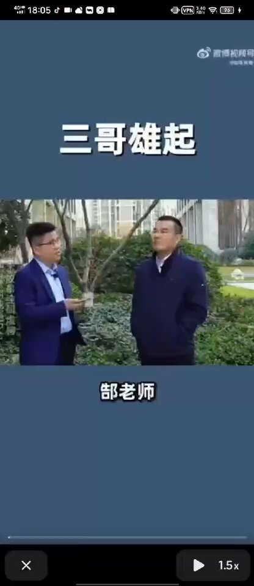
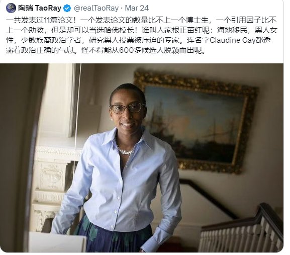
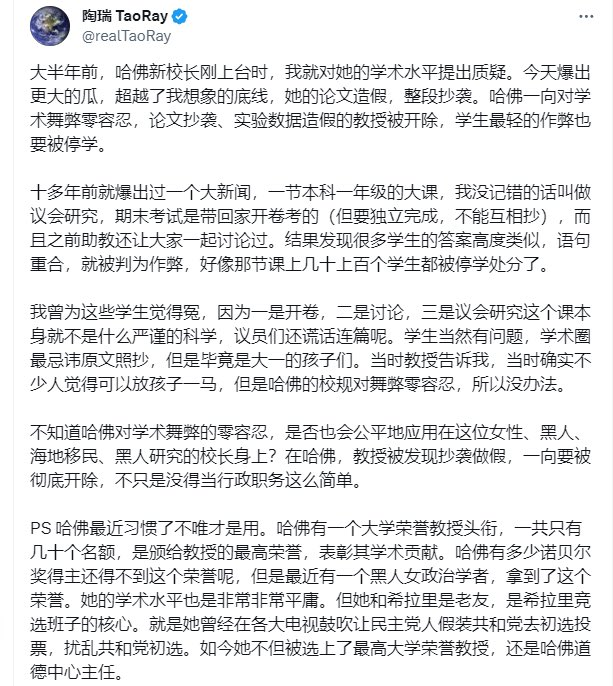
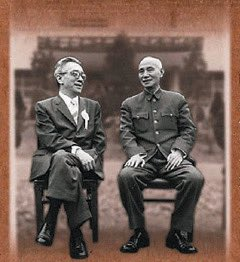
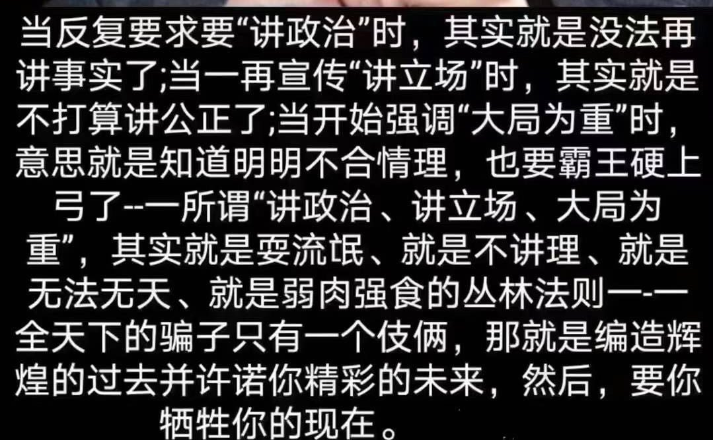
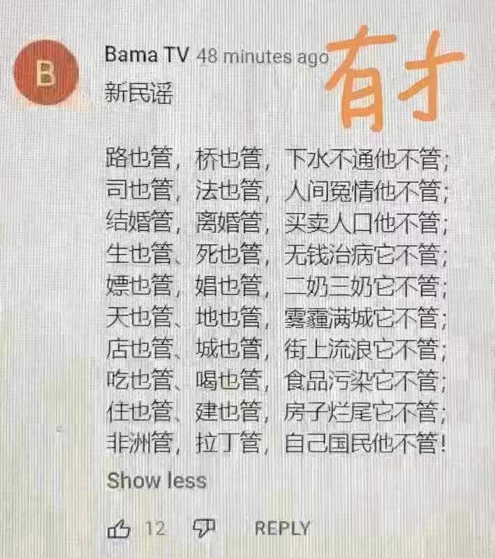
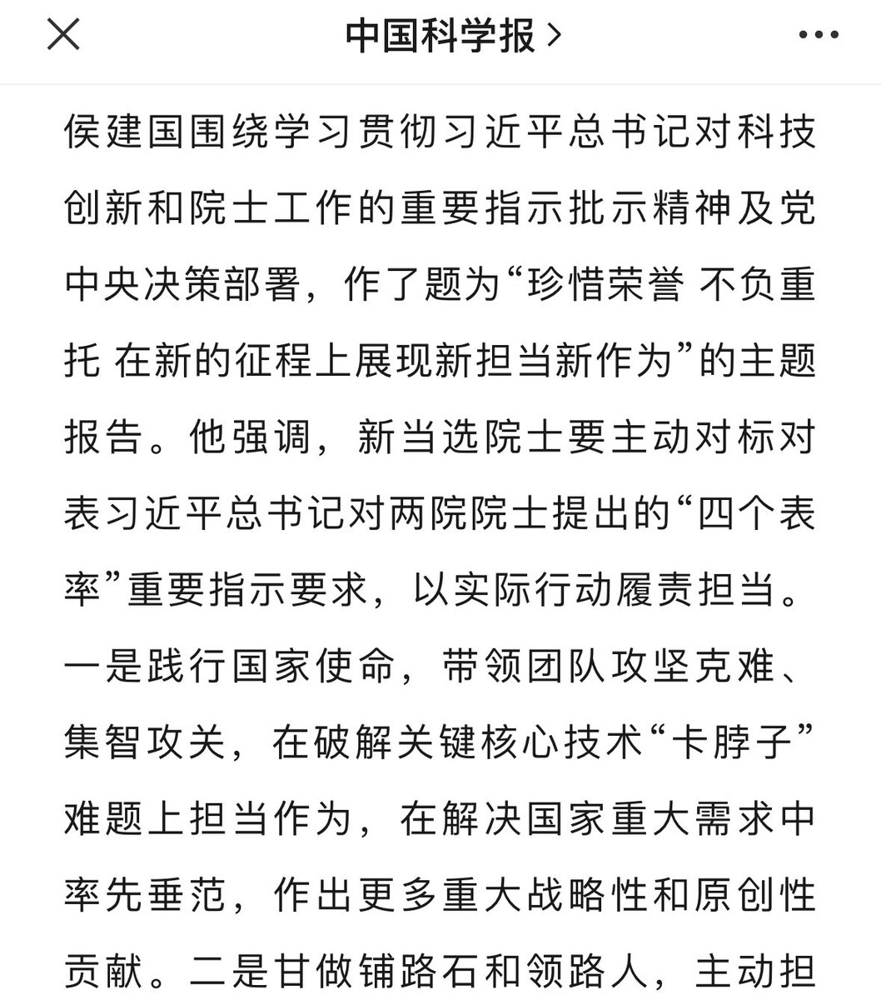
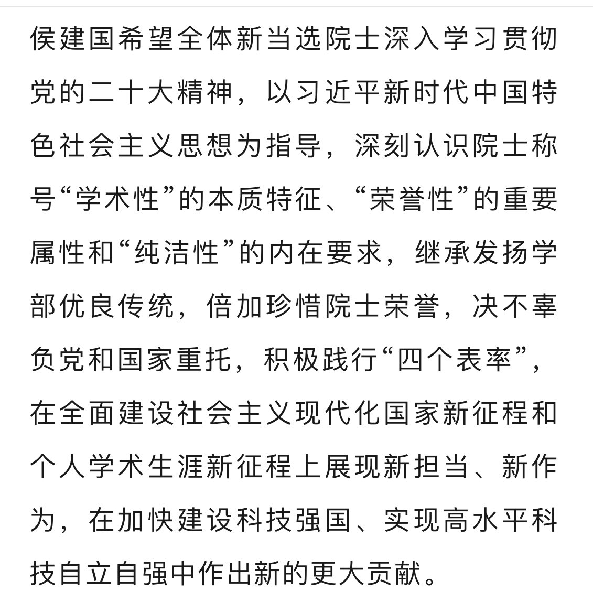

Petrichor 北京时间 2023-12-12T21:41:14Z 1734569099663929425 刘道玉：“大学就是剥了壳的熟鸡蛋，外面是白的，里面是黄的。大学基本就是洋务运动和戊戌变法那时候从西方引进的，从引进开始，我们就用了实用主义思想，就是洋务运动提出的‘中学为体，西学为用’。

“我认为当时这个口号错了，应该是‘西学为体，中学为用’。因为现代科学发源于西方。”   Petrichor 北京时间 2023-12-12T18:33:33Z 1734521864586736088 谁说政治制度不影响吃饭？错。
谁说民主不能当饭吃？错。 https://t.co/gtxcqEBsiT   Petrichor 北京时间 2023-12-12T18:37:29Z 1734522858259292559 七国集团领导人声明（有关中国部分的摘译）
美国白宫
2023年12月6日
七国集团（G7）合作伙伴重申《七国集团广岛峰会领导人公报》（G7 Hiroshima Leaders’ Communique），并就以下内容达成一致，这些内容构成我们各国对中国关系的基础：
• 认识到与中国坦诚接触并直接向中国表达我们的关切的重要性，我们随时准备与中国建立建设性的、稳定的关系。我们的行动符合国家利益。鉴于中国在国际社会中的作用及其经济规模，有必要与中国就全球性挑战并就存在共同利益的领域展开合作。
• 我们呼吁中国在《巴黎协定》（Paris Agreement）和《昆明-蒙特利尔协定》（Kunming-Montreal Agreement）的框架内，就气候危机和生物多样性危机以及自然资源保护等领域与我们接触，包括在国际论坛中进行接触，解决脆弱国家的债务可持续性和融资需求以及全球卫生和宏观经济稳定等问题。
• 我们的政策方针并非要损害中国，也无意阻碍中国的经济发展和进步。一个遵守国际规则的不断发展的中国符合全球利益。我们不会与中国脱钩或闭关自守。与此同时，我们也认识到，要增强经济韧性，就必须去风险并实现多样化。我们将单独地与集体地采取措施，投资于自身的经济活力。我们将减轻在关键供应链中的过度依赖性。
• 为了与中国建立可持续的经济关系并加强国际贸易体系，我们将为我们的工人和企业争取公平的竞争环境。我们将努力解决中国扭曲全球经济的非市场政策和做法构成的挑战。我们将打击诸如非法技术转让或数据泄露等恶性做法。我们将增强抵御经济胁迫的韧性。我们还认识到，必须在不过度限制贸易和投资的情况下，保护可能被用于威胁我们国家安全的某些先进技术。
• 我们仍然严重关切东中国海和南中国海的局势。我们坚决反对任何以武力或胁迫手段改变现状的单方面企图。
• 我们重申台湾海峡和平与稳定的重要性，这是国际社会安全与繁荣不可或缺的要素。七国集团成员对台湾的基本立场没有改变，包括已阐明的一个中国政策。我们呼吁和平解决两岸问题。
• 我们将继续表达对中国人权状况的关切，其中包括西藏和新疆，那里的强迫劳动问题是我们的重大关切。我们呼吁中国履行依据《中英联合声明》和《基本法》所做的承诺，其中明文载入了香港的各项权利和自由以及高度自治。
• 我们呼吁中国按照《维也纳外交关系公约》（Vienna Convention on Diplomatic Relations）和《维也纳领事关系公约》（Vienna Convention on Consular Relations）的规定履行其义务，不得从事破坏我们社会的安全和稳定、我们民主制度的完整性以及我们的经济繁荣的干涉活动。
• 我们呼吁中国向俄罗斯施压以促其停止军事侵略，立即、全面、无条件地从乌克兰撤军。我们鼓励中国支持基于领土完整和《联合国宪章》（UN Charter）的原则和宗旨的全面、公正且持久的和平，包括通过其与乌克兰的直接对话。
中国在南中国海的扩张性海洋主张没有任何法律依据，我们反对中国在该地区的军事化活动。我们强调《联合国海洋法公约》（UNCLOS）的普遍性和统一性，并重申《联合国海洋法公约》在制定管辖所有海洋活动的法律框架方面的重要作用。我们重申，国际仲裁庭（Arbitral Tribunal）于2016年7月12日做出的裁决是一个重要的里程碑，对当事方具有法律约束力，而且是和平解决当事方之间争端的有效基础。   Petrichor 北京时间 2023-12-12T14:49:28Z 1734465476154032268 哈佛校友在推特上曝料，哈佛黑人校长在读哈佛时，她的关于种族的论文存在相当部分的逐句抄袭，几乎就是照搬大量别人文章的段落。她的绝活是抄自己导师的文章，她将别人的东西当成自己的论文，并且拿到了哈佛的博士。她的博士论文的题目是： "Race, Sociopolitical Participation, and Black Empowerment”，以如此撕裂种族为己任的所谓研究，与研究医学、物理、化学的科学家同样获得哈佛的博士，这是十分不公平的。
哈佛黑人女校长的抄袭相当恶劣，马斯克都表示震惊。我个人也认为她没有学术诚信，应该辞职！   Petrichor 北京时间 2023-12-12T05:44:10Z 1734328244113985761 https://t.co/mfMvnc4S5v   Petrichor 北京时间 2023-12-12T09:29:02Z 1734384835358032103 机场安检如果想偷，还真有机会偷。不得不防。 https://t.co/IsQhscXn8A   Petrichor 北京时间 2023-12-12T10:15:05Z 1734396421518839941 当他们提倡讲党性时，就是不要人性了。
当他们开始讲政治时，就是不顾事实和真相了。 https://t.co/KQQmkcovN1   Petrichor 北京时间 2023-12-12T03:49:54Z 1734299486875246751 有所为有所不为，选择性的作为。
你若到网络上批评他们几句，他们会效率很高的找到你。 https://t.co/mKI3aLJrXL   Petrichor 北京时间 2023-12-12T03:57:23Z 1734301373020192999 中国知识分子的无奈，即使做了院士，也要学习小学生思想。 https://t.co/TIr31TTJnn   