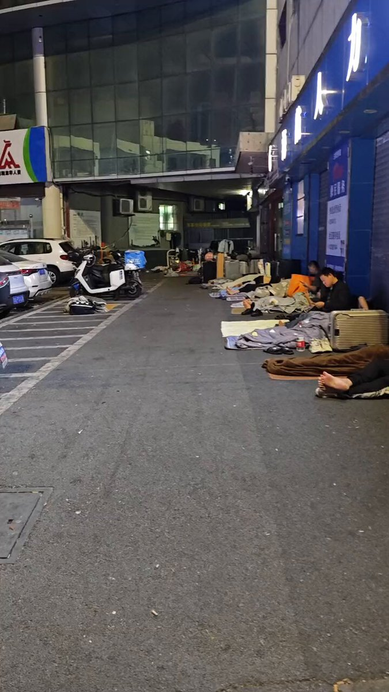
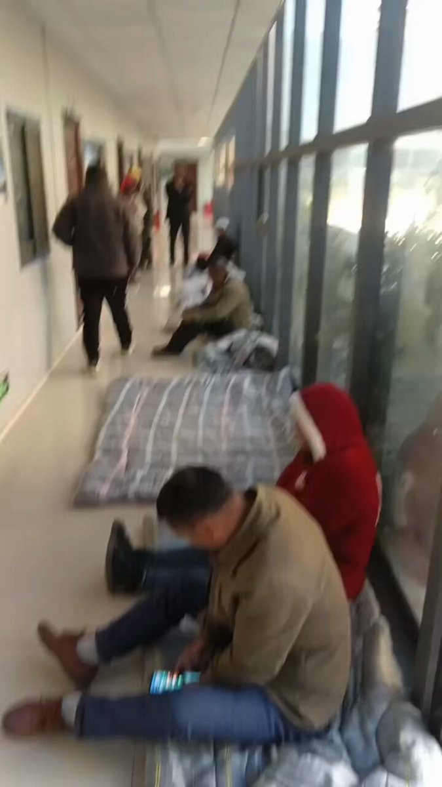
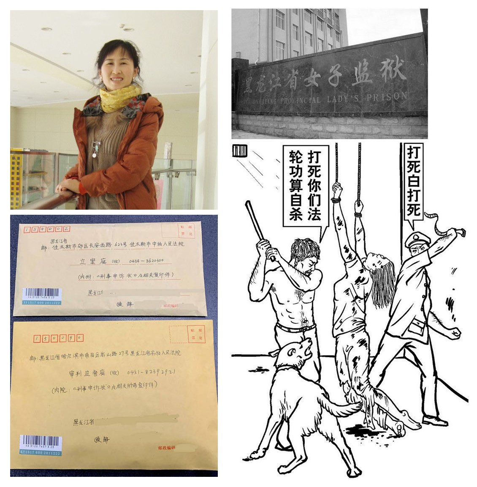

拆墙运动公号 北京时间 2023-12-12T23:11:53Z 1734591912957345961 RT @whyyoutouzhele: 12月11日，深圳市龙华汽车站。
当地的执法部门开始清理那些露宿街头的大神们。 https://t.co/IDpMwfETGJ   拆墙运动公号 北京时间 2023-12-12T23:20:52Z 1734594171883618489 RT @YesterdayBigcat: 农民工在西藏拉萨鲲泰公司讨薪/12月11日 https://t.co/pW0eVm7WMI   拆墙运动公号 北京时间 2023-12-12T23:36:50Z 1734598188936368523 RT @rqlsgc: #宗教迫害之法轮功信仰者陈静出狱后继续申诉 
遭五年冤狱、酷刑凌虐   陈静依法提起申诉… https://t.co/outESQlBwn   拆墙运动公号 北京时间 2023-12-12T07:21:44Z 1734352799276613895 共产党组织统治领导从起初的时候干的就是见不得光的   拆墙运动公号 北京时间 2023-12-12T04:35:57Z 1734311079029731386 RT @Ldl076ya: 进行司法迫害 #曹春生 的恶人 #徐卫岭 、  #宋应红 已经上 #恶人榜。
他们两个不但进行司法迫害 #曹春生 还伙同陕西省宝鸡市司法局司法迫害 #曹春生 的代理律师 #常玮平，使 #常玮平 律师的律师证被无辜吊销。
从此 #常玮平 成了法律维权者…   拆墙运动公号 北京时间 2023-12-12T04:36:11Z 1734311137095860548 RT @LinShengliang: #惡人榜 281號（缺照）
姓名：#韓貴芳/#韩贵芳 
性別：女
職務：山西省忻州市定襄縣檢察院检察员
單位地址：山西省忻州市定襄縣晉昌大街5號
郵編：035400
電話：
ID:
        山西省忻州地區定襄縣
手機/支付寶: 
手…   拆墙运动公号 北京时间 2023-12-12T05:15:44Z 1734321088484536498 RT @RFA_Chinese: 12月10日 #国际人权日 当天，#加拿大 多个族裔在多伦多发起集会，抗议中国当局持续迫害人权，并呼吁加拿大政府要有所作为。
鉴于 #亚投行 今年稍早遭前加拿大籍主管控诉已成为北京掌控谋利的工具，渥太华近日表示，决定扩大审查，将无限期暂停参与亚…   拆墙运动公号 北京时间 2023-12-12T05:32:01Z 1734325188878069965 这是中国政府日益打压人权捍卫者，并打压程度越演越烈的表现。 世界人权宣言已经成立了75周年，全世界各个国家的人权都在改进的今天，中共政府不但不注重人权，反而打压人权越来严重。   拆墙运动公号 北京时间 2023-12-12T05:35:26Z 1734326048777478483 RT @ShengXue_ca: 杜文律师介绍阿拉木沙真实情况🙏
杜文因追查天主教留在中国的教产遭中共当局侵占而被关押在监狱12年8个月，他原是内蒙古政府法律顾问室执行部主任。
他跟阿拉木沙很长时间关在同一监狱、同一监区、同一监室。
https://t.co/mCn0rAQYMj   拆墙运动公号 北京时间 2023-12-12T05:35:55Z 1734326168373846331 RT @VOAChinese: 国际人权日：人权组织在伦敦游行示威，呼吁关注中国人权问题 https://t.co/0XS38PnD9A   拆墙运动公号 北京时间 2023-12-12T05:36:52Z 1734326408183177467 RT @AnnaWruiqin: 週三、12月13日，國会中共特別委員會將於美國東部時間晚上 7:00 舉行 2023 年最後一次聽證會，題為“中共跨國鎮壓：該黨努力壓制和脅迫海外批評者”   拆墙运动公号 北京时间 2023-12-12T00:29:18Z 1734249007323508819 RT @BeaconChen53906: 致敬高贵的灵魂
1996年开始系统调查揭露中国河南省因卖血艾滋病大规模感染事件的高耀洁医生被当局迫害，被迫流亡海外，本月在纽约曼哈顿寓所去世，享年95岁

致敬，哀悼…… https://t.co/O43nZmoRmm   拆墙运动公号 北京时间 2023-12-12T00:55:33Z 1734255613977243725 中国对于基督教的基督徒、传道人和牧师一直以来受到中国政府的打压、抓捕、判刑。
希望世界关注中国的基督教、关注中国的基督徒   拆墙运动公号 北京时间 2023-12-12T01:28:07Z 1734263807810191577 RT @LinShengliang: 投訴控告
  投訴控告人：曹金芝，女，55歲，1968年10月1日出生，原住址：北京市大興區瀛海鎮瑞合一村瑞宏西路北四條10號內2號，電話13716437830，現暫住：南海家園六里23號樓一單元102室。… https://t.co/IE…   拆墙运动公号 北京时间 2023-12-12T01:28:11Z 1734263823350014291 RT @Ldl076ya: 一直维权的北京市大兴区瀛海镇瑞合一村瑞宏西路北四条10号内2号的 #曹金枝 ，电话13716437830，现暂住：南海家园六里23号楼一单元102室。
#曹金枝 因为维护其权力，长期被跟踪、被警察上门骚扰、被拘留。深受其害！
她整天过着人无宁日的生活…   