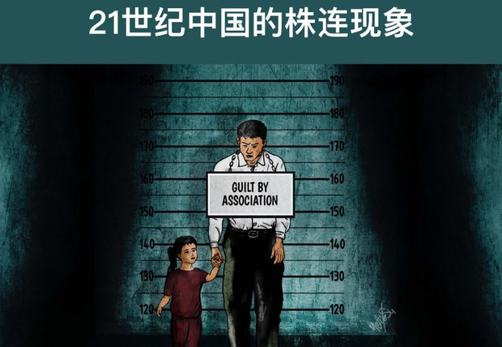
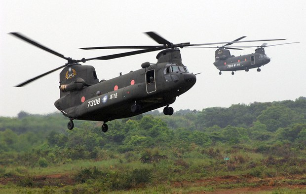
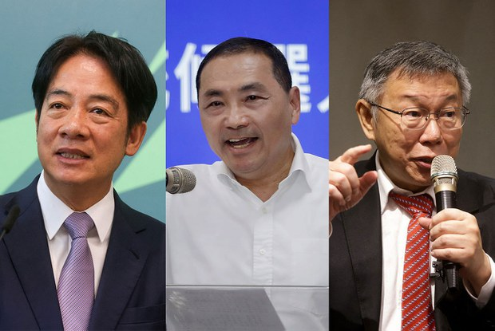

自由亚洲电台 北京时间 2023-12-12T03:22:10Z 1734292507763318800 国际人权组织“#保护卫士” @SafeguardDefend 在2023年12月10日 #国际人权日 发布人权报告，报告显示，在中共领导人习近平治下，当局正在把 #连坐 模式作为控制人权捍卫者及其家属的政治工具。
https://t.co/1fxD3Vx7dm https://t.co/jpXshJc1Pt   自由亚洲电台 北京时间 2023-12-12T02:07:51Z 1734273808918552969 据台湾《周刊王》报道，航特部谢姓中校遭策动，计划驾驶CH-47“#契努克”军用直升机趁中国军舰逼近海峡中线时前往停靠，事成后将获得1500万美金的酬劳。台湾检调接获线报，在事发之前逮捕陈姓退役军官与谢姓中校。
#策反 https://t.co/EkjbsQ4CQh   自由亚洲电台 北京时间 2023-12-12T00:09:44Z 1734244082908856767 【台湾大选：候选人比拼台海议题 主权与避战之争】
国民党 #侯友宜 宣布，胜选后，会推出“国家安全战略”报告；
民进党 #赖清德 表示 ，如果他当选，两岸战争的机率最小；
民众党 #柯文哲 强调，外交军事政策会按照蔡英文路线走，但不认同其两岸与内政政策。
https://t.co/pk4sZdd31D https://t.co/P8JrxsqslY   