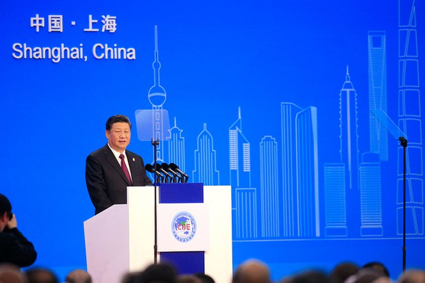
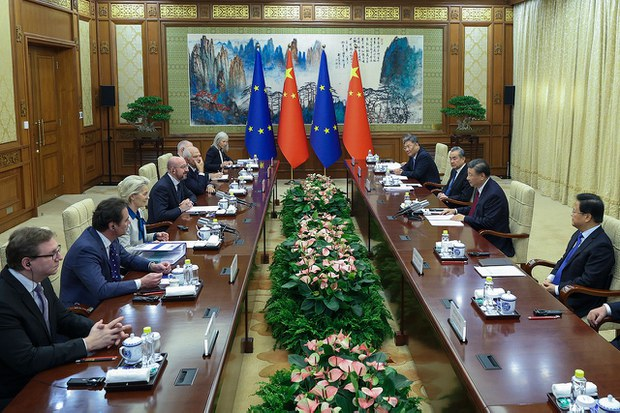
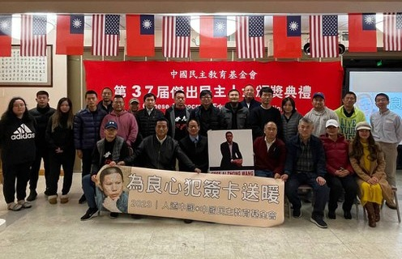
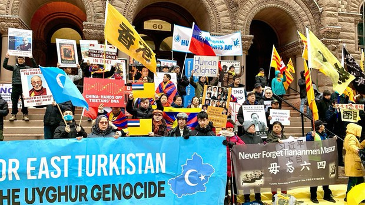
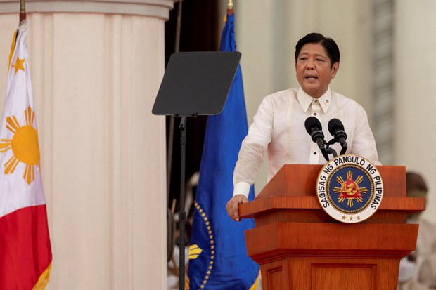
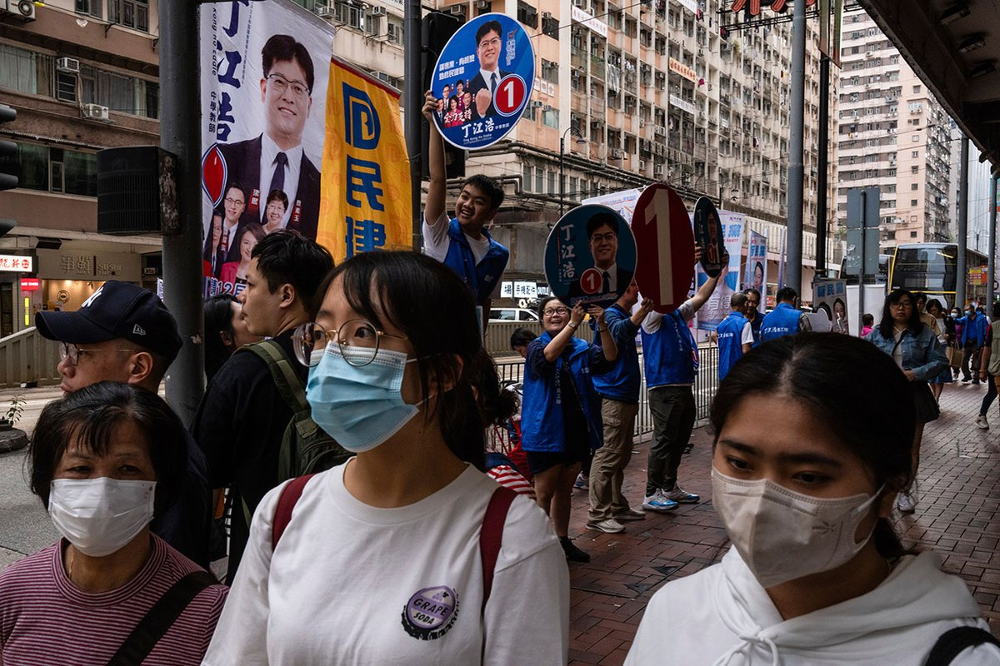

自由亚洲电台 北京时间 2023-12-12T09:00:51Z 1734377741292847108 评论 | #陈破空：北京上海大尺度开放？为何没人买账
https://t.co/JoccjhY7vW https://t.co/uhn8WczFqz   自由亚洲电台 北京时间 2023-12-12T09:06:19Z 1734379116710039950 评论 | 魏京生 @WEI_JINGSHENG：外援没戏，内需通缩，路在何方？
https://t.co/pAnZyO90LG https://t.co/32yXVIqCaX   自由亚洲电台 北京时间 2023-12-12T04:40:05Z 1734312119330619534 在今年12月10日 #世界人权日 之际，南北加州的多族裔居民举行了多种形式的活动，表达对中国当局的抗议以及对人权的关注。

https://t.co/zQWZVJIh2i https://t.co/Zsg68qBaIr   自由亚洲电台 北京时间 2023-12-12T05:09:26Z 1734319505856463219 12月10日 #国际人权日 当天，#加拿大 多个族裔在多伦多发起集会，抗议中国当局持续迫害人权，并呼吁加拿大政府要有所作为。
鉴于 #亚投行 今年稍早遭前加拿大籍主管控诉已成为北京掌控谋利的工具，渥太华近日表示，决定扩大审查，将无限期暂停参与亚投行。
https://t.co/b8KzLlPCpx https://t.co/S2pGPt4F79   自由亚洲电台 北京时间 2023-12-12T05:52:25Z 1734330322052096269 近日，中菲两国接连在 #南海 主权争议水域发生对峙冲突。#菲律宾 总统 #小马科斯 就此强调，菲方不会被中国吓倒。美国国务院也发表声明，敦促中国停止破坏区域稳定。

https://t.co/UxuYy7TaMz https://t.co/6KbwnnE75A   自由亚洲电台 北京时间 2023-12-12T01:28:16Z 1734263847241031989 "现实中不能再用示威抗议表达愤怒，唯一抗议的选择就是不投票和投白票。“
香港地区选举的总投票率不足三成。
遥记2019年的投票率是71.23%。 https://t.co/tIbR50mAXc   自由亚洲电台 北京时间 2023-12-12T03:22:10Z 1734292507763318800 国际人权组织“#保护卫士” @SafeguardDefend 在2023年12月10日 #国际人权日 发布人权报告，报告显示，在中共领导人习近平治下，当局正在把 #连坐 模式作为控制人权捍卫者及其家属的政治工具。
https://t.co/1fxD3Vx7dm https://t.co/jpXshJc1Pt   自由亚洲电台 北京时间 2023-12-12T02:07:51Z 1734273808918552969 据台湾《周刊王》报道，航特部谢姓中校遭策动，计划驾驶CH-47“#契努克”军用直升机趁中国军舰逼近海峡中线时前往停靠，事成后将获得1500万美金的酬劳。台湾检调接获线报，在事发之前逮捕陈姓退役军官与谢姓中校。
#策反 https://t.co/EkjbsQ4CQh   自由亚洲电台 北京时间 2023-12-12T00:09:44Z 1734244082908856767 【台湾大选：候选人比拼台海议题 主权与避战之争】
国民党 #侯友宜 宣布，胜选后，会推出“国家安全战略”报告；
民进党 #赖清德 表示 ，如果他当选，两岸战争的机率最小；
民众党 #柯文哲 强调，外交军事政策会按照蔡英文路线走，但不认同其两岸与内政政策。
https://t.co/pk4sZdd31D https://t.co/P8JrxsqslY   