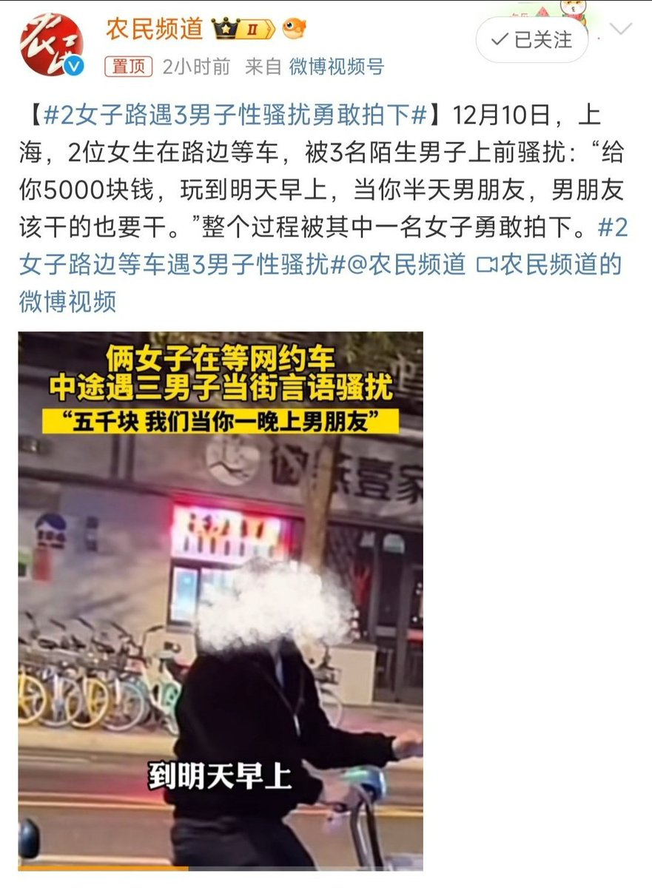
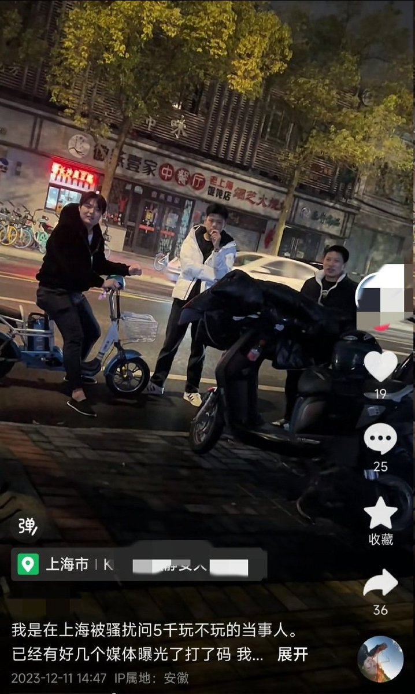
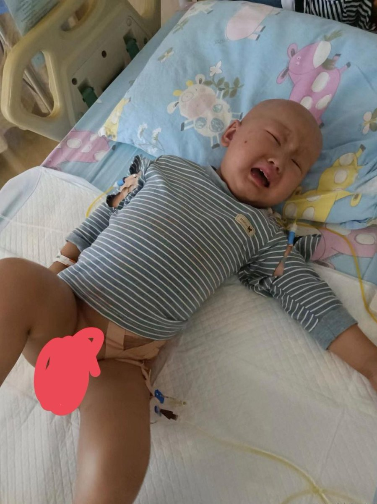

谁将十万横扫三江 北京时间 2023-12-12T22:40:02Z 1734583897785319605 3男子性骚扰被骚扰者勇敢拍下

“女孩说，媒体发的都打码了！她再一次发出来，希望涉事3男子向她道歉！” https://t.co/0KJm99tGdV   谁将十万横扫三江 北京时间 2023-12-12T15:56:30Z 1734482342255947952 RT @torontobigface: 最近中国又在炒作英国核泄漏了。
我今天搜了下，发现新闻媒体根本没有太关注这件事情。
当然这也不是纯粹子虚乌有的，他是来自卫报的一系列文章。
只是内容大相径庭，比如图一。
是中文自媒体说的，说英国气象局测算污染已经扩散… https://t…   谁将十万横扫三江 北京时间 2023-12-12T14:14:03Z 1734456560812994882 中国悲剧：三岁宝宝患“儿童癌症之王”神经母细胞肿瘤，两年花费90万，医生说治疗最少还需一百多万，父亲跑外卖，卖血补亏空，70岁爷爷为给孙子治病从老家返京打工

我叫黄建永，是患神经母细胞肿瘤的小瑞琪的爸爸。2022年1月11日，不到两岁的小儿子瑞琦开始频繁发烧。检查结果出来的那天，是瑞琦2岁的生日。我和孩子妈妈以为会等到一个好一点的消息，但是现实是残忍的，医生说瑞琦得了神经母细胞肿瘤。在这之前，我们一家人从没有听过这个病名。孩子妈妈当即就瘫软到了地上，我们查了一下，这种病被称为“儿童癌症之王”，我强忍泪水问医生，好治吗，“不太好治”简单的几个字，概括了孩子治病路上的坎坷曲折。神经母细胞肿瘤的治疗过程漫长。化疗、放疗、移植······无论哪一个环节，都特别的痛苦。幸好小瑞琦非常坚强，一次次挺过了难关。在多次的化疗放疗后，孩子的病情稳定了下来。那时，我们一家人已经为了孩子的病掏光了微薄的家底，为了多攒一点钱，我只能挨个挨个的找亲戚朋友借钱，好不容易才凑到了化疗的费用。在医院治病的时候，为了多挣点钱，我开始跑外卖，孩子稍微稳定下来，我就没日没夜地接单，就怕孩子没钱看病。瑞琦的病需要输血，为了让孩子的输血费便宜一点，我也会定期献血······但是这一切还远远不够，治病花的钱就像无底洞一样，让这个我们一家陷入了贫困的窘境中。就算已经到了这样艰难的地步，命运也没有松开魔爪。2022年9月21日，瑞琦的病情加重，医生说需要进行干细胞移植。我和孩子妈妈竭尽全力为瑞琦筹到15万做了移植，孩子却出现了严重的并发症，需要更多钱去进行抗感染治疗···…瑞琦生病以后，我们已经不记得自己一年在医院往返了多少次。每当看着病床上的瑞琦努力呼吸的样子看着瑞琦在上完疗后强忍不适的样子，看着瑞琦望着病房外的世界羡慕的眼神……2023年2月份，给孩子做完移植后出现腹水，vod，肺动脉高压，治疗了好几个月，为了给孩子治病，前前后后花费了九十多万，大部分都是跟亲戚朋友借的，很多人说既然没有钱了，还有那么多的债，不如放弃回家吧。可是怎么舍得呢？只要有钱能够治好并发症，已经做了移植的小瑞琦完全有机会拥有全新的生活啊！我们无论如何也说不出放弃的话。只要孩子还有一线生机，我们就绝不能说放弃啊。我们问医生大概还需要多少钱，医生说孩子目前状况最好的选择是上免疫，免疫要一百多万，还不能报销，这个天文数字哪里是普通人家能承受得起的，我们只能通过吃药保守治疗。
希望有相同患病经历的朋友分享治疗经验，也希望有能力的朋友能帮帮小瑞琪，谢谢大家。

PS：这种家境，没有临床试验免药费的话等于判死刑了   谁将十万横扫三江 北京时间 2023-12-12T11:05:18Z 1734409060508971414 RT @CDTChinese: https://t.co/koSCdAQoTI   谁将十万横扫三江 北京时间 2023-12-12T11:07:44Z 1734409672386580540 RT @xiaojingcanxue: 有些朋友已经不清楚河南血祸的原因，在这里普及一下。 https://t.co/cW2MYQsOnK   谁将十万横扫三江 北京时间 2023-12-12T11:10:07Z 1734410271840780377 RT @conmeenism: 不仅要安装反诈app，还要接受信息监管。但与此同时，电诈破案率不到百分之五。 https://t.co/2WLWvbY5q1   