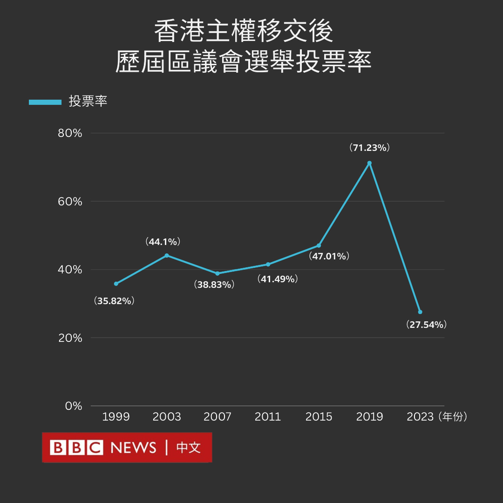
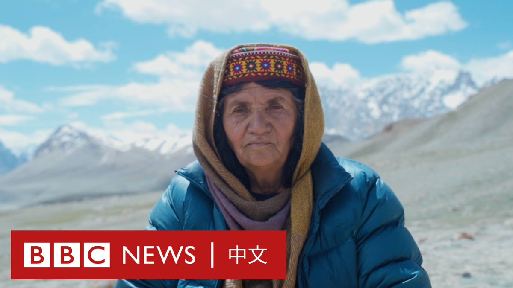

D英国广播公司BBC 北京时间 2023-12-11T12:31:32Z 1734068375892939006 被誉为中国“民间防艾滋病第一人”的高耀洁医生在纽约去世，享年95岁。高耀洁因揭发1990年代中国河南卖血和“血浆经济”导致艾滋病蔓延而引发关注。https://t.co/CLvo1nFjZj   D英国广播公司BBC 北京时间 2023-12-11T14:00:09Z 1734090673920307608 台湾总统大选不同候选人的两岸政策倾向背后，一直无法摆脱美中两大力量的拉扯。柯文哲的“等距论”，侯友宜的“合宪的九二共识”，赖清德的“维持现状”，都已在传递三名候选人的微妙态度差异。

在“两强争霸”笼罩下，“三雄演义”将如何展开？https://t.co/TulKmmLUKQ   D英国广播公司BBC 北京时间 2023-12-11T10:52:00Z 1734043325353910276 香港首次经“整顿”的区议会选举投票结束，官方公布投票率为27.54%，是1997年主权移交以来最低。

新选制下的选举中，只有20%议席透过地方直选产生。香港选举事务处12月11日清晨公布，在433万登记选民中，有119.3万多名选民参加投票。

由于新制度下参选人必须先得到特首委任的地区组织委员提名，并通过有国安部门参与的资格审查，传统民主派在投票前已被全数排除在外。

香港中联办称投票“彻底把反中乱港分子排除在特区管治体系之外，有力贯彻了‘爱国者治港’原则，开启了香港特区地区治理新篇章”。

本次投票因电子选民登记册发生系统故障，须改以人手核发选票，并因此延迟至11日0时（10日16:00 GMT）结束，但香港特首李家超称“整个选举都很成功”。

新一届区议会470名议员将于2024年元旦日就职。

扣除新界各区27名当然议员后，12月10日的投票决出20%地方直选议席和40%特首委任地方组织委员互选议席，余下40%将是由特首直接任命的委任议员。   D英国广播公司BBC 北京时间 2023-12-11T09:08:38Z 1734017314184438124 几个世纪以来，瓦罕族的牧羊女一直在帕米尔高原的偏远山区生活和工作。正是这些女性改变了当地下一代的命运。 https://t.co/tGvQ5Cw6DB   