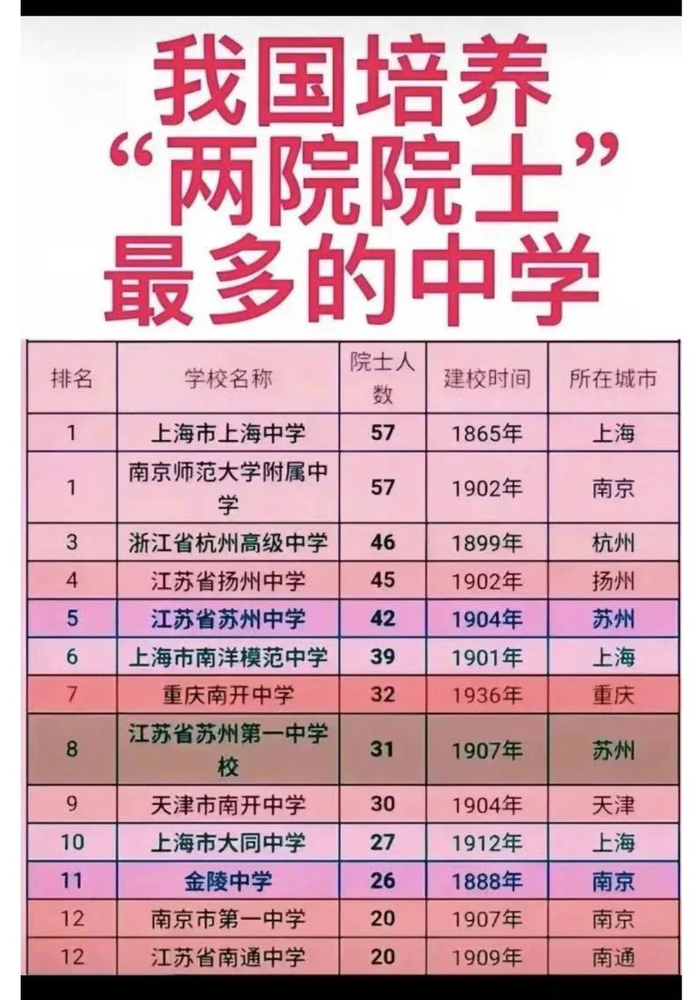
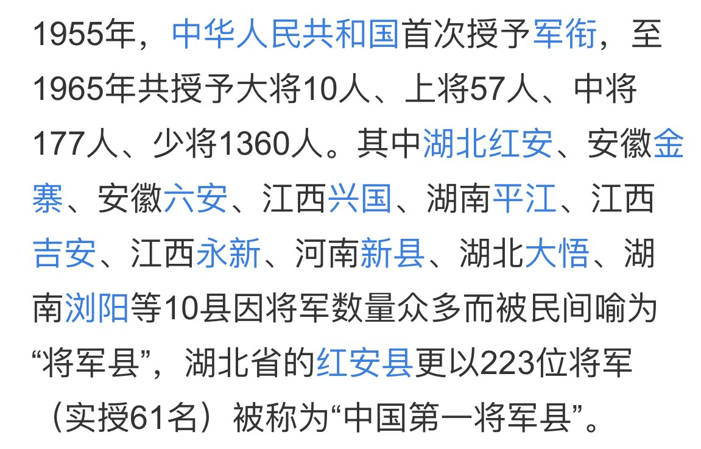
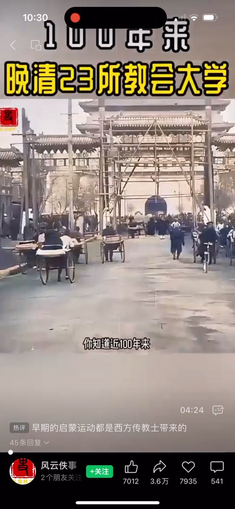

Petrichor 北京时间 2023-12-11T19:37:00Z 1734175448379142290 对比这两个名单，您会得出什么结论？搞恐怖破坏、犯上作乱的人来自穷山恶水之地。即使现在，那些地方依然不发达，暴力革命或许只给他们个人带来改变，有了红二红三代。搞发明创造的学术大家来自经济发达和文化沉淀厚的土壤。他们造福社会、民族、人类。 https://t.co/RkMTm63NYV   Petrichor 北京时间 2023-12-11T07:19:52Z 1733989939895742915 专制制度中，越自视甚高、凡事定于一尊的领导人，越有破坏性。 https://t.co/8Mri2DSFjD   Petrichor 北京时间 2023-12-11T04:09:27Z 1733942021927174383 高价引进黑人，不知200斤怎么打算的？目的是什么？对国家和他本人有什么好处？做世界人民的伟大领袖？ https://t.co/5PIGyQZ0Ti   Petrichor 北京时间 2023-12-11T00:21:59Z 1733884776673583130 以马克思列宁主义为理论基础的共产党，似乎在管理大学方面非常不成功，中国的好多大学被他们砸烂了。这些土包子革命者，他们不懂科学，缺少文化修养，更不知道大学就是培养人的独立思考能力、创造新的思想，追求真理真相。他们不让大学校园具有言论自由，让大学培养只懂技术听话的奴才。总之，他们采取行政手段，对大学管得太多，隔绝中西方思想交流，钳制人民思想，把大学办成官本位的培训班。   