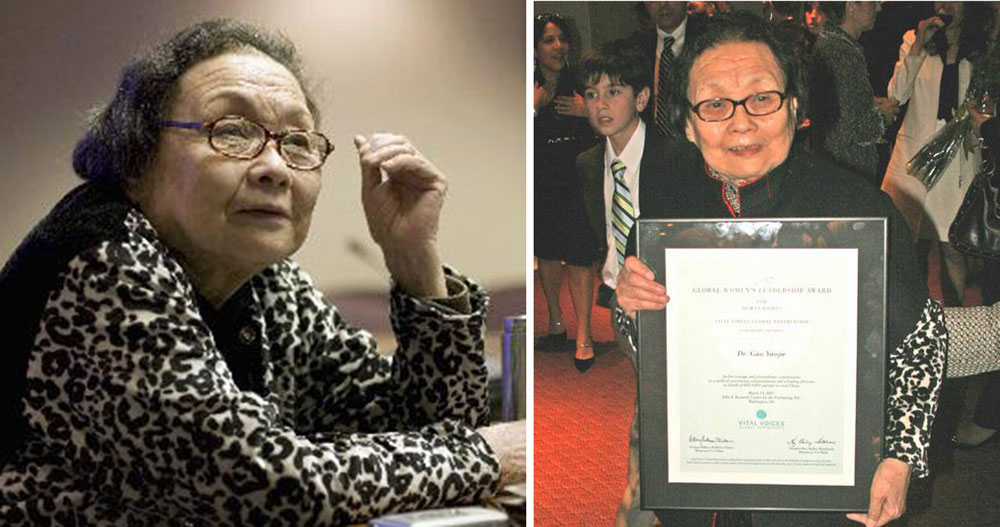
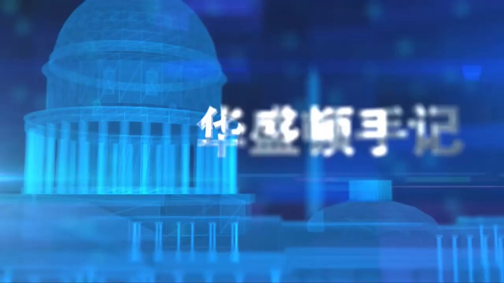
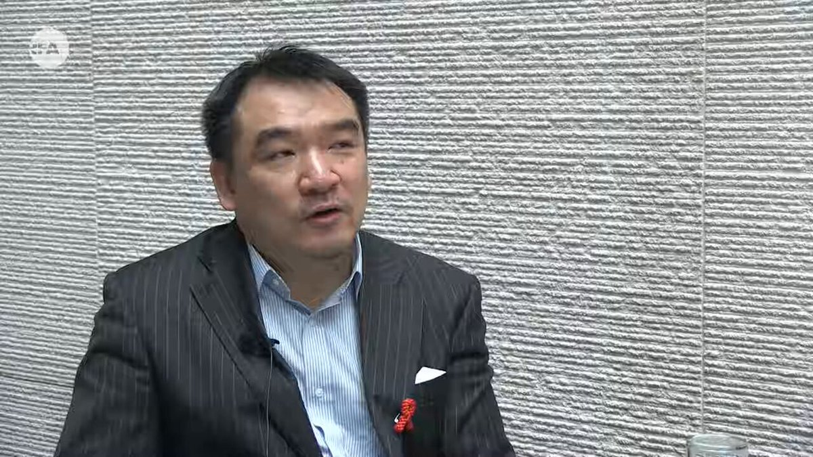
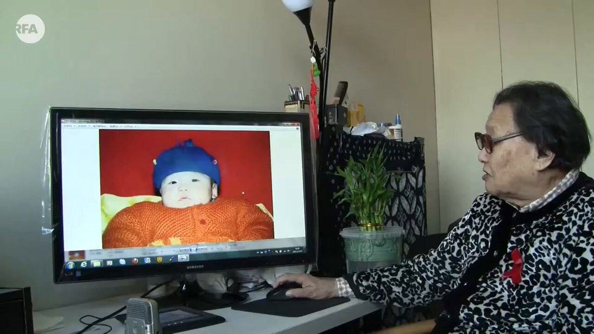

自由亚洲电台 北京时间 2023-12-11T12:23:45Z 1734066416129822775 【中国医生 #高耀洁】 专页 https://t.co/fQlTbyRFY5
本台《华盛顿手记》主持人 #北明 采写拍摄 https://t.co/hvkOnKFBI0   自由亚洲电台 北京时间 2023-12-11T06:38:28Z 1733979520389075240 【蔡英文苏贞昌助选：国家不设防才是最危险】#蔡英文 表示，“#台湾 展现守护自己决心时，全世界才会守护台湾”；又透露，美台21世纪贸易倡议已谈判完毕，这是四十几年来台湾与美国最完整的贸易协定。
详情：https://t.co/xMFah2Pshq   自由亚洲电台 北京时间 2023-12-11T07:51:37Z 1733997931684938146 【医保费上涨，上千万人退保】中国基本医保参保人数截至2022年底为134592万人，比上一年减少1705万人。其中职工 #医保 增长812万人，居民医保减少2517万人。
详阅：
https://t.co/nuIdwC6Oyg   自由亚洲电台 北京时间 2023-12-11T08:31:33Z 1734007979094036747 【国际人权组织：中国使用株连手段逼供】习近平治下，当局“株连”手法受害者人数、使用频率和惩罚类型都在扩大。报告指，#株连 被越来越多地被用在“劝返”胁迫海外人士。
详阅：
https://t.co/X3vd0ax7dT   自由亚洲电台 北京时间 2023-12-11T09:36:22Z 1734024291958632823 【鸟笼式区议会选举，三港人被捕】遭拘捕的3人正接受调查，罪名是试图煽动他人进行扰乱 #香港 区议会选举。本次选举要求所有候选人必须获得亲北京委员会提名，导致多个民主派甚至温和派团体失去 #参选 资格。
详阅：
https://t.co/ndkQHxBSJq   自由亚洲电台 北京时间 2023-12-11T09:59:49Z 1734030193726022130 【#高耀洁昔日受访影像-5 “#华盛顿手记”】本台主持人 #北明 采访拍摄撰写 https://t.co/orwq6eUVuj
#高耀洁 的遗嘱，标志着这位恓惶一世只为苍生的老人，不仅生前与欺诈、冷酷、贪婪、残酷、邪恶势力分道扬镳，身后也与这个堕落的世道势不两立。 https://t.co/ed0LuMRyk1   自由亚洲电台 北京时间 2023-12-11T10:10:27Z 1734032868639199333 RT @RFA_Chinese: 【“防艾滋斗士”去世，不惧打压揭发真相】享年95岁的高耀洁医生在纽约家中过世。#高耀洁 因揭发河南非法卖血导致艾滋病泛滥，遭受中国政府打压被迫流亡美国。曾被《#时代》评为“亚洲英雄”人物。
详阅：
https://t.co/6LCSfz5r3X   自由亚洲电台 北京时间 2023-12-11T07:18:19Z 1733989551838757016 【“防艾滋斗士”去世，不惧打压揭发真相】享年95岁的高耀洁医生在纽约家中过世。#高耀洁 因揭发河南非法卖血导致艾滋病泛滥，遭受中国政府打压被迫流亡美国。曾被《#时代》评为“亚洲英雄”人物。
详阅：
https://t.co/6LCSfz5r3X   自由亚洲电台 北京时间 2023-12-11T07:41:21Z 1733995347322573116 【#高耀洁昔日受访影像-3】本台主持人北明采访、拍摄https://t.co/orwq6eUVuj
香港慈善家杜聪说：“她对中国有很深的了解。她是极少数说真话的人，也是无机会说真话的人。”
#高耀洁 #艾滋病 #防艾 https://t.co/eluGgMDd3y   自由亚洲电台 北京时间 2023-12-11T08:08:28Z 1734002170058481830 【#高耀洁昔日受访影像-4】本台主持人北明采访拍摄 （悲惨慎入）
https://t.co/orwq6eUVuj
高耀洁医生在她的回忆录中写道：
“对我这个医生来说很清楚，艾滋病的死亡，不是一个简单的抽象数字，而是一串串真实的姓名和面孔，一个个惨不忍睹的场面，一声声绝望的哭声，和一片片连绵不断出现的新坟……” https://t.co/YSE6HWEGgV   自由亚洲电台 北京时间 2023-12-11T09:01:47Z 1734015589994127654 【银行行长“贡某志”坠楼】周六上午环渤海发展中心有人疑似坠楼身亡。10日下午，事发地派出所民警证实，堕楼人为华夏银行 #天津 分行行长。
详阅：
https://t.co/wBeEtukkT4   自由亚洲电台 北京时间 2023-12-11T04:54:32Z 1733953365770469740 【香港建制派就穆迪降级有分歧】
＃立法会 议员叶刘淑仪表示，穆迪评估很专业，不是在抹黑香港，＃穆迪 下调中国的评级后自然会下调香港和澳门的评级。 特区政府应多向穆迪负责任地解释 ＃香港 的情况。
详阅： 
https://t.co/F1JbWdtsoB   自由亚洲电台 北京时间 2023-12-11T05:18:41Z 1733959445737017786 【中国成为越南的最大投资者】在前11个月，中国大陆和香港来源的注册投资总额升至82亿美元，是去年同期的两倍。而美国的投资额则从去年的7亿美元下降到今年的5亿美元，位列第十。
详阅：https://t.co/3gD40kSrAe   自由亚洲电台 北京时间 2023-12-11T05:37:05Z 1733964075422351526 欧洲理事会主席查尔斯·米歇尔（#CharlesMichel）透露提前离开中欧峰会的原因之一是他在北京没有安全的通话线路，无法在不被 ＃中共 监听的情况下与欧盟领导人通话。
详阅： 
https://t.co/gcf4HwR9Ip   自由亚洲电台 北京时间 2023-12-11T06:01:09Z 1733970129728196804 【12月4日最后一次现身】黑龙江省委常委、副省长王一新涉嫌严重违纪违法，目前正接受中央纪委国家监委纪律审查和监察调查。
详阅：
https://t.co/LBSHNJWUvC   自由亚洲电台 北京时间 2023-12-11T03:58:11Z 1733939184279191716 【印度将产全球1/4iPhone】苹果公司及其供应商打算在未来两三年内实现在印度生产五千万部以上的 #苹果 手机，并逐年增加，但印度存在基础设施不完善和劳动法规的限制等问题。
详阅： https://t.co/hM63jXUCVy   自由亚洲电台 北京时间 2023-12-11T04:17:25Z 1733944027181916417 【学者呼吁不要入市，遭全网禁言】刘纪鹏在 ＃和讯财经 年会上直言，中国资本市场财富分配不公、缺少正义。大部分人在资本市场产生不了财富效应，呼吁官方要把“振兴股市”放在第一位。
详阅： https://t.co/ikZYqUsFDA   自由亚洲电台 北京时间 2023-12-11T00:49:16Z 1733891642740924545 【零八宪章15周年，梦想追求没过时】《#零八宪章》反对一党专政, 主张在自由平等人权等 #普世价值，迄今已有十多万名中国公民参加联署，是1949年中共建政后影响力最大的公民签名运动。
详阅：https://t.co/ZfuJMgUZWI   自由亚洲电台 北京时间 2023-12-11T01:16:21Z 1733898458073829786 【学者：短时间内中美关系无法扭转】“恐惧可能是造成 #美中 两国之间彼此战略误判，双边关系螺旋式恶性下滑的关键。大多数美中专家预判，两国关系的改善可能需要10年或者更长时间，这将是漫长的过程”。— #李成
详阅：
https://t.co/jLDoufvIWA   自由亚洲电台 北京时间 2023-12-11T01:32:35Z 1733902542210228279 【香港区议会选举日，伦敦百人示威】游行人士由英国外交部出发，行至中国驻英国大使馆，沿途举标语、呼口号，要求中国政府停止侵害人权，又要求英国外交大臣的前首相 #卡梅伦 改变其“亲华”立场。
详阅：
https://t.co/FyEdxPGQe5   自由亚洲电台 北京时间 2023-12-11T01:47:22Z 1733906266110492786 四川成都 #秋雨圣约教会 12·9教案五周年当天，当地警方为了阻止该教会信徒参与网络线上活动，采取电话警告、上门威胁、跟踪看守、断电等骚扰手段，目前已有2人被警方拘留。
详阅：
https://t.co/p9PqR7B5OV   