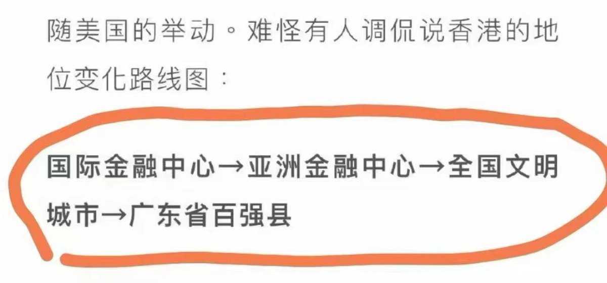
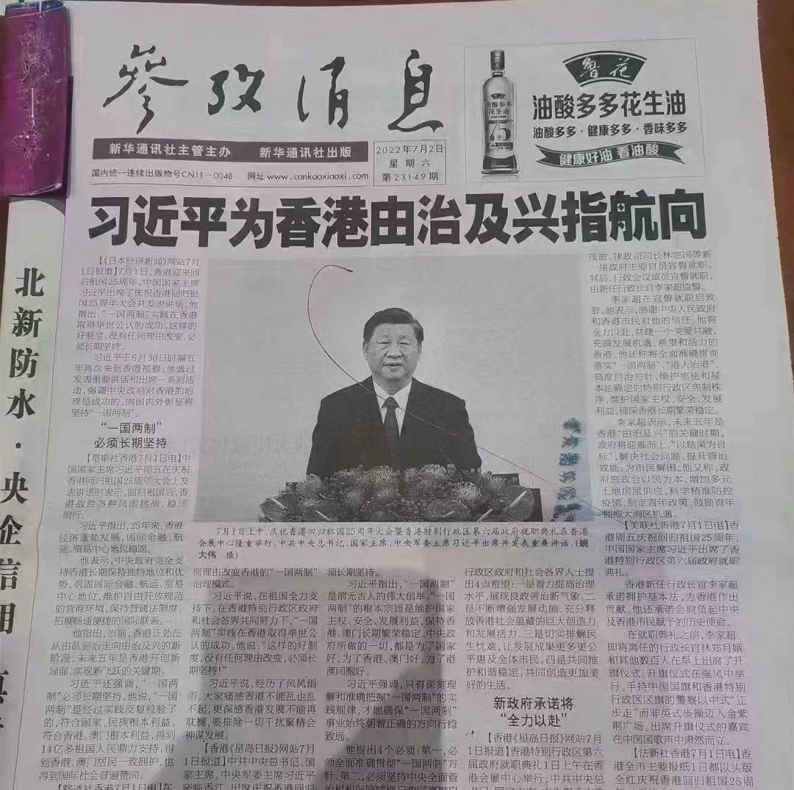
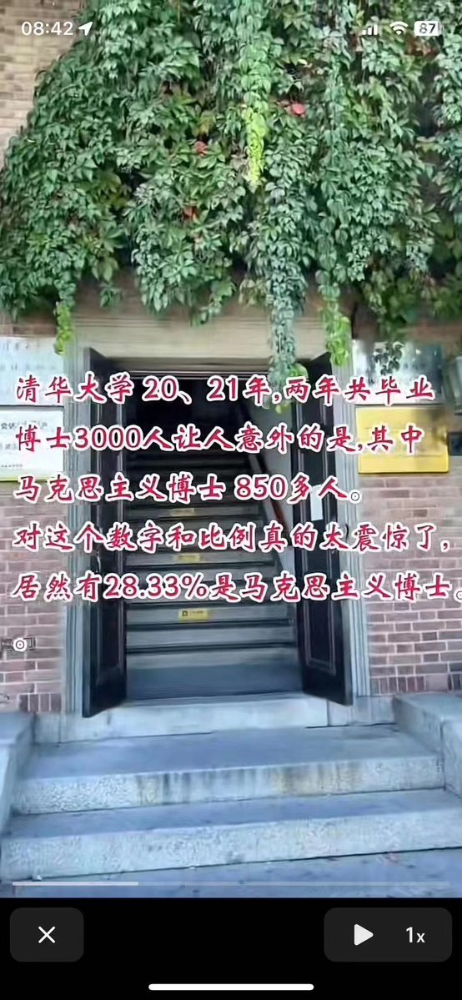

Petrichor 北京时间 2023-12-10T10:49:06Z 1733680208169865719 可是，当初是英国人把小渔村变成国际大都市和国际金融中心的。 https://t.co/yYjphTwynk   Petrichor 北京时间 2023-12-10T05:48:18Z 1733604508406571328 我朋友说她挺为全国各地数以万计的马院博士担忧的，那人下台后这些人会不会失业啊？ https://t.co/8JqwSpN9Ie   Petrichor 北京时间 2023-12-10T04:10:27Z 1733579882930610657 钱学森的儿子钱永刚在回忆父母的文章中写道：
 
“我38岁那年，到美国加州理工学院计算机科学系读研究生。在学院的图书馆前，我看到奠基石碑上刻着图书馆建馆的时间：1966年。注视着这个年份，我心里顿生感慨：我来晚了！如果爸爸不回国，我可能18岁就进入这个图书馆大门了，早20年入学，我是不是会比现在优秀一点呢？只是人生没有如果……从那时起，我就一直紧赶慢赶，一直很努力。我从未对父母说起过自己那一闪而过的感慨，因为我知道，爸爸妈妈对于回国的决定从未有过一丝一毫的后悔。”   Petrichor 北京时间 2023-12-10T01:39:59Z 1733542019698503688 不看他们说什么，只看他们做什么？对自己人都那么狠，对外人可想而知。 https://t.co/Ji6I6Z5aUN   Petrichor 北京时间 2023-12-10T01:47:13Z 1733543836830306370 全民所有制就是官员所有制，纳税人的血汗钱，他们想怎么用就怎么用，无需和纳税人商量。他们可以用这个钱给自己建高干病房，给自己换器官，进口外国昂贵药品和医疗器械。还用这些钱送给非洲兄弟或民族外敌俄罗斯，支持它侵略乌克兰。 https://t.co/1cmhCyP2YQ   Petrichor 北京时间 2023-12-10T00:18:38Z 1733521544402374882 这不仅是文风问题，更是党风问题，是做人诚实与虚伪的基本问题。这样的问题已经愈演愈烈了，从上到下，或者说是上行下效。有什么样皇帝，就有什么样的太监。 https://t.co/B1Kb9zzj5T   