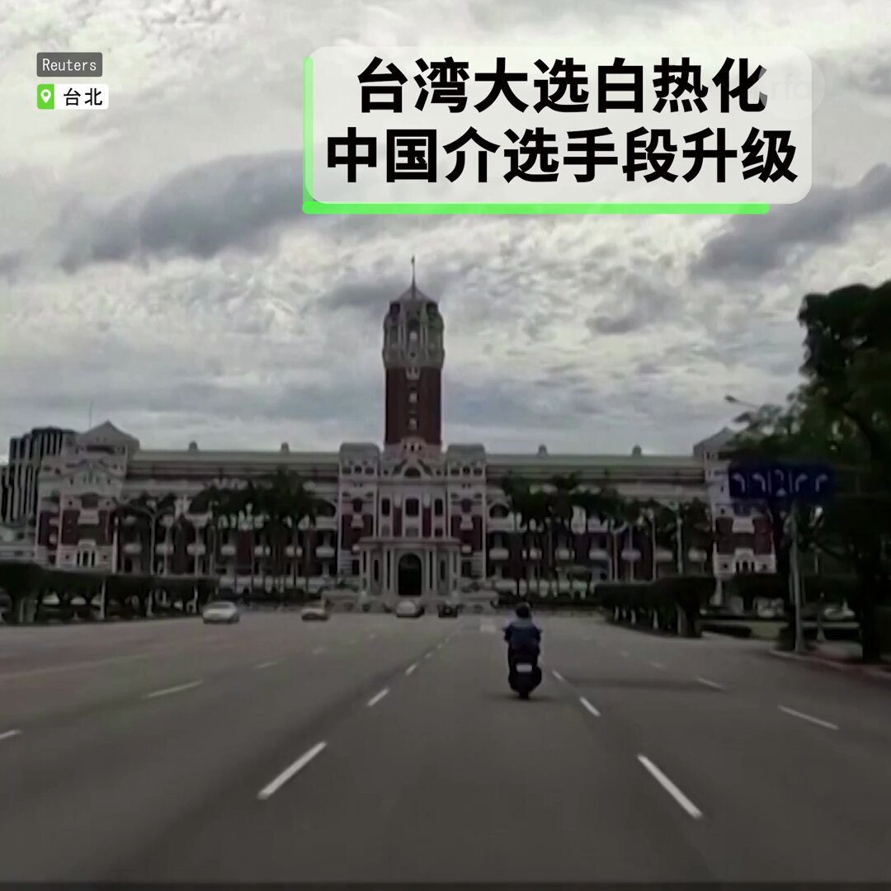

自由亚洲电台 北京时间 2023-12-10T22:33:33Z 1733857488083030393 【财经时时听 | 平安银行爆雷?】恰逢 #穆迪 调降中国，香港，澳门及40多家中资企业的信用评级之际，网传37个 #平安 信托产品没有兑付，涉及金融上百亿人民币及3891个家庭。
详阅：https://t.co/kJYsVxK8DF   自由亚洲电台 北京时间 2023-12-10T22:17:31Z 1733853454798348330 RT @RFA_Chinese: 为纪念人权日，法国 #里昂市 向五位致力于捍卫人权的人物授予荣誉公民身份。据法媒援引无国界记者报告称，2020年无国界记者自由奖获得者、出版商黎智英 (#JimmyLai)荣获里昂市荣誉公民称号。
详阅： https://t.co/N6B29w…   自由亚洲电台 北京时间 2023-12-10T23:33:59Z 1733872697438880034 【#周末茶馆 | “边输液边做题”折射反人性统治?】“中国人的学习不是为了追求真理，不是为了探索知识，而是为了符合统治者设计的模式和标准答案，教育内卷和就业困难让许多家长心中充满焦虑”。— #钱浩成
详情：https://t.co/cWdBFGA6OU   自由亚洲电台 北京时间 2023-12-10T11:37:38Z 1733692421823705468 台湾其中两个邦交国－危地马拉及瑙鲁－在 #联合国 气候变化 #COP28 会议发言时，赞扬台湾提供的协助，呼吁联合国让台湾能参与。
详阅：
https://t.co/1g4p9zQs6g   自由亚洲电台 北京时间 2023-12-10T12:47:52Z 1733710098105536695 中国 #指数研究院 发表报告指出，尽管当前房市政策环境已接近2014年最宽松的阶段，但民众收入下滑影响需求、房价下跌预期未减，预料明年 #中国房市 成交量及价格下跌的态势仍将延续。
详阅：https://t.co/EhgISSrsFz   自由亚洲电台 北京时间 2023-12-10T13:20:06Z 1733718208559894861 讲述维吾尔人处境的记录片“#杂音和噪音”(All Static &amp; Noise)在美国首都华盛顿举行北美首映，在动画与无人机镜头的帮助下，记录了多位逃离中国的维吾尔人讲述自己或家人在再教育营的经历。
详阅：https://t.co/EFPeBZiIXu   自由亚洲电台 北京时间 2023-12-10T13:54:21Z 1733726829016449516 总部位于印度 #达兰萨拉 的藏人行政中央领导司政边巴次仁在 #哈利法克斯 国际安全论坛之后，访问了渥太华，会见了 #加拿大 议员。他向来自 70 多个国家的数百名代表发表了讲话，并敦促他们继续支持 #西藏“自由斗争”事业。
详情：
https://t.co/ChCde5EZsT   自由亚洲电台 北京时间 2023-12-10T12:11:54Z 1733701044549398721 【多疾同行，口罩归来】#中国 呼吸道疾病疫情严峻，中国 #疾控中心 9日晚发布佩 #戴口罩 指引，建议在前往医疗机构，脆弱人群集中场所，搭乘公共交通时戴口罩。
详阅：https://t.co/LI9JI1XR8W   自由亚洲电台 北京时间 2023-12-10T06:19:55Z 1733612465257136144 【中国气球飞台湾为哪般? 美国承诺不介入台湾大选】
中国间谍气球闹剧时隔数月，近日爆出有罕有气球飞越台湾海峡中位线，不排除介入 #台湾 大选的嫌疑。台湾外交部部长称，中国介选言论肆无忌惮，公然号召选民票投其中一政党。美国 #在台协会 则向台湾保证，美国没有心仪的候选人，对各政党不偏不倚。 https://t.co/yuHk9Wgxyi   自由亚洲电台 北京时间 2023-12-10T04:56:26Z 1733591458081288287 菲律宾指责中国 #海警 在南海岛礁附近多次向渔民运送粮食的三艘政府船只发射水炮 。但 #央视 CCTV则称，中国海警队对侵入岛礁水域的 #菲律宾 船只采取了“合法控制措施”。
详情：
https://t.co/xKC1OfDRIu   自由亚洲电台 北京时间 2023-12-10T05:28:58Z 1733599644704186484 【有问有答 | 回顾2023】经历三年“动态清零”后，房市崩盘，股市下跌，外资撤离。习近平政治清洗，高官接连落马。李克强骤然去世，给本来就很紧张的局势，增加了更多不确定性。年末的APEC抗议活动，以其少有的浩大规模，尖锐诉求以及广泛参与，令人感到与以往截然不同。
https://t.co/HMXz6A7aJh   自由亚洲电台 北京时间 2023-12-10T05:47:43Z 1733604364235735519 为纪念人权日，法国 #里昂市 向五位致力于捍卫人权的人物授予荣誉公民身份。据法媒援引无国界记者报告称，2020年无国界记者自由奖获得者、出版商黎智英 (#JimmyLai)荣获里昂市荣誉公民称号。
详阅： https://t.co/N6B29wQ9Mb   自由亚洲电台 北京时间 2023-12-10T06:02:23Z 1733608053826588762 12月10日是人权日，以纪念75年前联合国《世界人权宣言》的通过。中国 #人权律师团 就此发布公开信，呼吁中国政府立即释放所有人权捍卫者。
详阅： https://t.co/LZf6L9ERd0   自由亚洲电台 北京时间 2023-12-10T02:35:22Z 1733555957542617487 【变态辣椒 | 最后一次握手】在美国对华开放政策中起关键作用的外交顾问 #基辛格 今年11月29日去世，#习近平 将基辛格称为"世界著名的战略家"和“中国人民的老朋友”，并在基辛格百岁生日不久后与其在京会晤。
https://t.co/8QtUfWrcEi   自由亚洲电台 北京时间 2023-12-10T03:21:24Z 1733567541417529721 据日本内阁民调，对 #钓鱼岛/钓鱼台/“尖阁诸岛”的“关心”和“比较关心”的受访者占78.4%，和2013年起的以往4次调查结果相比，创新高。
详阅：https://t.co/845oUuXVMd   自由亚洲电台 北京时间 2023-12-10T04:16:20Z 1733581364040028595 贵州省 #遵义 习水县金源建材厂当天中午发生钢棚垮塌事故，截至下午5时，已造成6死3伤。
另见：https://t.co/qGf99jY7hI   自由亚洲电台 北京时间 2023-12-10T00:50:13Z 1733529496148386061 【“清零”一周年 中国经济复苏缓慢】11月份主要通胀指标居民 #消费价格指数 同比下降0.5%。工业生产出厂价格连续第14个月下降，同比下降3%。第三季度中国经济增长 4.9%，低于北 年度目标5% ，是多年来的最低水平之一。
https://t.co/TfluKH5A10   自由亚洲电台 北京时间 2023-12-10T01:23:39Z 1733537908382941362 【拆香港科学文化馆, 建国家发展成就馆?】香港 #文体旅局 最近向立法会建议在科学馆现址上建设“中国国家发展成就馆”，并将分拆文化馆以缩短建设时间, 引起以梅艳芳粉丝为代表的香港文化保育人士强烈反对。
详阅： 
https://t.co/bLWr19fLwb   自由亚洲电台 北京时间 2023-12-10T01:59:55Z 1733547033493909578 美国国家安全顾问 #沙利文 在首尔与日韩官员三方会谈后表示将继续为台海和平稳定和南海航行自由挺身而出（continue to stand up for peace and stability）。
详阅：https://t.co/ceO1601lbT   