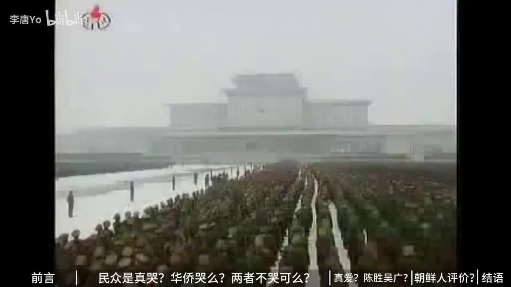

谁将十万横扫三江 北京时间 2023-12-10T22:45:26Z 1733860481243459725 爱国者：选民进党以后变乌克兰，选国民党以后变香港   谁将十万横扫三江 北京时间 2023-12-10T22:50:48Z 1733861828613345680 朝鲜出生的UP主介绍朝鲜人对三位将军的感情，局部片段令人感到熟悉

有网友评论道：我们五十年前也哭，听当时老人家说消息传来时大家都在作田，哭声随着消息一起传播，现在看来我们当时哭还真是哭的很有道理 https://t.co/q9v1adk5wp   谁将十万横扫三江 北京时间 2023-12-10T23:08:35Z 1733866305328214076 RT @cskun1989: 台湾大选的脚步越来越近，一直围观的简中媒体更是津津乐道，发表了很多文章和视频，几乎都是倾向于蓝营，特别是名嘴赵少康加盟国民党聚拢了人气，其慷慨激昂的演讲赢得看客阵阵喝彩，给人的感觉是在野党人气爆棚，执政党无人问津，国民党夺得2024年的台湾大选信心…   谁将十万横扫三江 北京时间 2023-12-10T19:20:04Z 1733808795724493085 网友投稿：在b站上，有关血槽姐的内容，除了少数官方＂辟谣＂外，已经全部被删除下架 https://t.co/IX3zZJ47aA   谁将十万横扫三江 北京时间 2023-12-10T20:07:15Z 1733820671497769169 RT @CirnoSapientia: 来看看拐卖离我们有多近

什么是男性特权？走在路上突然被塞进面包车、永锁深山的铁链、拒绝性骚扰后当街的拳头、专挑单身女性下手的色狼或抢劫犯，这些对你只是新闻，对我们却是每天都要竭力避免的危险

一记闷棍、一次被强拽上面包车、 一次好心指路…   谁将十万横扫三江 北京时间 2023-12-10T20:31:09Z 1733826683797651484 RT @CuimaoSheriff1: 老宝贝，真的老二次元了😀😀😀 https://t.co/j8KIeH4XCf   谁将十万横扫三江 北京时间 2023-12-10T11:06:46Z 1733684653104754777 RT @whyyoutouzhele: 12月7日，有多名律师通过不同渠道爆料称，当天在四川省内江市中级法院公开开庭审理的一起受贿案时，出现戏剧性一幕：辩护人出示的一份省高院刑事裁定书显示，正在主持法庭审判的审判长刘某曾被四川省高院确认存在行贿行为。… https://t.co…   