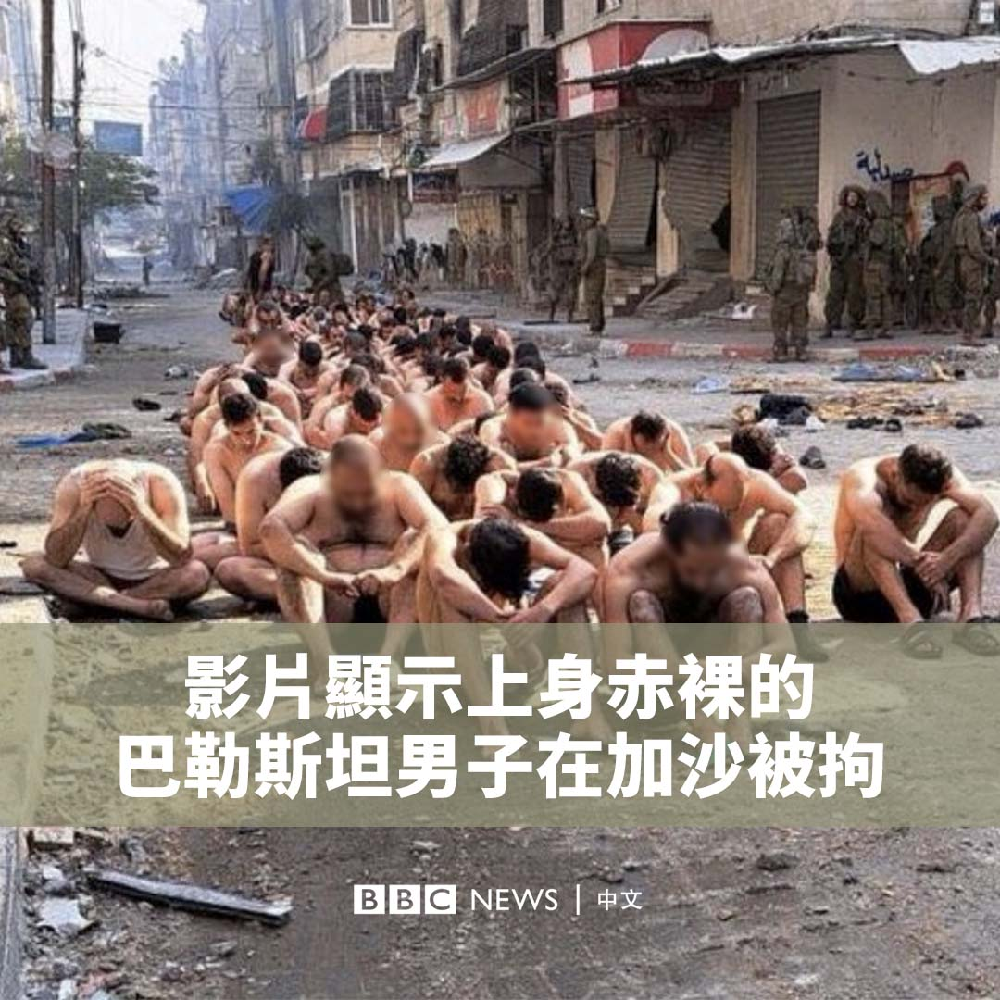
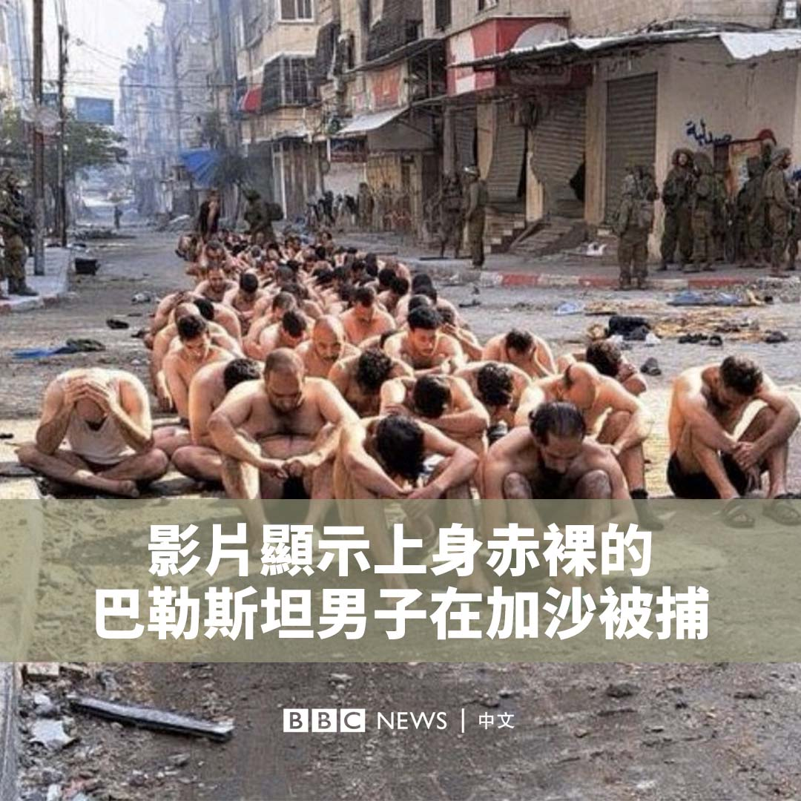

D英国广播公司BBC 北京时间 2023-12-09T17:24:28Z 1733417316493205515 联合国秘书长古特雷斯表示，加沙冲突“对维护国际和平与安全构成严重威胁”。但以色列人拒绝接受古特雷斯对事态的描述，认为在以色列完全摧毁哈马斯之前就试图结束战斗，是在迎合哈马斯。

https://t.co/HoncEYyNaK   D英国广播公司BBC 北京时间 2023-12-09T15:34:32Z 1733389649962582344 “人生那么短，可能还是要有点不同的尝试。”

泰国北部城市清迈为何吸引了众多前来旅居的中国年轻人？ https://t.co/QbU3NXcVrz   D英国广播公司BBC 北京时间 2023-12-09T11:19:42Z 1733325519825825906 【一周热点回顾】欧盟成员国从法德到希腊、匈牙利，都在各自寻求与中国改善关系，比如双边互访、扩大经贸联系、文化交流等；各国对华的不满则通过冯德莱恩代表的欧盟“唱红脸”与中国交涉，比如俄乌战争、台湾问题，以及针对电动车的反补贴调查。https://t.co/aPKfXQhM2P   D英国广播公司BBC 北京时间 2023-12-09T10:17:10Z 1733309782013129155 随着加沙的汗尤尼斯（Khan Younis）及北部战事愈演愈烈，社交媒体上出现一段影片，显示数十名巴勒斯坦男子被以色列拘留。

经BBC证实的这段影片显示，他们大部分都上身赤裸，在以色列士兵的看守下排队坐在地上。

据信这些人是在加沙地带最北端的拜特拉希亚（Beit Lahia）被捕的。BBC被告知，其中一些人被释放。

其中一名确认被拘者是一名知名巴勒斯坦记者。他的雇主指责以色列对平民进行“侵犯性搜查和侮辱对待”。

当被问及这段影片时，以色列政府发言人回应BBC，被拘留男子都属于入伍年龄，并且“是在平民几周前就应该撤离的地区被发现的”。

有其他画面显示他们被军用卡车运走。以色列媒体称这些人是投降的哈马斯武装分子。   D英国广播公司BBC 北京时间 2023-12-09T02:13:44Z 1733188125097410685 随着加沙的汗尤尼斯（Khan Younis）及北部战事愈演愈烈，社交媒体上出现一段影片，显示数十名巴勒斯坦男子被以色列拘留。

经BBC证实的这段影片显示，他们大部分都上身赤裸，在以色列士兵的看守下排队坐在地上。

据信这些人是在加沙地带最北端的拜特拉希亚（Beit Lahia）被捕的。BBC被告知，其中一些人被释放。

其中一名确认被拘者是一名知名巴勒斯坦记者。他的雇主指责以色列对平民进行“侵犯性搜查和侮辱对待”。

当被问及这段影片时，以色列政府发言人回应BBC，被拘留男子都属于入伍年龄，并且“是在平民几周前就应该撤离的地区被发现的”。

有其他画面显示他们被军用卡车运走。以色列媒体称这些人是投降的哈马斯武装分子。   