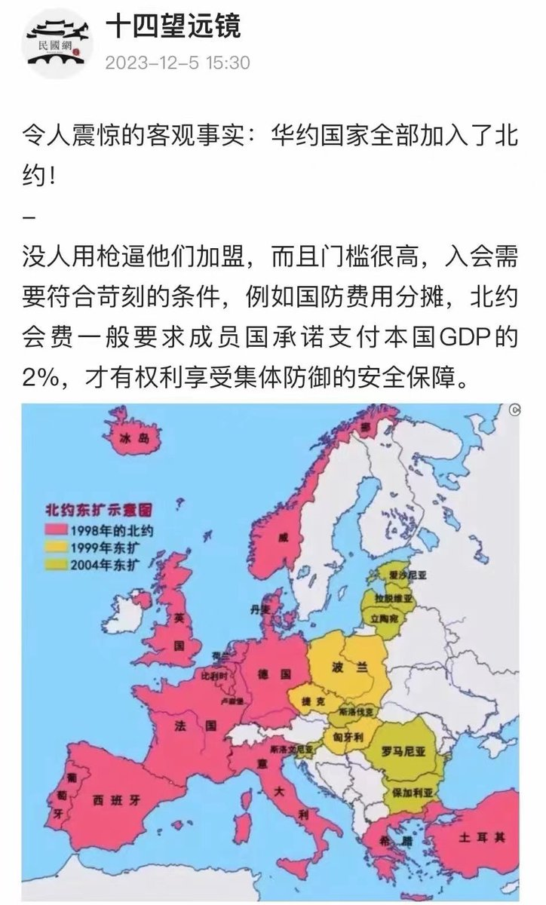
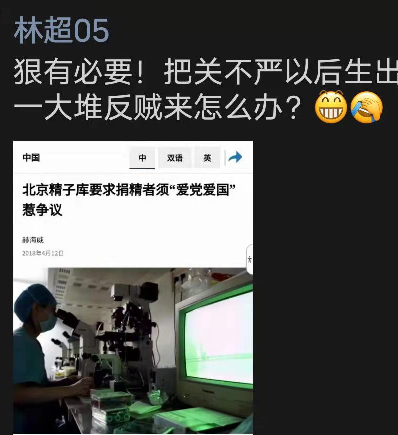

Petrichor 北京时间 2023-12-09T22:07:32Z 1733488555513491594 符合热力学原理，不稳定必然分解，重新组合，形成新的结构，达到新的平衡。 https://t.co/CDPQro6SZv   Petrichor 北京时间 2023-12-09T11:43:33Z 1733331521455403430 爱党爱国靠基因遗传？那么反贼也肯定有基因遗传？这似乎逻辑不通，红一代是大清和民国的反贼，但是红二红三代却是爱党爱国爱政府的。反与不反，全看屁股坐在哪个位置。 https://t.co/afaJarjFmF   Petrichor 北京时间 2023-12-09T02:18:50Z 1733189406775824885 魏杰教授的演讲的内涵意思就是，中国要想发展，必须去马克思化和共产党思想。民营经济和私有制才能促进国民经济的繁荣。而马克思主义或共产思想就是消灭私有制。坚持马克思主义和共产思想，必然反美和抵抗普世价值，孤立于世界文明和创新社会之外，经济同样得不到发展。啥时候，领袖独裁和搞个人崇拜，意识形态上必然强调马克思主义和共产思想，就会政治第一，限制言论自由，经济就会崩溃，人民就会遭殃。   