自由亚洲电台 北京时间 2023-12-09T06:59:39Z 1733260076511871034 【中国签证费降价了，你会去中国吗？】
中国在12月8日降低2023年12月11日至2024年底多国游客签证费的25%，覆盖了来自十几个国家的数亿旅客，包括泰国、日本、墨西哥、越南和菲律宾等国家。
作为世界第二大经济体的中国经济复苏乏力，希望通过这一新措施增加外国游客和商人的入境旅游。 https://t.co/klpPubKABN 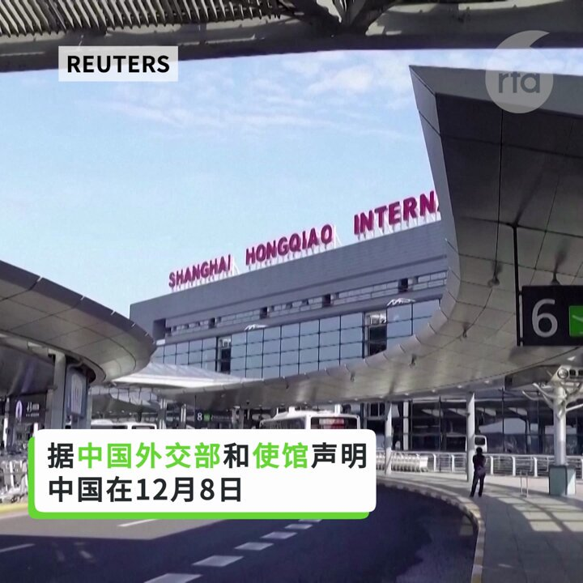  自由亚洲电台 北京时间 2023-12-09T07:15:56Z 1733264174505951657 【蔡英文: 不要香港式和平 要有尊严的和平】
台湾 #蔡英文 总统在为民进党选举助威时，强调 #台湾 不要香港那样的没有尊严的和平。然而，香港民主运动被镇压以来，台湾接收的 #香港 政治难民寥寥无几，不少申请更因有大陆联系而被拒。大多数香港政治难民选择英美澳加寻求庇护，包括近日弃保流亡的前 #香港众志 发言人周庭。台湾说到没做到，香港牌还能打多久？您认为台湾有义务去帮助香港人吗？ 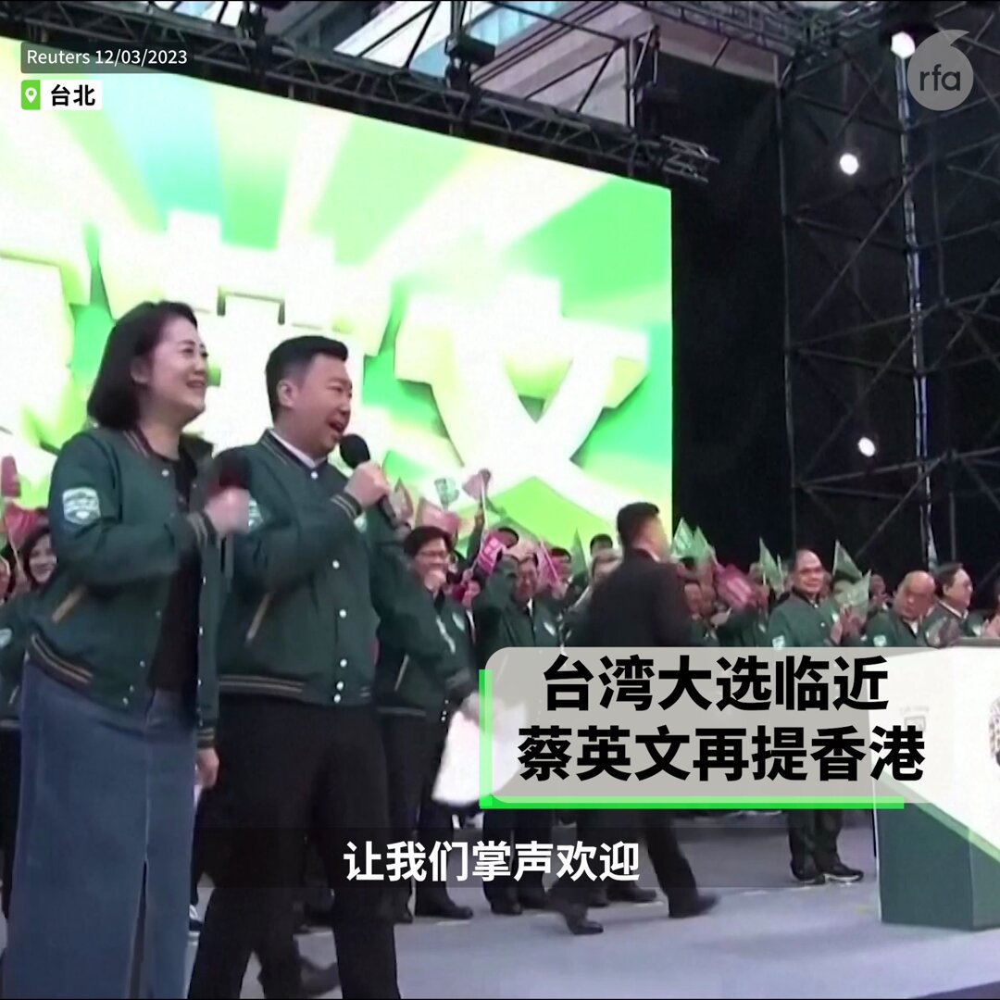  自由亚洲电台 北京时间 2023-12-09T07:19:24Z 1733265045650641278 【难怪普京看不起“临时工” 】
12月8日 #普京 宣布将在2024年竞选连任。
普金今年71岁，1999年8月9日被时任总统的叶利钦任命为代理总理，此后一直任总统或总理，长达20年。
普京：“我想再说一遍，我在不同时期对此有不同的想法。但我明白，今天没有其他办法。所以我将竞选俄罗斯联邦总统。” https://t.co/pCLbVN9IK1 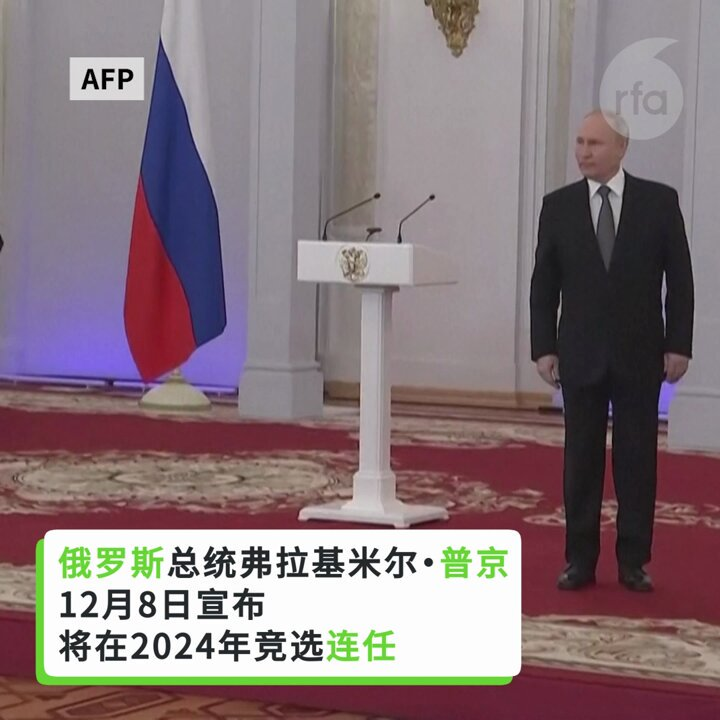  自由亚洲电台 北京时间 2023-12-09T07:30:02Z 1733267722136617022 专栏 | #夜话中南海：两任 #央行行长 居然分别是中共十九大和二十大上的中委落选者
https://t.co/4xzcfUEsyV https://t.co/VMjU2Va7jC 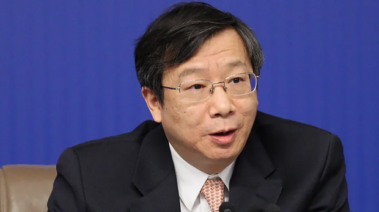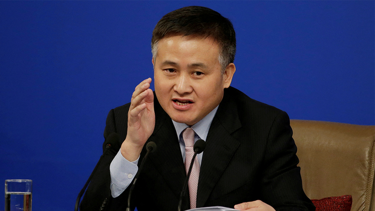  自由亚洲电台 北京时间 2023-12-09T08:42:03Z 1733285847464853992 欢迎收听和订阅播客【＃亚太报道】 https://t.co/MjLNSvVMqc

中国多地政府扩招“#维稳编制”人员；#习近平 即将出访 #越南；#吴敬琏 示警中国经济前景；#意大利退出一带一路 引发热议；#台湾大选 特别报道。 https://t.co/OJ1guLxGXS 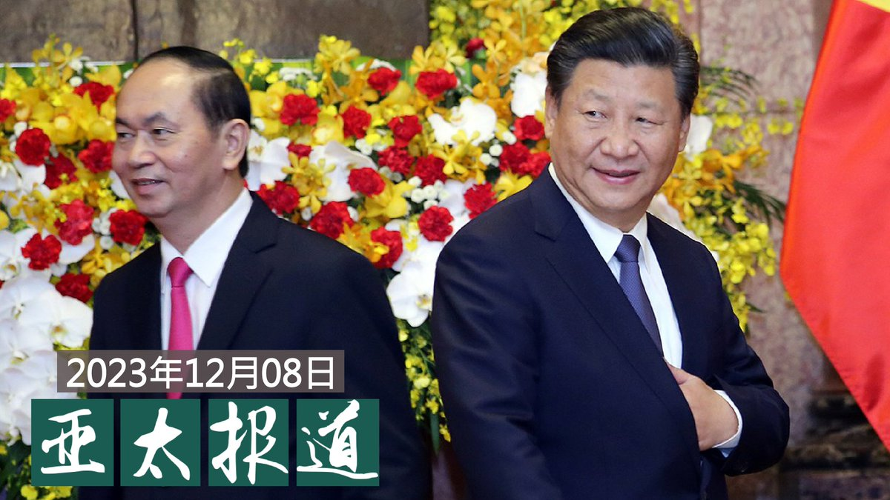  自由亚洲电台 北京时间 2023-12-09T05:58:17Z 1733244635680854129 中国干预加拿大令很多人感到不安和困扰，中国领事馆门前也时常成为抗议集会地点，但不少人批评明年将举行的中国干预公开听证会，令出席证人感到不安全。

https://t.co/bxC9aVqU2o https://t.co/Oq4aORX29B 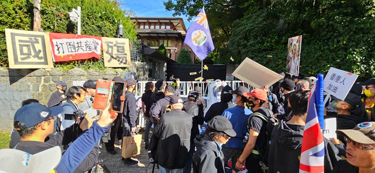  自由亚洲电台 北京时间 2023-12-09T01:26:53Z 1733176333814116445 【江峰 @realjiangfeng：非常态大流行 政治处理疫情民众受苦】
【林晓旭：“#神秘肺炎” 再次欠下中国人民血债】
本集 #亚洲很想聊  https://t.co/NVs7qxj1Af
探讨中国呼吸道疾病及 #肺炎 大流行的不寻常现象，中国政府是否再次 #隐匿疫情？为何不愿面对病原体可能变异、以及国际间的询问？ https://t.co/OYBOPK1L9B 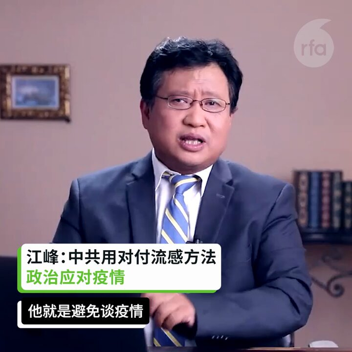  自由亚洲电台 北京时间 2023-12-09T02:32:33Z 1733192857849381339 台湾中央研究院周五(12月8日)举办“#当香港研究走向全球”研讨会，美国约翰霍普金斯大学教授孔诰烽担任主旨演讲嘉宾，谈及中共如何再利用香港金融中心地位，以及香港已变成 #国际金融中心遗址 等在 #香港 被视为敏感的话题。

https://t.co/mV3bCtSZ8u https://t.co/FQgdxFx9Im 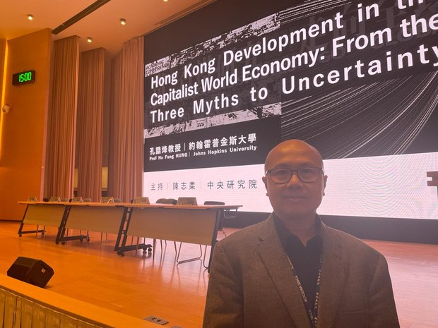  自由亚洲电台 北京时间 2023-12-09T03:02:54Z 1733200498365513805 据路透社报道，台湾官方情报获知，中国高层领导人在12月初开会，讨论了如何干预台湾选举的方案。
台湾官员提出警告说，北京试图引导台湾选民投票给寻求与中国更紧密联系的候选人；情报还显示在1月13日总统和立法院选举之际，中国正加大对台湾军事和政治压力。
https://t.co/GCX4CchS6N https://t.co/qYipHpyfwM 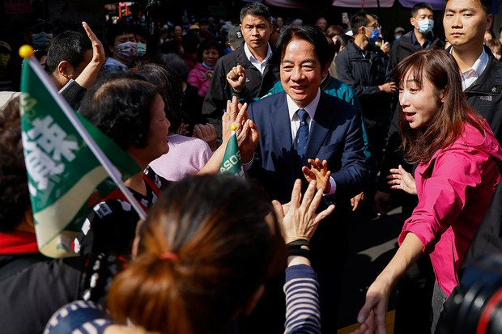  自由亚洲电台 北京时间 2023-12-09T03:27:28Z 1733206679381295267 评论 | 胡平 @HuPing1：解除"#清零"的前前后后——写在 #解除清零一周年
https://t.co/HJSAHUEB06 https://t.co/FEV1f50UcS 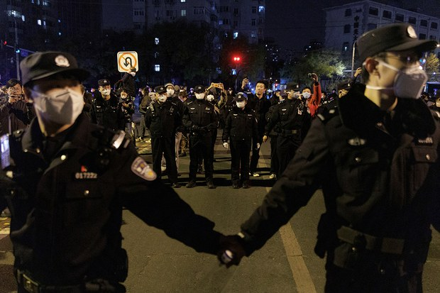  自由亚洲电台 北京时间 2023-12-09T04:09:02Z 1733217141678325986 专栏 | #周嘉有话说：#美中关系 还有救吗？(上）
#周孝正 
https://t.co/tmiOo3An9s https://t.co/afL0k91tbq 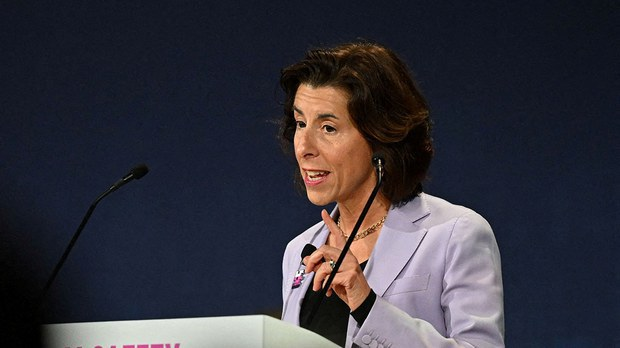  自由亚洲电台 北京时间 2023-12-09T01:10:20Z 1733172167842406623 #台湾选情观察
台湾大选的国民党候选人 #侯友宜 并非传统型政治人物，
由于是警察大学博士毕业，如果当选，他将是台湾第一个非台湾大学毕业的总统。
侯友宜曾经因为顺利化解南非武官官邸挟持案，一跃成为台湾治安英雄。
而转战政坛后，他也曾多次获选五星级市长。
然而参选总统后，侯友宜却因国政议题遭质疑答非所问，因此被冠上"草包"形象，民调坠入谷底...
但是，在野政党"#蓝白合"破局后，侯友宜的民调却逆势上涨，紧追民进党的总统候选人 #赖清德。
https://t.co/1TpnRhV3ch 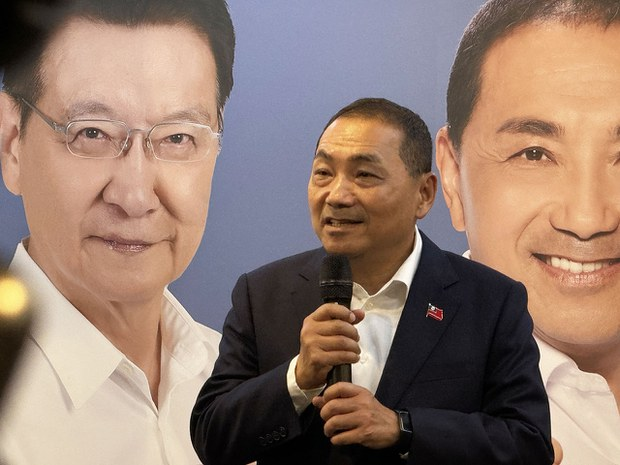  自由亚洲电台 北京时间 2023-12-09T01:37:57Z 1733179117942817039 【专栏 | #中国最钱线：“#短剧出海”：令人哭笑不得的“#文化输出”】
自2023年10月以来，A股市场上“短剧”概念突然爆出一轮火热的行情，中文在线、天威视讯等龙头股甚至出现了翻倍涨幅。这一概念的出现的标志事件是一部叫做《完蛋！我被美女包围了！》的短剧
https://t.co/qwkVZAs11J https://t.co/EyIGFNSDun 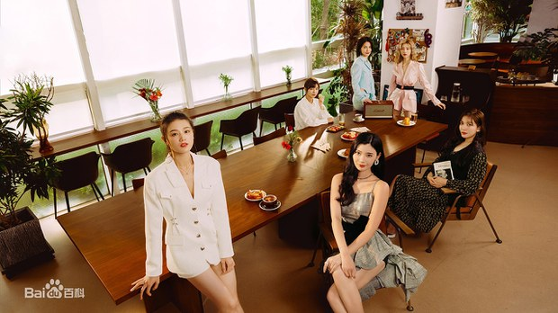  自由亚洲电台 北京时间 2023-12-09T00:16:40Z 1733158662162809032 #澳大利亚 军方近期连续遭受中国军方滋扰。对此, 多位专家提醒, 澳大利亚面对中国日益严重的侵犯行为, 在争取与中国沟通的同时, 必须加强吓阻。

https://t.co/yh8xuU8V8n https://t.co/LoprpbL94S   