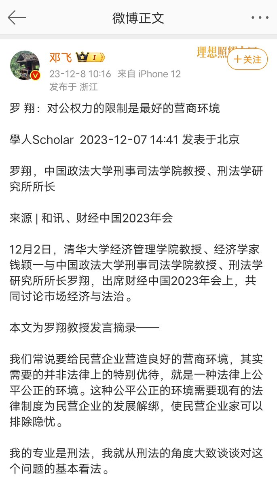
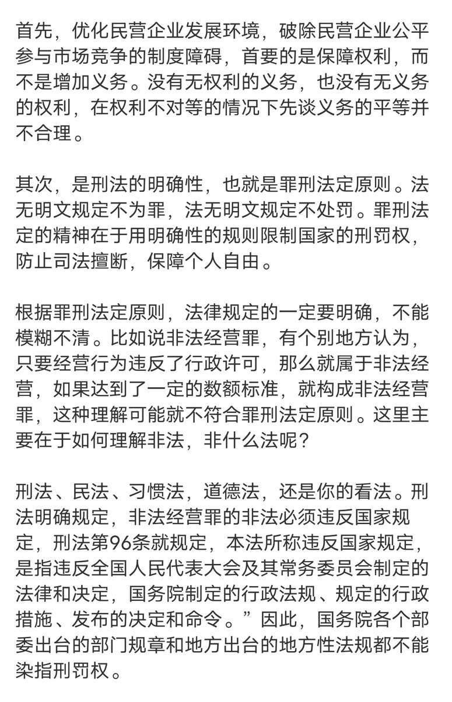
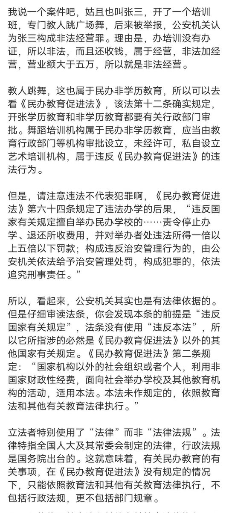
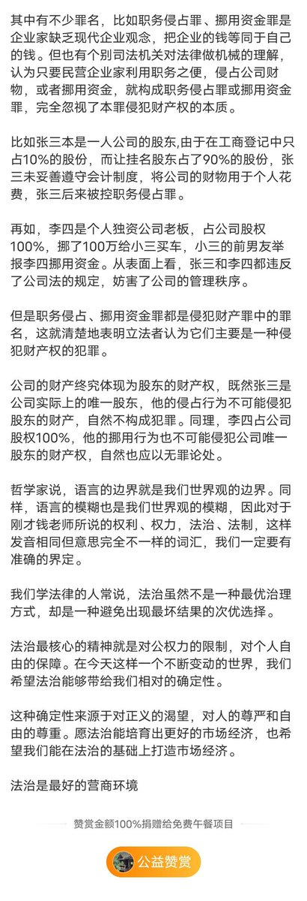

谁将十万横扫三江 北京时间 2023-12-09T08:13:51Z 1733278749884600806 RT @raycat2021: 这篇文章很有意思，记者深入到印度南部一家富士康工厂，实地观察产业链向印度迁移的进展。
苹果公司将部分iPhone生产转移到印度，许多派来培训和管理印度工人的是来自中国的工程师和经理人员。
中国和印度的员工之间存在着互信问题和严重的文化冲突。
中国…   谁将十万横扫三江 北京时间 2023-12-09T08:33:50Z 1733283779735863519 RT @jakobsonradical: 罗翔教授：对公权力的限制才是最好的营商环境。 https://t.co/kfmpVopLkr   