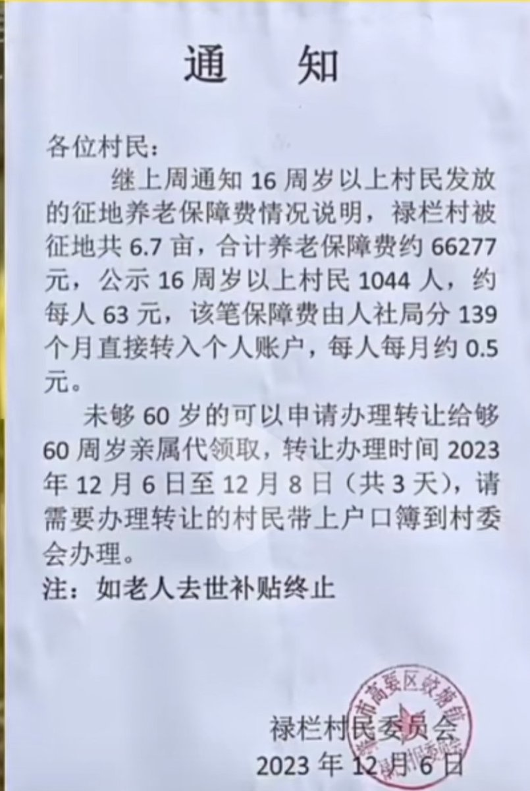
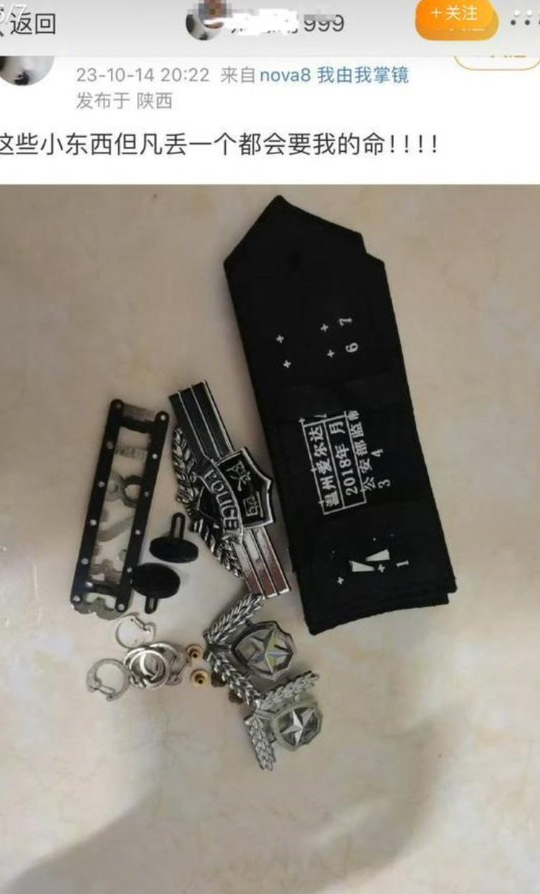
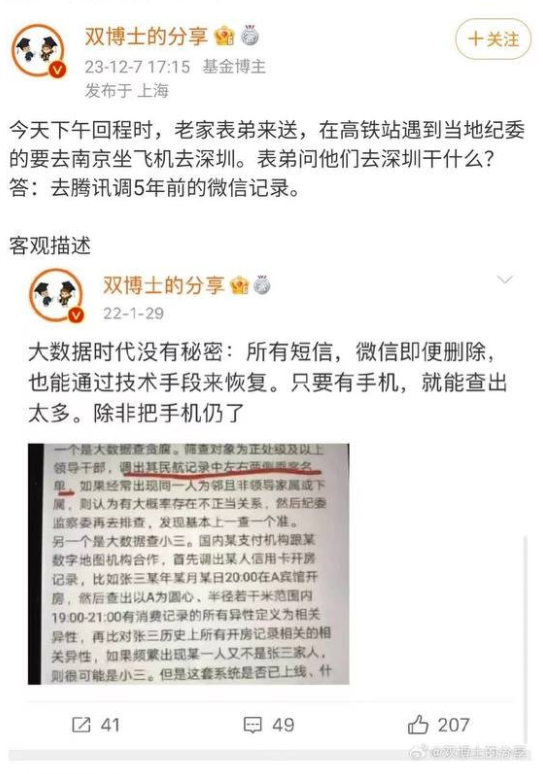
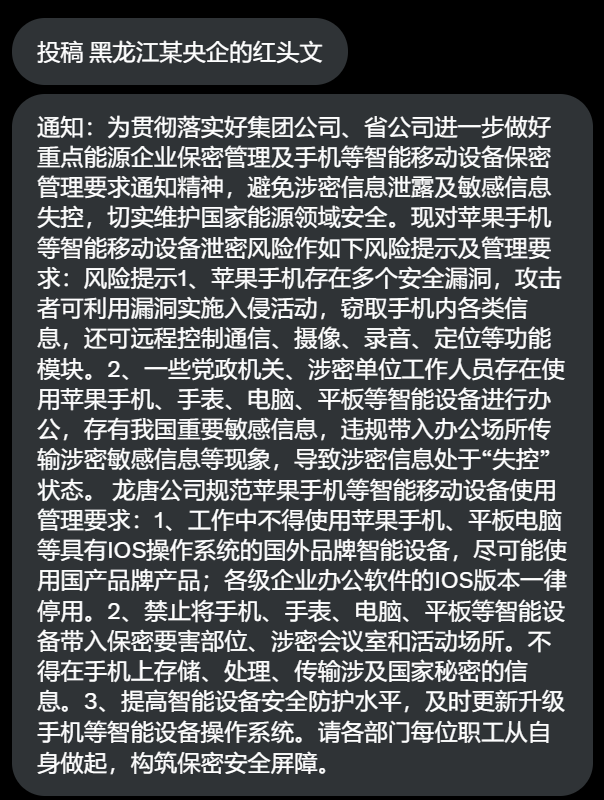
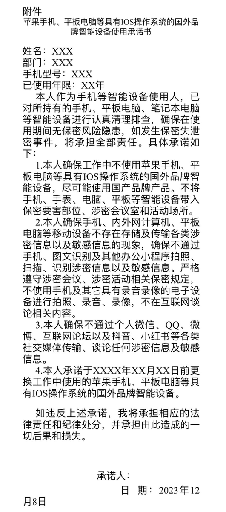
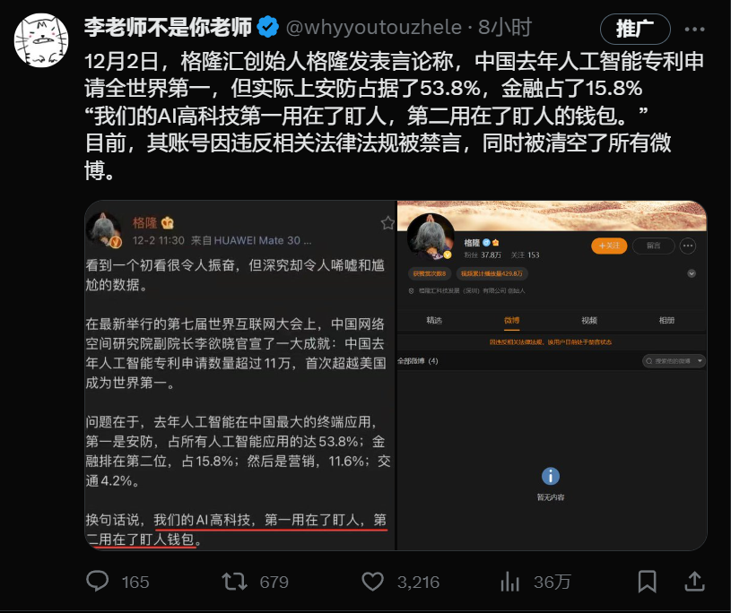
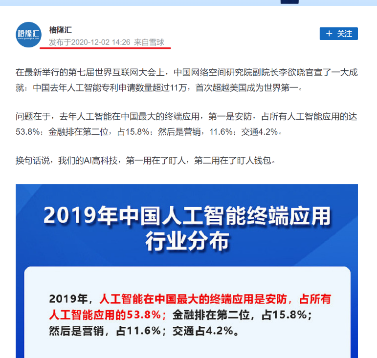

A李老师不是你老师 北京时间 2023-12-08T19:40:02Z 1733089045394149533 12月6日，广东肇庆禄栏山村民委员会发出通知：16周岁以上的村民发放征地养老保障费，1044人每人每月约0.5元。
“禄栏山被征地共6.7亩，合计养老保障费66277元，公示16周岁以上村民1044人，约每人63元。该笔保障费由人社局分139个月直接转入个人账户，每人每月约0.5元。” https://t.co/nT08jx7imJ   A李老师不是你老师 北京时间 2023-12-08T19:40:28Z 1733089153485504979 12月6日晚，西安都市快报举办了主题为“禁燃烟花爆竹，安全共记心中”的直播，期间两位公安局长亲临直播间为网友科普燃放爆竹的利害关系。
结果却引起了评论区网友们的大量吐槽。
随后，在众多网友们的吐槽和谩骂中，直播间关闭了评论功能。 https://t.co/WTUmFQ5w2y   A李老师不是你老师 北京时间 2023-12-08T19:59:56Z 1733094053972005217 12月7日晚，有网友发帖并@陕西公安和陕西网警称，一名网名叫“别感动999”的网友私信威胁她要查询个人ID和开放记录，此后还告之她已经查到了。
发帖网友称，网友“别感动999”的身份疑似是警方工作人员，并发布一张其曾晒出的照片，照片显示有警号、胸徽、肩章等物品，胸徽上印有“陕西police”字样。  
根据一些网友的描述，网友“别感动999”是一名于姓明星的粉丝，因维护自己偶像与发帖网友在网上发生争论。 
 12月7日23时36分，西安阎良分局回应称，该局督察部门已开展调查。   A李老师不是你老师 北京时间 2023-12-08T20:07:46Z 1733096025596776760 12月7日，邝桂英带着女儿一起去东风路正骨医院看骨科，途径省政府门口时，几名警察突然出现并以安全为由将邝桂英拉到省政府界线，随后越秀洪桥派出所的人过来强行把邝桂英拉上警车。
在挣扎中，手机也被警察抢走，被带到越秀公安局后扣押了三个多小时。
没曾想期间邝桂英的手机录下了疑似是越秀公安局警察的对话。   A李老师不是你老师 北京时间 2023-12-08T17:48:58Z 1733061097370907003 12月7日，微博大V 双博士表示政府可以查阅五年前的微信记录；
同时也有网友称，腾讯也配合开辟了几百平米的办公室来接待全国各地的办案人员调数据 https://t.co/KzxRFuoslx   A李老师不是你老师 北京时间 2023-12-08T18:03:50Z 1733064836580298927 网友投稿
黑龙江央企龙唐电力公司发布红头文件，针对苹果手机等设备做出风险提示和管理要求，要求员工签署承诺书不使用苹果设备。 https://t.co/Qi1sAlbM4f   A李老师不是你老师 北京时间 2023-12-08T13:10:00Z 1732990889847619650 12月6日，河北保定顺平县，零下五度在大街上洒水致路面结冰多名市民摔倒。
接受采访时住建局表示：是环保局洒的
环保局表示：是住建局洒的 https://t.co/z9JUQpk7xd   A李老师不是你老师 北京时间 2023-12-08T04:13:21Z 1732855837402505371 勘误
关于格隆汇创始人格隆针对中国人工智能的言论是一则2020年的旧闻，其本人并非因此被禁言和清空微博，为所产生的误导抱歉。 https://t.co/oZlaURamTl   