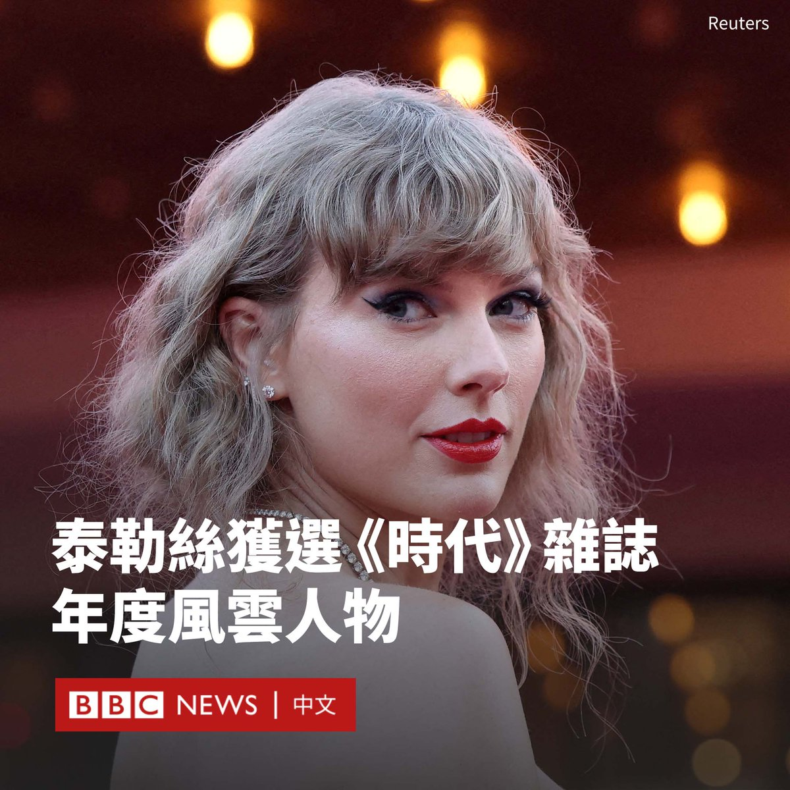
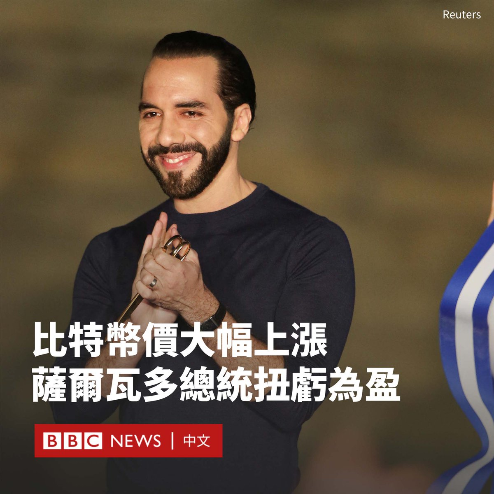

D英国广播公司BBC 北京时间 2023-12-08T22:10:49Z 1733126991929303400 国际评级公司穆迪（Moody's）连续发布报告，将中国和香港、澳门的评级展望下调，此外还有一系列中国企业和银行的评级展望被下调。穆迪为何看衰中国经济？https://t.co/M3mg8uG2oH   D英国广播公司BBC 北京时间 2023-12-08T14:40:06Z 1733013566670696896 自2021年获释以来，周庭一直在公共场合保持沉默，但她在赴加拿大留学后突然宣布将弃保流亡，随即引发轩然大波。

她对BBC表示，香港现在已经成为“充满恐惧之地”，而她希望能“不仅安全，而且自由地生活”。https://t.co/cUBCGvQ9u0   D英国广播公司BBC 北京时间 2023-12-08T18:38:35Z 1733073582706803019 美国歌手泰勒·斯威夫特（泰勒丝；Taylor Swift）被时代（Time）杂志评为2023年度风云人物，成为时代杂志评选年度风云人物96年来，第一位单独获选的艺人。

其他候选单位包括中国国家主席习近平、“芭比”（Barbie）、好莱坞罢工者及人工智能（AI）公司OpenAI共同创办人萨姆·奥尔特曼（Sam Altman）等。

《时代》每年都会选出年度风云人物，授予过去一年被认为对全球事件产生最大影响的事件或人物，此前的年度人物包括美国前总统奥巴马（Barack Obama）、乌克兰总统泽连斯基（Volodymyr Zelensky）等。

斯威夫特告诉该杂志，她“感到前所未有的自豪和幸福”。

斯威夫特今年的“时代巡回演唱会”（Eras Tour）打破了票房纪录，甚至导致Ticketmaster售票系统不堪重负而瘫痪，巡演的电影版本也成为史上收入最高的演唱会电影。

她在西雅图举行演唱会时，嗨翻的歌迷引发的震动相当于2.3级地震。

斯威夫特曾公开发表对前美国总统特朗普（Donald Trump）的批评并支持堕胎权。在疫情期间，她推出专辑《美丽传说》（Folklore）和《恒久传说》（Evermore）被认为是其创作上的巅峰。

《时代》总编辑山姆·雅各布斯（Sam Jacobs）指斯威夫特“找到超越边界的方式，成为光之源”，更加罕见地同时是“歌曲创作人，也是故事的主角”。   D英国广播公司BBC 北京时间 2023-12-08T17:20:49Z 1733054011190686002 在中国禁止歌手对嘴型假唱的规定之下，台湾一支受欢迎的摇滚乐队“五月天”陷入假唱风波，但该乐队否认假唱指控。https://t.co/hLeeJ424Hu   D英国广播公司BBC 北京时间 2023-12-08T15:56:02Z 1733032675290821056 随着比特币价格持续上涨，萨尔瓦多总统纳伊布·布克莱（Nayib Bukele）正在庆祝他用公共资金购买的比特币储备扭亏为盈。

自2021年以来，布克莱将国库中的1.2亿美元用于购买比特币。他在X（推特）上呼吁批评者“道歉”。

但也有经济学家表示，现在就庆祝他的高风险赌注取得成功还为时过早。

布克莱本周辞去总统职务，专注于2024年连任竞选。由于他在这个中美洲国家人气居高不下，人们普遍预计他将赢得第二任期。

根据一家追踪其比特币投资组合的网站，截至周二（12月5日）下午，他购买的2764枚比特币总价超过了买入价。

如果他现在卖掉它们，他可以赚大约370万美元。

这些数字是根据布克莱每次在X上宣布采购的帖子进行估算。记者无法联系到这名匿名的网站创建者置评。

布克莱说，有成千上万的文章曾“嘲笑我们所谓的损失”。他表示这些反对者需要“收回他们的言论”。

由于比特币过山车式的行情，在某个阶段，布克莱的比特币价值跌到他购买时的一半。

一年前，比特币的单价仅有1.7万美元，而在本周已经涨到4.4万美元。这背后的原因包括直接投资于该加密货币的交易所交易基金可能很快在美国获得批准。

2021年9月初，萨尔瓦多正式将比特币作为国家法定货币与美元并列使用。批评者认为，尽管比特币的价格上涨，但该国付出了大量成本用于推广该加密货币。

还有经济学者质疑该国比特币钱包缺乏透明度的问题。没有任何公共机构跟踪比特币投资或储备的账目。   D英国广播公司BBC 北京时间 2023-12-08T13:12:58Z 1732991638405017805 乌克兰运动员卡特琳娜·萨杜斯卡（Kateryna Sadurska）创造了一项新的自由潜水世界纪录。她在没有辅助设备的情况下潜入78米深的水下，屏住呼吸近三分半钟。

她的训练是在乌克兰前线城市哈尔科夫进行的，那里正遭遇炮火袭击和电力中断。尽管训练条件远非理想，卡特琳娜还是成功实现了梦想。 https://t.co/1Wbrw2Itku   D英国广播公司BBC 北京时间 2023-12-08T11:42:38Z 1732968905281265911 在一个暴风雨的夜晚，金先生感到他等待多年的时机已经到来。于是，他带着全家人——怀孕的妻子、母亲、兄弟一家以及装有父亲骨灰的骨灰盒——在黑暗中穿过雷区，前往秘密停泊的逃生船。

他们完成了一次看似不可能的逃离朝鲜的行动：从海上前往韩国。https://t.co/2HJcNcK2qf   D英国广播公司BBC 北京时间 2023-12-08T09:04:14Z 1732929040342769918 欧盟成员国从法德到希腊、匈牙利，都在各自寻求与中国改善关系，比如双边互访、扩大经贸联系、文化交流等；各国对华的不满则通过冯德莱恩代表的欧盟“唱红脸”与中国交涉，比如俄乌战争、台湾问题，以及针对电动车的反补贴调查。https://t.co/TELxEkua49   