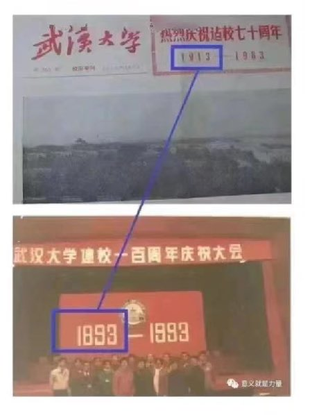
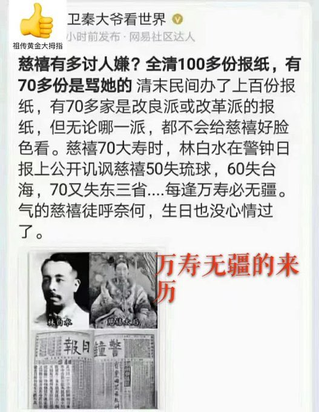
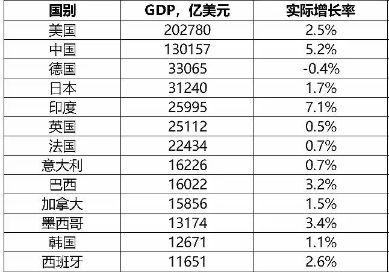

Petrichor 北京时间 2023-12-08T10:32:06Z 1732951152151441841 1913年建立的是国立武昌高等师范学校。
1893年创办的私塾自强学堂。
武汉大学年龄虚报了整整30岁。
然后他们还会说1949年10月1日建立的中华人民共和国为“祖国母亲”。谱系有些乱。
武汉大学左得出名，例如，反右运动中把中文系主席程千帆弄到农场放鸭20年，反自由化运动中把刘道玉校长下课。 https://t.co/ZYeuJief3N   Petrichor 北京时间 2023-12-08T05:16:50Z 1732871813363880105 汽车的差速器不是由中国人发明的，而是由法国雷诺汽车公司的创始人雷诺原创的。这项发明使得汽车左、右(或前、后)驱动轮实现以不同转速转动。它由左右半轴齿轮、两个行星齿轮及齿轮架组成。仔细想想，世界上重要的发明真没有中国人的贡献，什么原因？ https://t.co/UINKcdO8O8   Petrichor 北京时间 2023-12-08T05:40:43Z 1732877827089772801 历史倒退得很厉害。现在，哪份报纸敢批评习近平，哪怕骂一个市委书记都不行？就是那些到外国自媒体上骂的人，也不敢回国。只要回国，国安深更半夜破门而入，带走调查，用个颠覆罪判上几年。大康、江峰、唐靖远、李沐阳、老北京茶馆那两位名嘴….谁敢回中国大陆？中国现在已经变成前苏联那样的警察国家，人人生活在恐怖之中，谁敢“妄议”中央？饭桌上喝酒大家也不敢说话了，毕福剑丢工作就是例子。没有言论自由，即使吃好喝足，人也如圈里的猪，没有国家公民的尊严。   Petrichor 北京时间 2023-12-08T06:05:49Z 1732884141136392634 这位老干部植物人是他子女的印钞机。那么，哪个水晶棺的腊尸又是那群人的什么东西？它给他们割百姓韭菜带来合法性？打江山，坐江山。世世代代坐下去。 https://t.co/1fT5uZ490H   Petrichor 北京时间 2023-12-08T04:06:26Z 1732854097269649675 此表内容有意义，貌似中国是世界上第二大经济体，把第三第四名拉了一大截。但是人均财富就不一样了。例如，加拿大四千万人口，中国十四亿人口，后者是前者的35倍。中国GDP是加拿大的8.2倍，但是加拿大的人平GDP却是中国的4.3倍，况且中国的财富过于向少数权贵手中集中，穷富差距太大。 https://t.co/qQWtVIlCKQ   