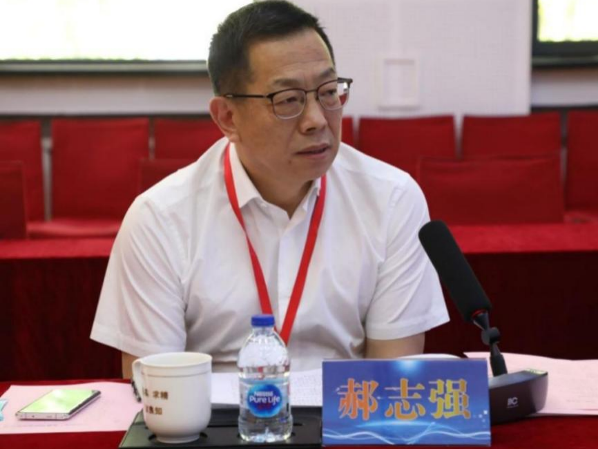
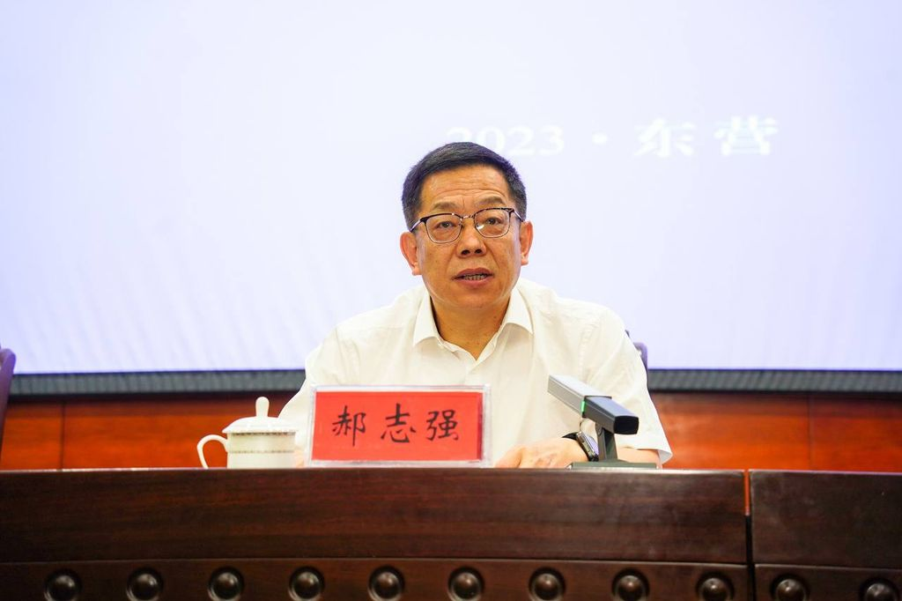

拆墙运动公号 北京时间 2023-12-08T04:01:28Z 1732852848264651193 【#2259专案组 互联网防火墙第006号嫌犯 #郝志强】
（更新)
 性别：男
出生日期：1963年2月出生。
身份证: 140421196302047616
籍贯：山西省长治县
手机/微信/支付宝/QQ: 13834301660
职务：工业和信息化部电子通信行业职业技能鉴定指导中心主任.

工业和信息化部教育与考试中心（工业和信息化部电子通信行业职业技能鉴定指导中心）主任
工业和信息化部电子通信行业职业技能鉴定指导中心地址：北京石景山区政达路2号CRD银座A座6层
单位邮箱：webmaster@ceiaec.crg
单位电话：010-68607701

擅长互联网络加密和监控控制
#拆墙运动 #BanGFW #反人类犯罪

人物履历

曾任国家工业信息安全发展研究中心（工业和信息化部电子第一研究所）纪委书记 ，国家工业信息安全发展研究中心（工业和信息化部电子第一研究所）副主任等职务。
2023年1月，任工业和信息化部教育与考试中心（工业和信息化部电子通信行业职业技能鉴定指导中心）主任

详细资料见: #BanGFW拆墙运动（建墙罪犯录）（#ban_great.wall）:https://t.co/kG3GUuRUzg

合作伙伴：#zhinawiki   拆墙运动公号 北京时间 2023-12-08T23:11:42Z 1733142314514583607 #拆墙运动 议题会议，会议时间：本周六的北京时间晚上10点， 欧洲时间下午3点， 纽约时间上午9点， 温哥华时间早上6点 会议规则：按照举手顺序文明发言1、有人发言时不准抢麦，有发言者发言完毕按照举手的先后顺序发言， 2、文明发言，不得人身攻击。 3、围绕拆墙主题发言、不得偏离主题。   拆墙运动公号 北京时间 2023-12-08T13:33:31Z 1732996809910354056 RT @HumanPrinceYe: 巴黎国际人权日集会（活动地址时间已经警方批准）

12月10日（下午 2:30 - 4:00）

维克多·雨果广场，巴黎 75016

国际特赦
无国界记者
东南亚人权联盟
团结中国
中国民主党
中国公民行动党法国支部
中国民权联盟法国支部…   