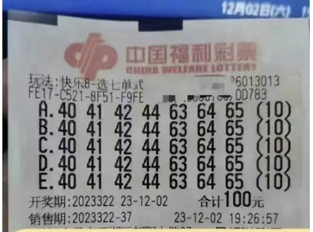
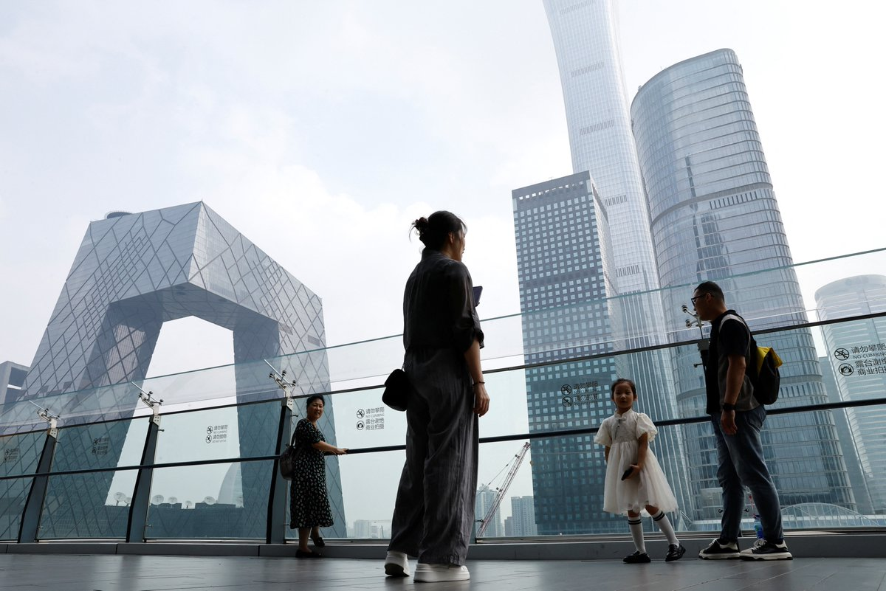
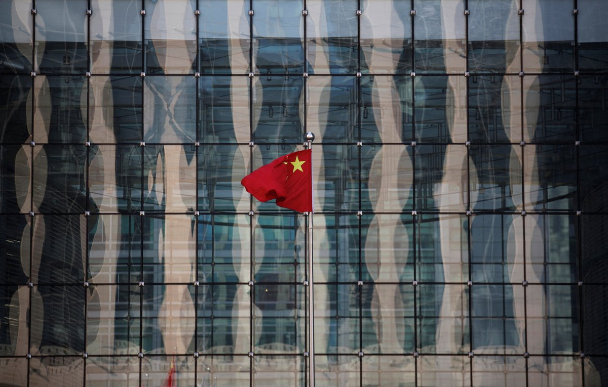
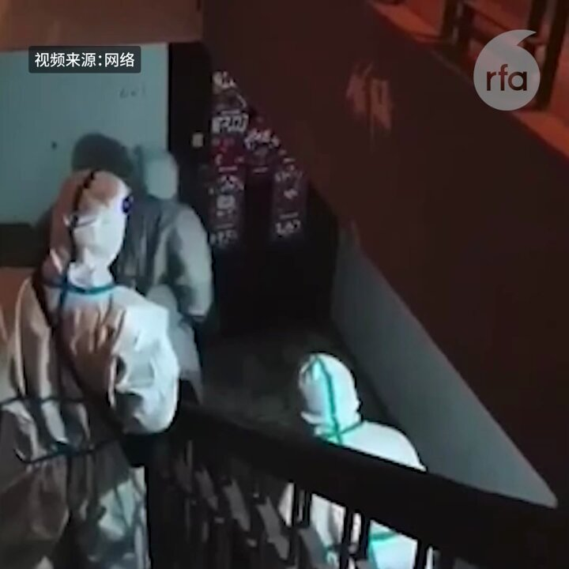
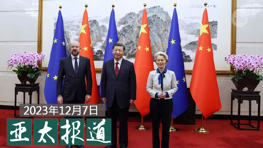
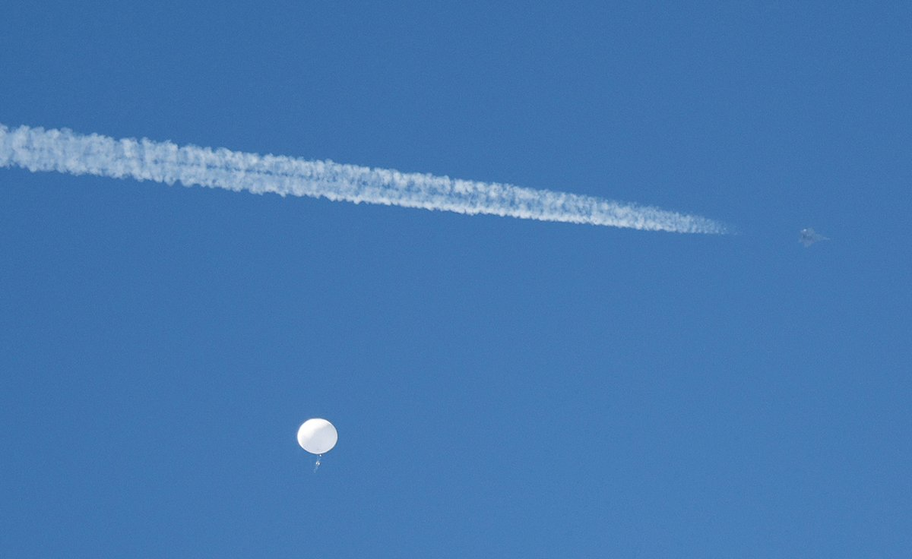
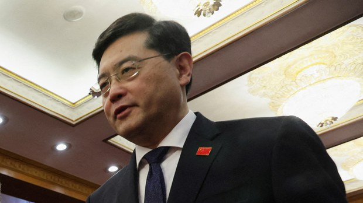

自由亚洲电台 北京时间 2023-12-08T23:33:30Z 1733147801868190126 江西南昌一位彩民上周六（12月2日）花近10万元人民币独中了2.2亿的 #福彩大奖，还避免了缴税，引发外界广泛质疑。江西省民政厅周四（12月7日）出面表示，正调查此事。
https://t.co/lo8mcPi9Sv https://t.co/IgotHP8NgT   自由亚洲电台 北京时间 2023-12-08T21:59:06Z 1733124042276700579 RT @asiafactcheckcn: 【韩国舆论战 】  

#北京 介入他国舆论又一桩，韩国国家情报院日前证实，三家中国公司在韩国投资，设立了共18个 #韩语新闻 网站，并持续散播亲中、反美日的文章。

https://t.co/Rh2JsfOMle   自由亚洲电台 北京时间 2023-12-08T17:33:52Z 1733057294299251055 【吴敬琏获最具影响力经济学家奖】
【致词称经济面临“严重的爬坡任务”】
中国经济学家吴敬琏近期获得网易2023年度最具影响力经济学家奖。他表示，中国经济目前仍面临严重的爬坡任务，需要广大群众共同努力。详细报道：https://t.co/sgK6pUGEmk
#吴敬琏
#经济爬坡 https://t.co/cNZckH0sYR   自由亚洲电台 北京时间 2023-12-08T16:09:50Z 1733036146274574460 【中国经济连年下行 基层 #网格员 续扩充】
中国经济连年下行，政府财政支出却在增加。今年初以来，中国各地基层政府不停的扩大“维稳编制”，招收编制外警务人员、网格员等，确保政权安全。详细报道：https://t.co/MufzgEFaHo https://t.co/RQLervXMyu   自由亚洲电台 北京时间 2023-12-08T11:36:24Z 1732967334988726596 天下虽兴，好战必亡；天下虽安，忘战必危。 
自由亚洲电台与军事博主 #周子定 @tansuoshifen1 合作推出新栏目 #兵家常事， 居安思危，聚焦军事，洞悉时局。
首秀：从 #福建号 测试 #电磁弹射，看攻台时机 https://t.co/54zaYpH417
欢迎捧场！ https://t.co/aVYt2Qigg6   自由亚洲电台 北京时间 2023-12-08T11:54:49Z 1732971971942522978 RT @RFA_Chinese: 【从福建号测试电磁弹射，看中共攻台时机？福建号何时才能具备完整战斗力？｜兵家常事】
近日中国的第三艘航空母舰 ＃福建号 试射 ＃电磁弹射 。福建号在2022年6月下旬，到现在已经接近一年半的时间。过去一年半，福建号究竟在干什么？它何时才能服役？…   自由亚洲电台 北京时间 2023-12-08T11:55:12Z 1732972065328636190 RT @RFA_Chinese: 天下虽兴，好战必亡；天下虽安，忘战必危。 
自由亚洲电台与军事博主 #周子定 @tansuoshifen1 合作推出新栏目 #兵家常事， 居安思危，聚焦军事，洞悉时局。
首秀：从 #福建号 测试 #电磁弹射，看攻台时机 https://t.co…   自由亚洲电台 北京时间 2023-12-08T12:00:36Z 1732973427684691992 RT @RFA_Chinese: 【#中国取消动态清零一周年】
三年折腾，还有哪些瞬间让您此生难忘？旧日荒唐会不会卷土重来？ https://t.co/J6kyawLHWJ   自由亚洲电台 北京时间 2023-12-08T08:00:11Z 1732912923750838502 欢迎收听和订阅播客【＃亚太报道】 https://t.co/MjLNSvVMqc
＃中欧峰会 在北京登场；＃中国解除疫情封控一周年；美国“＃趋势科技”研发中心撤离中国；王丹呼吁关注 ＃恶俗维基案 主犯 ＃牛腾宇 狱中状况；“＃香港自由艺术奖”作品展在台北举行。 https://t.co/ynWGFuo4rr   自由亚洲电台 北京时间 2023-12-08T09:49:39Z 1732940472824586333 【美国会公布国防授权法案内容】
【美拟协助台湾培训军队】
【中国空飘气球逾越台湾海峡中线】
美国参众两院军委会公布协商版2024财政年度国防授权法案内容。法案要求美国国防部为台湾制定全面的培训、谘询与制度性能力建设计划，以提升台湾战力。
台湾的国防部发布，7日11点52分侦获一个中国的空飘气球，逾越海峡中线，位于台湾的基隆西南方约101浬，高度约2万1千呎，续向东飘行，于12点55分消失。报道：https://t.co/bLoU2TctWb (图为今年2月在美国上空发现的中国气球)
#国防授权法
#中国气球   自由亚洲电台 北京时间 2023-12-08T06:11:03Z 1732885459901284655 美国媒体《政客》周三（12月6日）报道称，有两位消息人士透露，中国前外长、国务委员 #秦刚 已经在7月份去世，死因可能是自杀，也可能是酷刑所致。
目前还没有进一步的消息可以佐证秦刚的死讯。
https://t.co/5O2L8RgWx9 https://t.co/Akq6N1SiW6   自由亚洲电台 北京时间 2023-12-08T06:22:36Z 1732888363907309619 ＃事实查核 @asiafactcheckcn| 媒体观察：“＃中国制造”的 ＃韩国假新闻网站
https://t.co/wH2dABjDkB https://t.co/eAG86tWGux   自由亚洲电台 北京时间 2023-12-08T06:37:38Z 1732892146976612428 评论 | 何清涟 @HeQinglian：中国为何对“＃中国威胁论”的提倡者敞开大门？
https://t.co/9SpLyaBmEU https://t.co/1cjWRv0zvW   自由亚洲电台 北京时间 2023-12-08T08:30:01Z 1732920432255537305 评论 | ＃余杰：＃上海万圣节 — 你的鬼蜮，我的人间
https://t.co/LNa19c5ZNo https://t.co/Qbbh3A8Pdo   自由亚洲电台 北京时间 2023-12-08T05:17:22Z 1732871948815020489 专栏 | ＃军事无禁区: ＃福建号 航母明后年服役－中国走向蓝水海军？
https://t.co/d5ClWd7YCZ https://t.co/6BWKaeGSFe   自由亚洲电台 北京时间 2023-12-08T05:39:25Z 1732877496478269724 专栏 | ＃绿色情报员：夺命气候（上）沸腾亚洲成了掘墓者
https://t.co/y8mk9glkNd https://t.co/agBd5LWxEb   自由亚洲电台 北京时间 2023-12-08T06:14:24Z 1732886303681941877 今年的12月7日，是中国官方实际放弃“#动态清零”政策一周年的日子。当局此前的三年封控措施，彻底改变了社会及民众的生活。而目前，新一波呼吸道传染疾病又正在中国爆发，多地儿童医院爆满，#新冠检测 重启、健康码复活。中国人的“#清零”梦魇真的结束了吗？

https://t.co/L552D6OnUF https://t.co/Wnvslxfkbq   自由亚洲电台 北京时间 2023-12-08T02:40:17Z 1732832416434430280 流亡加拿大的 ＃周庭 对媒体表示，即使在加拿大，她仍担心海外的 ＃中国秘密警察。有加拿大的港人说，周庭反映了多数参加过社会运动的海外港人心声，因为中国渗透太厉害，让许多人仍活在恐惧中。专家表示，这些“新港人”可能还未拿到加拿大身份，所以最容易成为受害者。

https://t.co/NXmsAJs8D6 https://t.co/l9lcSrnyN6   自由亚洲电台 北京时间 2023-12-08T04:06:07Z 1732854018790318483 12月7日，经美国总统拜登提名为副国务卿的白宫国安会印太事务协调员坎贝尔在国会接受提名听证。#坎贝尔 警告说，“有些国家”正在测试美国在印太地区的能力。

https://t.co/bxS4yc3GmP https://t.co/kpoH3mAPqw   自由亚洲电台 北京时间 2023-12-08T00:48:24Z 1732804259958431834 国际信用评级机构穆迪近日下调了中国、香港和澳门的主权信用评级后，又于日前下调了18家中资银行和企业的信用评级，包括中国的工、农、中、建四大银行，另外还有中国国家开发银行、中国农业发展银行、中国进出口银行和中国邮政储蓄银行。它们的评级被下调为负面。 https://t.co/qCAFbAxclS   自由亚洲电台 北京时间 2023-12-08T01:43:53Z 1732818224327352680 英国虽为港人开通了 ＃英国国民海外护照（ ＃BNO）签证计划，但仍有不少香港青年不符申请条件，而要在英国寻求 ＃政治庇护，部分人经历漫长审批程序后仍被拒绝，面临被递解出境。一批在英港人成立新项目，希望协助这些年轻人上诉，并期望英国当局能检视审批政策。

https://t.co/QET4hSqIY9 https://t.co/XQMZOOdM55   自由亚洲电台 北京时间 2023-12-08T00:06:02Z 1732793599224623428 香港民主女神团队和日本香港民主连盟，举办首届以香港抗争精神为主题的“＃香港自由艺术奖” ，并选择在台北作为首站的主办点。主办方希望，在香港人已经无法发声的情况下，离散港人能透过艺术创作，展示香港精神，连结台港日团结对抗中共极权。

https://t.co/Xm8AMmxMqi https://t.co/hCIBfqtbSo   